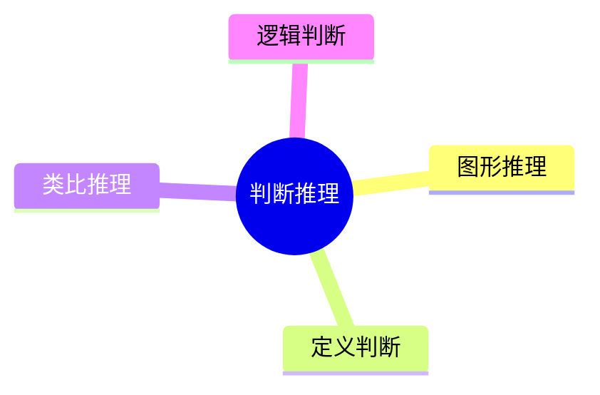

# 导出 HTML（.md → HTML 转换）

将已有的 .md 文件转换为精美 HTML 文件。支持数学公式、流程图、数据图表、SVG 图形、Canvas 动态绘图、思维导图、折叠展开、Tab 切换和自动目录。HTML 转换默认生成 HTML 文件 + 同级资源目录的完整包，本地图片和运行时资源以引用方式写入资源目录，转换前逐一验证可访问性。如需单文件离线包，请在转换后使用内联 HTML 资源功能。

## 执行步骤

1. 确认用户已有 .md 文件（通过 `export-document` 工具导出，或已有文件）。
2. 调用 `convert-md-to-html` 工具，参数：`mdFilePath=<.md 文件的路径>`。
3. 工具返回后，把转换后的相对路径告诉用户。
4. 如用户想编辑内容后重新渲染，提醒用户编辑 .md 源文件后再次调用 `convert-md-to-html`。

## Markdown 扩展语法

在 .md 源文件中可以使用以下扩展语法，转换器会自动渲染：

### 数学公式（KaTeX）
```
行内公式：$E=mc^2$
块级公式：
$$\sum_{i=1}^{n} a_i = S$$
```

### 流程图（Mermaid）
用 ` ```mermaid ` 代码块，写 Mermaid 语法：
```
graph TD
    A[开始] --> B{判断}
    B -->|是| C[结果1]
    B -->|否| D[结果2]
```

### 数据图表（Chart.js）
用 ` ```chart ` 代码块，写 JSON 配置：
```chart
{"type":"bar","data":{"labels":["2019","2020","2021"],"datasets":[{"label":"GDP","data":[7.1,6.8,7.5]}]}}
```
支持的 type：`bar`（柱状图）、`line`（折线图）、`pie`（饼图）、`doughnut`（环形图）。

### 思维导图 / 知识图谱（Markmap）
用 ` ```markmap ` 或 ` ```mindmap ` 代码块，写 Markdown 层级结构：
```markmap
# 数量关系
## 工程问题
### 基本公式
### 常见陷阱
## 行程问题
### 相遇追及
### 比例法
```
适合导出知识框架、复盘笔记、章节图谱。

### Mermaid 图的思维导图语法
如果你更熟悉 Mermaid，也可以继续用 ` ```mermaid ` 代码块写 `mindmap`：


### SVG 图形
用 ` ```svg ` 代码块，直接写 SVG 标签：
```svg
<svg width="200" height="100">
  <circle cx="50" cy="50" r="40" fill="#2563eb"/>
</svg>
```

### Canvas 动态绘图
用 ` ```canvas ` 代码块，写 JavaScript Canvas API 代码。代码中可直接使用 `canvas`（canvas 元素）和 `ctx`（2D 上下文）变量：
```canvas
ctx.beginPath();
ctx.moveTo(50, 200);
ctx.bezierCurveTo(100, 50, 200, 50, 250, 200);
ctx.strokeStyle = "#2563eb";
ctx.lineWidth = 2;
ctx.stroke();
```
**禁止使用** `fetch`、`XMLHttpRequest`、`eval`、`import` 等访问外部资源或动态执行高风险代码的 API；导出器也会额外拦截部分定时器和 DOM 越权调用。
推荐优先使用绘图、动画、渐变和 `requestAnimationFrame` 这类前端可视化逻辑，不要访问页面外部资源。

### 图片
- Markdown 图片 `` 会保留，本地图片复制到同级资源目录并以相对路径引用。
- 适合导出公考题图、资料分析图表、手写笔记图片。
- 远程图片会保留原 URL 并在转换时验证可达性；工作区内的本地图片复制到同级资源目录。

### 交互组件

折叠展开（题目→点击显示解析）：
```html
<details>
<summary>📋 题目：某商品先涨价 20%...</summary>

**正确答案：B**

解析内容...

</details>
```

Tab 切换（多种解法）：
```html
<div class="tabs">
  <div class="tab-buttons">
    <button class="tab-btn active" onclick="switchTab(event,'tab-1')">方法一</button>
    <button class="tab-btn" onclick="switchTab(event,'tab-2')">方法二</button>
  </div>
  <div class="tab-panel active" id="tab-1">方法一内容</div>
  <div class="tab-panel" id="tab-2">方法二内容</div>
</div>
```

悬停提示：
```html
<span class="tip">路程<span class="tip-text">路程 = 速度 × 时间</span></span>
```

### 目录导航
- 当内容包含 **2 个及以上** `##` / `###` / `####` 标题时，自动生成侧边栏目录。
- 目录支持滚动高亮和点击跳转。
- **不要**在 content 中手写目录，工具会自动处理。

## 题目区域涂鸦板

转换的 HTML 支持在试题区域上进行鼠标涂鸦（Scratchpad）：

- 在 .md 内容中用 `<section data-exam-question>` 或 `<div data-exam-question>` 包裹题目内容即可启用涂鸦板。
- 涂鸦板仅在标记区域内激活，不影响其他内容。
- 涂鸦为临时功能，刷新页面后自动消失。
- 如果没有 `data-exam-question` 标记，不会注入涂鸦板功能。

示例：
```html
<section data-exam-question>
**题目：** 某商品先涨价 20%...

A. 选项一
B. 选项二
</section>
```

## 性能预算

- HTML 转换（≤20 个引用资源）：p50 < 500 ms，p95 < 1.5 s（不含文件系统冷启动）。
- 含远程资源时：远程验证总耗时上限 5 s。
- 无 `data-exam-question` 标记的文档不注入涂鸦板资源，不产生涂鸦板相关开销。
- 默认转换不会将运行时库或图片内联到 HTML 正文中，不会在单次转换中重复复制相同资源。
- 如需单文件离线包，请在转换后使用内联 HTML 资源功能。

## 关键注意

- **不要**用 `write` 工具或 `bash` 写文件，必须用 `convert-md-to-html` 工具。
- **不要**在调用工具前反复确认或思考，确认 .md 路径后直接调用。
- 只有显式导出意图时才落文件。
- 转换结果为 HTML 文件 + 同级资源目录，移动时必须一起移动。
- .md 文件是可编辑的源文件，编辑后可再次调用 `convert-md-to-html` 重新渲染。
