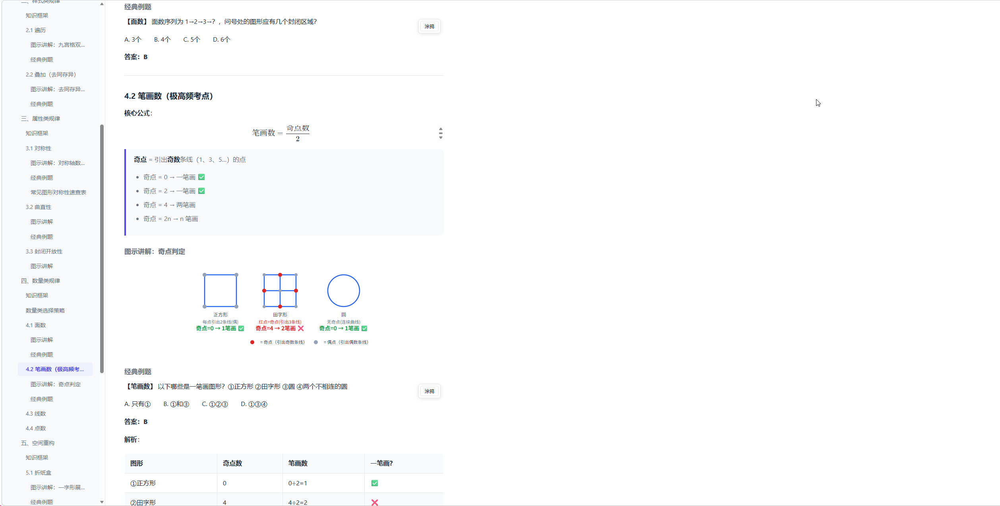

# AI Agent Gwy

基于 OpenCode 构建的公务员/事业单位考试多代理辅导项目。

当前版本的核心方向已经转向：

- 基础知识总结
- 相关知识点梳理
- 经典例题/代表性示例补充
- 题目讲解
- 显式导出为 Markdown / HTML

## 预览效果



## 快速开始（安装与使用指南）

本节面向所有用户，即使你完全不懂编程，按照以下步骤也能跑起来。

### 第一步：安装 Node.js

1. 打开浏览器，访问 Node.js 官网：https://nodejs.org
2. 点击下载 **LTS（长期支持版）**，选择你的操作系统对应版本：
   - **Windows**：下载 `.msi` 安装包，双击运行，一路点"下一步"即可完成安装
   - **macOS**：下载 `.pkg` 安装包，双击运行按提示完成
   - **Linux**：下载对应发行版的包，或使用包管理器安装（如 `sudo apt install nodejs`）
3. 安装完成后，打开一个新的 **命令行窗口**：
   - Windows：按 `Win + R`，输入 `cmd`，按回车
   - macOS / Linux：打开"终端"应用
4. 在命令行中输入以下命令测试是否安装成功：

   ```bash
   npm -v
   ```

   如果显示一个版本号（如 `10.9.2`），说明安装成功，跳到 **第二步**。

   如果提示 **"npm 不是内部或外部命令"** 或 **"command not found"**，说明环境变量没有自动配置好，请按照下面的方法手动配置：

   <details>
   <summary>👉 点击展开：如何配置 Node.js 环境变量（Windows）</summary>

   1. 找到你的 Node.js 安装路径，默认通常是：
      - `C:\Program Files\nodejs`
   2. 按 `Win + S` 搜索"环境变量"，点击"编辑系统环境变量"
   3. 在弹出的窗口中点击"环境变量"按钮
   4. 在"系统变量"区域找到 `Path`，双击打开
   5. 点击"新建"，把 Node.js 的安装路径（如 `C:\Program Files\nodejs`）粘贴进去
   6. 一路点"确定"保存
   7. **关闭所有已打开的命令行窗口**，重新打开一个新的命令行窗口，再试 `npm -v`

   **快捷替代方法**：也可以直接进入 Node.js 的安装目录（如 `C:\Program Files\nodejs`），在地址栏输入 `cmd` 按回车，就能直接在该目录下使用 `npm` 命令。
   </details>

### 第二步：安装 OpenCode

1. 在命令行中输入以下命令，全局安装 OpenCode：

   ```bash
   npm install -g opencode-ai
   ```

   等待安装完成（可能需要几十秒到一两分钟，取决于网络速度）。

2. 安装完成后，**新开一个命令行窗口**，输入以下命令测试：

   ```bash
   opencode
   ```

   如果出现 OpenCode 的交互界面，说明安装成功。按 `Ctrl + C` 退出，继续下一步。

   如果提示 **"opencode 不是内部或外部命令"**，需要配置 npm 全局安装目录到环境变量：

   <details>
   <summary>👉 点击展开：如何配置 OpenCode 环境变量（Windows）</summary>

   1. 在命令行中输入以下命令，查看 npm 的全局安装目录：

      ```bash
      npm config get prefix
      ```

      会输出一个路径，类似：
      - `C:\Users\你的用户名\AppData\Roaming\npm`
      - 或 `C:\Program Files\nodejs`

   2. 按 `Win + S` 搜索"环境变量"，点击"编辑系统环境变量"
   3. 在弹出的窗口中点击"环境变量"按钮
   4. 在"系统变量"区域找到 `Path`，双击打开
   5. 点击"新建"，把刚才 `npm config get prefix` 输出的路径粘贴进去
   6. 一路点"确定"保存
   7. **关闭所有已打开的命令行窗口**，重新打开一个新的命令行窗口，再试 `opencode`
   </details>

### 第三步：克隆本项目

你需要先安装 Git。如果还没有安装 Git：

<details>
<summary>👉 点击展开：如何安装 Git</summary>

1. 访问 https://git-scm.com/downloads 下载对应系统的安装包
2. 双击安装，一路"下一步"即可
3. 安装完后重新打开命令行，输入 `git --version` 确认安装成功
</details>

然后在命令行中执行（将地址替换为你实际获取到的仓库地址）：

```bash
git clone 你的仓库地址
```

> 仓库地址可以在代码托管平台的仓库页面找到（通常是一个绿色的 **Code** 或 **克隆/下载** 按钮），复制 HTTPS 地址即可。

> 如果你不会用命令行克隆，也可以直接在仓库页面找到 **下载 ZIP** 的选项，下载后解压到任意文件夹。

### 第四步：启动项目

1. 打开命令行，进入刚才克隆（或解压）的项目目录：

   ```bash
   cd ai-agent-gwy
   ```

   > 如果你是下载的 ZIP，`cd` 后面换成你解压后的实际文件夹路径。

2. 输入以下命令启动 OpenCode：

   ```bash
   opencode
   ```

   按一下 **回车键**，OpenCode 就会在当前项目目录下启动。

3. 启动后，按 **Tab 键** 切换代理，选择 **Orchestrator**（编排器）作为你的对话对象。

4. 现在你可以开始和 AI 辅导系统对话了！例如：
   - 输入"帮我总结一下言语理解的解题方法"
   - 输入"上传一张题目图片，请帮我讲解"
   - 输入"我想制定一个省考备考计划"

### 常见问题

<details>
<summary>👉 启动 opencode 后没有反应或报错</summary>

- 确保你是在项目根目录（包含 `opencode.json` 的那个目录）下运行的 `opencode` 命令
- 确保你的 Node.js 版本 >= 18，可以在命令行输入 `node -v` 查看版本
- 如果提示权限错误，尝试用管理员身份打开命令行
</details>

<details>
<summary>👉 找不到项目目录在哪</summary>

- 如果你用的 `git clone`，项目通常下载到了你的用户主目录下
- Windows 默认路径通常是 `C:\Users\你的用户名\ai-agent-gwy`
- 如果你下载的是 ZIP，右键 ZIP 文件选择"全部提取"，记住提取到了哪个文件夹
- 在命令行中可以用 `cd /d 文件夹路径` 切换到项目目录，例如：
  ```bash
  cd /d E:\Documents\IdeaProjects\ai-agent-gwy
  ```
</details>

<details>
<summary>👉 如何配置 AI 模型的 API Key</summary>

OpenCode 需要连接大语言模型才能工作。请参考 OpenCode 官方文档 https://opencode.ai 了解如何配置你的 API Key。
</details>

---

## 项目功能

### 1. 多代理协同辅导

- `orchestrator` 作为中央编排器，负责识别用户意图、选择代理、调用工具并整合结果。
- 支持老师 + 状元骨架联合回答，输出结构为“角色发言 + 总结结论”。
- 老师代理负责知识点总结、框架梳理、题型拆解与经典例题讲解。
- 状元代理负责从真实备考场景补充经验视角，并根据身份/考试类型/地区动态收敛语境。

当前已配置代理包括：

- `xingce-zong-teacher`
- `xingce-yanyu-teacher`
- `xingce-shuliang-teacher`
- `xingce-panduan-teacher`
- `xingce-ziliao-teacher`
- `xingce-changshi-teacher`
- `xingce-zhengzhi-teacher`
- `guokao-working-champion`
- `guokao-campus-champion`
- `shengkao-working-champion`
- `shengkao-campus-champion`

### 2. 知识点总结与框架梳理

- 用户可以直接请求总结某一知识点、模块或题型。
- 编排器会优先组织知识框架，再补易错点、辨析和经典例题。
- 当状元视角确有帮助时，会按身份和考试语境补充经验建议。

### 3. 题目讲解

- 用户可以上传题目图片，请系统详细讲解。
- 支持常见文字题、表格题和普通图文混排题。
- 系统会先把图片中的题目收敛成结构化题面，再交给老师解释。
- 当图片不清晰、题干不完整或无法可靠识别时，会要求用户补图或补文字，不会硬讲。

### 4. 经典例题 / 代表性示例

- 系统可以围绕知识点自动生成 1 个代表性例题。
- 例题是辅助理解知识点的手段，不默认进入连续刷题模式。

### 5. Markdown / HTML 导出

- 用户明确要求导出时，可把指定内容导出到项目根目录 `output/`。
- 默认导出 Markdown。
- 用户明确指定 HTML，或对排版质量要求更高时，优先导出 HTML。
- 系统可以建议导出，但不会自动写文件。

### 6. 用户档案与学习画像

- 首次使用可自动创建用户档案。
- 用户档案保存在 `data/users/` 下，不进入 git。
- 当前档案重点保留：考试类型、地区、身份、学习计划，以及已有的学习画像/历史记录（如存在）。
- 不再把积分、等级、连胜等作为公开产品能力展示。

## 当前已实现的用户流程

1. 用户进入对话，创建或加载个人档案
2. 用户请求总结知识点、图片题目讲解、查看已有档案摘要、制定计划或导出内容
3. 编排器选择合适的老师与状元骨架参与回答
4. 若用户明确要求导出，则调用 `export-document` 写入 `output/`
5. 最终返回整合后的总结、讲解、例题和学习建议

## 核心工具

当前核心工具包括：

- `user-profile`：用户档案创建、读取、统计、资料更新
- `grading`：答案对比与基础判题辅助
- `question-generator`：经典例题/代表性示例提示模板生成
- `export-document`：将指定内容导出到 `output/` 下的 Markdown / HTML 文件

## 项目结构

```text
.
├─ .opencode/
│  ├─ agents/         # 代理定义
│  ├─ plugins/        # 自定义工具插件
│  ├─ rules/          # 共享提示词规则
│  ├─ skills/         # 用户触发的技能
│  └─ package.json    # OpenCode 插件依赖
├─ data/
│  └─ users/          # 用户档案数据
├─ output/            # 显式导出与运行报告
├─ sample/            # 导出运行报告的一些样例
├─ docs/
│  ├─ brainstorms/    # 需求文档
│  ├─ plans/          # 技术规划
│  ├─ architecture/   # 架构文档
│  └─ runbooks/       # 运行手册
├─ AGENTS.md          # 项目规范
└─ opencode.json      # OpenCode 配置
```

## 技术实现

- 基于 OpenCode Agent 配置驱动多代理协作
- 自定义插件使用 `@opencode-ai/plugin`
- 通过本地 JSON 文件持久化用户学习数据
- 通过编排器实现“意图识别 -> 代理路由 -> 工具调用 -> 结果整合”的交互链路
- 通过 `.opencode/rules/` 统一共享考试上下文、状元路由、题目输入工作流、导出流程和输出格式规则
- 由于当前 custom tool 在 `permission` 下的等价访问语义尚未验证完成，`opencode.json` 仍临时保留 orchestrator 的 `agent.tools` 配置作为兼容例外

## 当前范围说明

当前仓库的实现重点是：

- 行测知识点总结
- 经典例题辅助讲解
- 题目讲解
- 用户档案与学习计划
- 显式导出 Markdown / HTML

以下方向在项目规划中，但当前版本尚未完整落地：

- 申论完整辅导
- 事业单位考试的更完整老师/状元体系
- 更细的图片题型支持（复杂图形题等）
- 更完整的长期学习记录与知识画像设计

## 适用场景

- 梳理某一模块或题型的基础知识
- 用经典例题帮助理解知识点
- 上传题目图片并获得详细讲解
- 结合身份、考试类型和地区获得更贴近现实的备考建议
- 把重要内容导出为 Markdown 或 HTML
