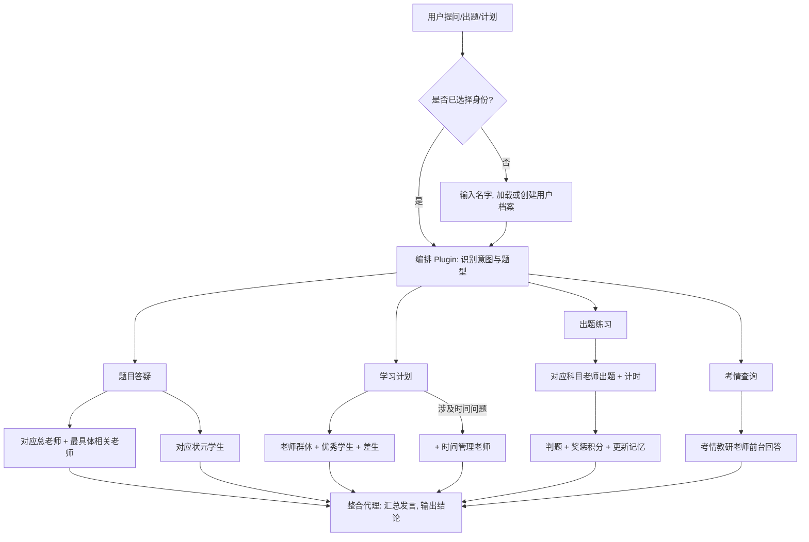

# 公务员/事业单位考试多代理辅导体系重构

## Problem Frame

当前仓库仅有两个状元型子代理：`666`（重庆省考状元）与 `667`（国考状元）。这不足以支撑按题型精准答疑、出题练习、学习进度追踪或多用户管理。

本次重构要将体系升级为：两大角色族群（老师与学生）、覆盖公务员国考/省考及事业单位考试的完整科目体系、出题答题与计时能力、积分等级系统、持久化学习记忆，以及通过 OpenCode custom tools/plugins 实现的考情获取与数据持久化。

## Requirements

### 编排与路由

- R0. 多代理编排必须通过 OpenCode plugin（`.opencode/plugins/`）实现：plugin 负责意图识别、题型路由、代理调度与最终整合输出。plugin 接收到用户输入后，判断场景（答疑/出题/计划/考情），根据路由规则组装代理阵容，依次调用各代理，最后将多代理发言整合为统一输出。
- R0b. plugin 编排层必须包含一个"整合代理"角色，负责将多代理的简短发言汇总为权威结论，确保输出稳定遵守"简短角色发言 + 最终整合结论"的结构。
- R0c. 编排层必须管理上下文窗口预算：当参与代理数量较多时，应控制每个代理的发言长度，或对长文本（如申论材料）进行摘要后再传递给代理。

### 用户身份与记忆持久化

- R1. 系统必须支持多用户身份。首次使用时通过 custom tool 触发身份选择流程（输入名字）；如果该名字已有档案则加载历史记忆，否则创建新用户档案。该 custom tool 在用户首次交互时自动触发。
- R2. 用户可以通过重新输入名字切换身份，系统必须为每个用户独立维护学习记忆。
- R3. 所有学习记忆必须持久化保存到项目文件中，确保新开终端时默认记忆之前的对话和学习数据。
- R4. 每个用户的记忆必须至少包含：答题记录（对错、耗时、题型、科目）、科目掌握度画像（必须细化到每一个小科目/叶子题型级别的正确率、平均耗时）、积分与等级状态、学习建议与薄弱点。
- R4b. 掌握度画像必须设定统计有效性下限：当某小科目/叶子题型的答题数量低于最小样本量（如 5 题）时，该维度的正确率应标记为"样本不足"，不得作为针对性出题或积分奖惩的唯一依据。

### 代理族群与覆盖范围

- R5. 系统必须从当前仅有两名状元代理的状态，重构为"老师代理 + 学生代理"的完整多代理体系，而不是在现有两名代理上做小修小补。
- R6. 所有代理必须使用与身份、能力或教学风格相匹配的可读名称，禁止继续使用 `666`、`667` 这类纯数字式命名。
- R7. 老师代理必须体现"著名机构老师"风格，重点突出系统教学能力、拆题能力、方法总结能力和带学经验，而不只是给出答案。

**公务员考试老师**

| 类别 | 必须覆盖的成员 |
|---|---|
| 老师总类 | 申论总老师、行测总老师 |
| 申论叶子题型老师 | 归纳概括、综合分析、提出对策、贯彻执行、文章写作 |
| 行测模块老师 | 言语理解与表达、数量关系、判断推理、资料分析、常识判断、政治理论 |
| 行测叶子题型老师 | 言语：逻辑填空、片段阅读、语句表达；数量：数学运算；判断：图形推理、定义判断、类比推理、逻辑判断；资料：资料分析；常识：法律、经济、科技与生活、人文与历史、国情地理、管理与公文 |

**事业单位考试老师**

| 类别 | 必须覆盖的成员 |
|---|---|
| 事业单位专属模块老师 | 公共基础知识（公基）、职业能力倾向测验（职测）、综合应用能力 |

- R8. 公务员考试与事业单位考试之间共享行测/申论相关老师，但事业单位专属科目（公基、职测、综合应用能力）必须拥有独立的专属老师。

**学生代理**

| 类别 | 必须覆盖的成员 |
|---|---|
| 优秀学生 | 国考总分第一、重庆市省考总分第一、行测第一、申论第一 |
| 特殊学生 | 成绩特别差且不爱学习的学生 |

- R9. 国考总分第一属于应届生身份的跨科目全能学生，在回答和制定计划时应体现全职备考的时间充裕感、校园学习节奏和应届生视角。重庆市省考总分第一属于在职备考的跨科目全能学生（朝九晚六，经常加班到八点半甚至更晚，偶尔通宵加班），在回答和制定计划时应体现其高效利用碎片时间的真实备考经验。
- R10. 行测第一与申论第一属于单科尖子，回答时应优先体现各自单科视角。
- R11. 差生代理必须长期保持"基础差、执行弱、态度消极"的人格特征，但其存在目的是暴露现实学习阻力，帮助老师把方案做得更可执行。

**特殊老师**

- R12. 系统必须包含一名"考情教研老师"，负责维护题型树和老师队伍适配。
- R13. 考情获取必须封装为一个 OpenCode skill，由用户主动触发；触发后系统通过公开考试信息渠道（如官方考试公告、权威考试资讯网站）获取最新考情，如果有新的稳定题型或大纲变化，则扩招对应科目老师；如果没有获取到新考情，则明确告知用户。具体数据源在实现阶段确定。
- R13b. 考情 skill 必须定义"有新考情"的判定标准：仅当同一变化被多个独立信息源确认时，才视为稳定变化并触发扩招。
- R14. 当用户显式询问考情变化、命题趋势、考试大纲更新或新题型影响时，考情教研老师必须以前台角色直接参与回答。
- R15. 当系统已识别到应扩招的新题型、但新老师尚未补建完成时，必须进入降级模式：由最相关的总老师先按相近题型提供临时讲解，并由考情教研老师明确说明该方向已被标记为待扩招。
- R16. 系统必须包含一名"时间管理老师"，专门处理做题速度慢、模考节奏、答题顺序、各模块时间分配与备考时间规划问题。
- R17. 时间管理老师应按需直接出场：当用户提到时间不够、做题过慢、模考节奏失衡、刷题安排、时间分配，或明确要求规划做题时间时，应被优先拉入讨论。
- R18. 时间管理老师给出的建议必须结合学生在各子科目上的掌握情况；若信息不足则先追问关键短板，或明确退化为通用时间规划建议。

### 出题、答题与计时

- R19. 老师必须能够根据用户指定的科目和题型，随机出一道练习题。出题时必须包含自检步骤：生成题目后由出题老师对答案正确性进行反向验证，确保事实正确性和选项一致性。
- R19b. 系统必须支持针对性出题：根据用户学习画像中各小科目的掌握度，优先对薄弱小科目出题，帮助用户定向补短板。用户也可以指定"只练薄弱项"或"随机出题"模式。
- R19c. 冷启动策略：当用户为全新用户（无任何历史画像）时，系统应采用"随机出题"模式，并在初始几题中覆盖不同小科目以快速建立基础画像。用户也可主动指定科目跳过冷启动阶段。
- R20. 出题后系统必须自动开始计时，直到用户提交答案后结束计时。计时器必须支持超时提醒（客观题默认 3 分钟，主观题默认 30 分钟）、用户主动放弃（记录为"未答"），以及跨工具调用时的状态持久化（计时状态保存在用户档案中，即使工具调用中断也能恢复）。
- R21. 答题结束后，系统必须判断答案是否正确，并告知用户答题是否正确、答题所花时间。对于客观题（行测选择题等），采用二值判题（对/错）；对于主观题（申论、综合应用能力），采用分级评分（如 A/B/C/D 四档），并给出评分理由和改进要点。积分奖惩根据判题类型分别设计。
- R22. 用户可以查看解析；查看解析时必须调用多个代理（对应科目老师 + 相关优秀学生）进行圆桌讨论并告知解题步骤。
- R23. 出题、答题、计时、判题、解析查看的完整流程应通过 OpenCode custom tools 实现。所有 custom tools 必须包含错误处理：外部调用失败时给出明确错误信息并保留已有进度，文件读写异常时使用内存缓存降级，数据损坏时提示用户并尝试从备份恢复。出题流程必须支持错误恢复：出题失败可重试，计时异常可手动修正，判题出错可申诉重新判题。

### 积分与等级系统

- R24. 系统必须建立积分与等级系统，量化学生的学习进度。
- R25. 答题正确必须获得积分，答题错误必须扣分；积分规则和等级门槛需要在实现阶段具体定义。
- R26. 老师在判题后必须根据答题结果给予口头表扬或批评，与积分系统配合形成正向激励。
- R27. 积分、等级、连续正确/错误记录必须持久化保存到用户档案中。

### 路由与参与规则

| 场景 | 必须参与的代理 |
|---|---|
| 题目答疑（公务员） | 对应总老师 + 最具体相关老师 + 国考总分第一 + 重庆市省考总分第一 + 对应单科第一 |
| 题目答疑（事业单位） | 对应事业单位专属老师 + 对应总老师（若涉及共享科目）+ 国考总分第一 + 重庆市省考总分第一 + 对应单科第一（若涉及共享科目） |
| 学习计划/备考策略 | 相关老师 + 相关优秀学生 + 差生；涉及时间问题时加入时间管理老师 |
| 出题练习 | 对应科目/题型老师 |
| 查看解析 | 对应科目老师 + 相关优秀学生（圆桌讨论） |
| 考情查询 | 考情教研老师 |
| 题型不明确 | 先自动判断；低置信度时再追问用户 |

- R28. 当用户提出题目相关问题时，编排 plugin 必须先判断考试类型（公务员/事业单位）、科目大类（申论/行测/公基/职测/综合应用能力）、叶子题型，再组织阵容。
- R29. 对于普通题目答疑，默认参与阵容固定包含 2 名老师与 3 名优秀学生。为控制延迟和成本，编排层可以按场景精简阵容：简单客观题答疑可缩减为 1 老师 + 1 学生，复杂主观题或学习计划保留完整阵容。具体缩减规则在实现阶段定义。
- R29b. 事业单位专属科目（公基、职测、综合应用能力）的答疑，学生代理参与规则为：国考总分第一 + 重庆市省考总分第一均以"跨考试类型学习者"视角参与；若问题涉及共享科目（如行测模块），对应单科第一也需参与。
- R30. "最具体相关老师"必须遵守统一层级：若已能可靠识别到叶子题型则拉入叶子题型老师；若只能判断到模块层级则拉入模块老师；总老师始终保留。
- R31. 当问题同时包含"题目讲解"与"时间/节奏/分配/提速"诉求时，时间管理老师应作为第 3 名老师加入。
- R32. 差生代理默认不得参与普通题目答疑和出题练习；仅在学习计划等脑暴型场景中参与，除非用户明确点名。

### 输出与体验

- R33. 多代理回答必须采用"简短角色发言 + 最终整合结论"的结构。
- R34. 最终整合部分必须是权威结论，能够直接给出解题思路、方法总结、学习建议或可执行计划。
- R35. 题目答疑场景应优先追求讲透、讲准、讲出方法。
- R36. 学习计划场景中，老师必须显式照顾差生代理暴露出的拖延、畏难等现实问题。
- R37. 重庆市省考总分第一在学习计划中必须体现在职备考的时间约束（朝九晚六、经常加班），给出适配打工人节奏的方案。
- R38. 用户不需要手动指定调用哪些代理；系统应根据问题内容自行组织阵容。

## Success Criteria

- 用户输入名字后，系统能加载或创建对应的用户档案，并读取历史记忆。
- 切换终端后，系统能通过项目文件恢复之前的所有学习数据。
- 用户画像能追溯到每一个小科目/叶子题型的正确率和耗时，而不是只有大类汇总。
- 用户输入一题或一类题目时，系统能自动识别考试类型、科目和叶子题型，并组织出符合预期的专家阵容。
- 老师能根据用户指定的科目和题型随机出一道题，自动计时，判题后给出积分奖惩。
- 用户查看解析时，能看到多代理圆桌讨论的解题步骤。
- 事业单位考试专属科目有对应的专属老师，不是把公基/职测/综合应用能力硬塞进行测/申论老师的工作范围。
- 用户主动触发考情 skill 后，系统能获取最新考情，有变化则扩招老师，无变化则明确告知。
- 学习计划场景能同时兼顾在职考生（时间紧张）和差生（执行弱）的现实约束。
- 代理名称让用户一眼看懂身份与专长，不再出现纯数字式命名。

## Scope Boundaries

- 本次重构覆盖公务员国考/省考和事业单位笔试，不包含面试、选岗、报考咨询。
- 考情获取通过 skill 由用户主动触发，不自动轮询或后台自动运行。
- 老师按叶子题型级建模，不为每个公式技巧单独配置老师。
- 积分/等级系统保持适度复杂，不引入社交、排行榜或多人竞争机制。
- 本次重构不要求兼容当前两名代理的旧角色定义或命名方式。

### 分阶段实现策略

从当前 2 个代理到完整 38+ 代理体系采用增量交付，每个阶段可独立验证：

**Phase 1 — MVP（核心答疑链路）**
- 编排 plugin + 意图路由
- 行测总老师 + 1 个行测模块老师（如言语理解）
- 国考状元 + 重庆省考状元
- 基础出题/计时/判题（仅客观题）
- 用户身份与记忆持久化（基础版）
- 验证：端到端跑通一个完整的答疑+出题流程

**Phase 2 — 行测完整覆盖**
- 补齐全部行测模块老师和叶子题型老师
- 行测第一学生代理
- 针对性出题（学习画像驱动的薄弱项优先）
- 积分与等级系统

**Phase 3 — 申论与主观题**
- 申论总老师 + 全部申论叶子题型老师
- 申论第一学生代理
- 主观题分级评分（A/B/C/D）
- 申论出题与解析

**Phase 4 — 事业单位与完整体系**
- 事业单位专属老师（公基、职测、综合应用能力）
- 差生代理 + 时间管理老师 + 考情教研老师
- 考情获取 skill
- 学习计划场景的完整阵容

## Key Decisions

- 公务员与事业单位共享行测/申论老师，事业单位专属科目（公基、职测、综合应用能力）拥有独立老师。
- 考情获取改为用户主动触发的 skill，而不是后台自动运行。
- 建立积分/等级系统，配合口头表扬/批评形成正向激励。
- 出题默认每次出一题，支持指定科目和题型。
- 记忆全量持久化到项目文件，支持多用户独立档案。
- 重庆市省考总分第一设定为在职备考（朝九晚六、经常加班到八点半甚至通宵），在学习计划中给出适配打工人的方案。
- 所有代理改用可读名称。
- 考情扩编遵循"先更新现有覆盖，确有新稳定题型再新增老师"的原则。
- 多代理编排通过 OpenCode plugin 实现，由 plugin 负责意图识别、路由、调度与最终整合。
- 客观题采用二值判题，主观题采用分级评分（A/B/C/D 档）。
- 出题包含自检步骤，确保生成题目的答案正确性。
- 采用分阶段实现：从 MVP（行测单模块答疑+出题）开始，逐步扩展到完整体系。

## Dependencies / Assumptions

- 多代理编排将通过 OpenCode plugin（`.opencode/plugins/`）实现，plugin 负责意图识别、题型路由、代理调度与最终整合输出。
- 出题、答题计时、判题、积分、记忆读写等功能将通过 OpenCode custom tools（`.opencode/tools/`）实现。
- 考情获取将通过 OpenCode skill 实现，由用户主动触发。
- 用户档案与学习数据将保存到项目文件目录中（如 `.opencode/data/`），确保跨终端持久化。
- OpenCode custom tools 支持 TypeScript/JavaScript 定义，可调用外部脚本和文件读写。
- OpenCode plugins 支持事件钩子和工具调用拦截，可用于实现多代理编排逻辑。

## Outstanding Questions

### Resolve Before Planning
- None.

### Deferred to Planning
- [Affects R1-R4, R24-R27][Technical] 用户档案与学习数据的具体文件格式、存储路径和读写机制。
- [Affects R19-R23][Technical] 出题、计时、判题、解析查看的 custom tool 具体设计和参数定义。
- [Affects R24-R27][Technical] 积分规则、等级门槛、奖惩分值的具体数值设计。
- [Affects R13][Technical] 考情获取 skill 的实现方式——调用哪个外部数据源（判定标准已由 R13b 定义：多源确认）。
- [Affects R5-R8][Technical] 新代理的可读命名规范、文件拆分方式，以及如何从旧数字式代理迁移到新命名体系。
- [Affects R28-R30][Technical] 如何在 OpenCode 代理能力边界内实现意图识别、题型路由与最终整合输出。
- [Affects R33-R38][Needs research] 如何让多代理回答稳定遵守"简短发言 + 最终整合"的统一格式。

## Next Steps
-> /ce:plan for structured implementation planning
