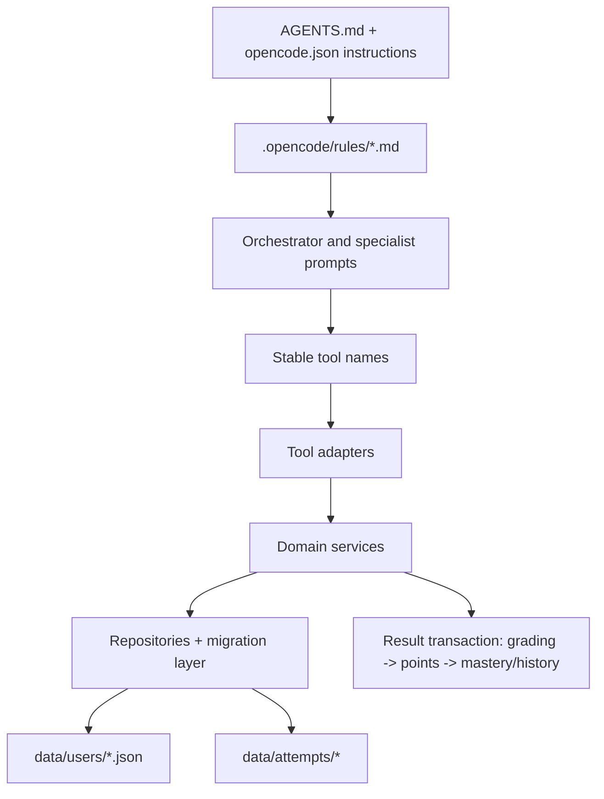
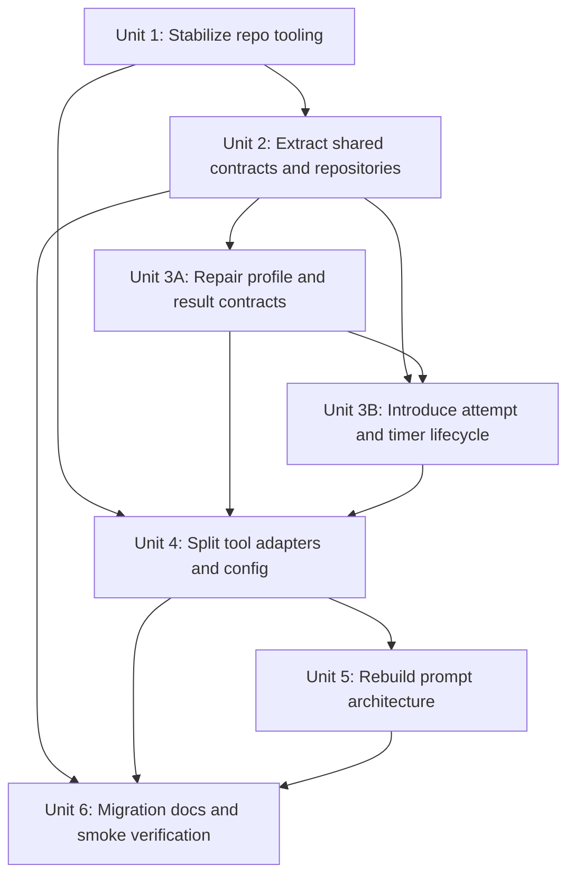

# refactor: Rebuild coaching tools and prompt architecture

## Overview

This plan restructures the project's OpenCode plugin, prompt assets, and supporting repo tooling so the codebase is modular, testable, and behaviorally coherent. The refactor is explicitly allowed to correct broken or misleading runtime behavior, especially around user profile lifecycle, timer persistence, and the practice-result write path.

## Problem Frame

The current project delivers useful Phase 1 tutoring behavior, but most of the operational contract lives in fragile places:

- `.opencode/plugins/coaching-tools.ts` concentrates all five tools, persistence logic, schema migration, constants, and business rules in a single file.
- User-facing behavior is split across executable tool logic, `orchestrator.md`, skill docs, README text, and repeated agent prompt sections, so contract drift is already present.
- Persistent state is only partially modeled. User profiles are durable, but in-progress attempts and timers are not; points and mastery updates are written separately; several flows claim behavior that is not actually persisted.
- The repo is not currently set up for reproducible refactor work because `.opencode/package.json` and lockfiles are ignored, there is no test harness, and the existing `opencode.json` agent configuration still uses deprecated `tools` configuration in agent blocks.

Because the user asked for a comprehensive refactor plan and explicitly chose behavior-correcting scope, this plan does not treat the current runtime behavior as authoritative when the implementation and prompt contracts disagree. The goal is to preserve the project's product intent while fixing internal contradictions and unsafe state transitions.

## Requirements Trace

- R1. Replace the monolithic plugin implementation with a modular architecture that separates OpenCode adapters, domain services, storage, and shared contracts.
- R2. Repair broken or misleading lifecycle behavior for profile creation/loading, in-progress practice attempts, timer recovery, timeout/abandon handling, and result persistence.
- R3. Preserve stable OpenCode-facing tool names where possible while making validation, error handling, and cross-tool handoffs explicit and testable.
- R4. Extract shared prompt and workflow rules into a single source of truth so individual agent prompts stay role-specific rather than duplicating operational policy.
- R5. Make the repository reproducible for contributors by tracking the plugin manifest, adding TypeScript/test configuration, and defining automated verification for code and prompt assets.
- R6. Provide migration, compatibility, and documentation guidance that protects existing user data and keeps future refactors from reintroducing contract drift.

## Scope Boundaries

- This plan does not add new product domains such as full 申论 support or complete 事业单位 teaching flows.
- This plan does not replace file-backed storage with a database or external service.
- This plan does not redesign the tutoring product or introduce a new UI surface.
- This plan does not require renaming the existing five user-visible tool capabilities during the first refactor pass.
- This plan does not attempt to solve subjective grading end-to-end beyond making its pending-evaluation state explicit and non-broken.

## Context & Research

### Relevant Code and Patterns

- `.opencode/plugins/coaching-tools.ts` is the current implementation seam for all tool behavior, shared constants, profile migration, and filesystem access.
- `.opencode/agents/orchestrator.md` is the strongest existing workflow document and should remain the main routing prompt after shared operational rules are extracted.
- `.opencode/agents/*.md` already separate teacher and champion roles cleanly, but six teacher prompts duplicate the same exam-context section verbatim.
- `.opencode/skills/update-profile/SKILL.md` repeats lifecycle behavior that should align with the canonical profile contract.
- `opencode.json` already points `instructions` at `.opencode/rules/**/*.md`, which creates a natural home for shared prompt policy even though that directory does not exist yet.
- `.gitignore` currently ignores `**/package.json` and `**/package-lock.json`, which prevents the plugin manifest from serving as a tracked source of truth.

### Institutional Learnings

- No `docs/solutions/` directory or prior institutional learnings exist yet. This refactor should assume no documented prior art inside the repo.

### External References

- OpenCode plugin, custom tool, agent, and rules documentation indicate that plugin adapters should stay thin, tool schemas are model-facing contracts, and agent-level `tools` configuration has been superseded by `permission`.
- Current 2026 guidance for `@opencode-ai/plugin@1.4.3` supports async-first plugin hooks, Bun-based dependency handling, and sequential hook semantics, so the refactor should not rely on hidden mutable in-memory state.
- Node filesystem guidance for `fs/promises` and concurrent writes reinforces the need for serialized writes, schema versioning, and repository boundaries for file-backed state.

## Key Technical Decisions

| Decision | Chosen approach | Rationale |
|---|---|---|
| OpenCode runtime boundary | Keep `.opencode/plugins/coaching-tools.ts` as the stable plugin entrypoint, exported plugin shape, and tool-registration seam while moving business logic behind internal modules | Stability means more than file path: implementation may change, but plugin initialization behavior, exposed tool names, and registration order remain explicit compatibility constraints |
| Persistence strategy | Keep file-backed JSON storage for this refactor, but add repository boundaries, schema versioning, serialized writes, guarded state transitions, and restart reconciliation rules | A thinner file-service abstraction would not adequately own migration, indexed identity, idempotent result application, guarded apply transitions, and multi-record recovery semantics |
| Canonical runtime state | Treat the attempt record as the source of truth for in-progress and result-application state, treat timer as attempt substate/recovery metadata, and treat profile data as a derived long-lived aggregate; allow at most one active score-bearing attempt per `profileId` at a time unless the prior one is explicitly resolved or superseded | This avoids multiple sources of truth while still keeping profile aggregates durable and query-friendly |
| Compatibility and rollback policy | Use a compatibility release model: the new runtime must read legacy records, normalized writes are forward-moving, ambiguous legacy records are blocked from mutation, and rollback after normalized writes requires snapshot restore of the full persistence set rather than mixed-version writes; write a migration manifest/epoch so new and old runtimes can detect cutover state | File-backed migration is itself a state mutation, so the plan needs an explicit version-interoperability rule rather than assuming safe mixed-version use |
| Question/answer capture | Require teacher generation to emit a structured payload plus display text, then persist the canonical answer key and grading metadata through an explicit attempt-registration step before `timer.start` | Restart-safe grading and replay-safe result application are impossible if the system depends only on later freeform chat text to reconstruct the correct answer |
| Timer identity binding | Make timer state authoritative by `attemptId` plus immutable `profileId`, while a persisted session-to-current-attempt mapping exists only as a convenience pointer for conversational tool calls | This resolves the current `sessionID`-only ambiguity and gives user-switch/restart behavior one durable identity model |
| Identity reservation | Maintain a durable display-name claim index with states `claimed`, `blocked`, and `released`, and require create/overwrite flows to consult it before mutating profile storage | This prevents blocked duplicate-name repairs from leaking into shadow-profile creation |
| Session invalidation | Treat session-to-current-attempt pointers as versioned convenience state with epoch-based invalidation on user switch | This closes crash windows where a stale session pointer could target the wrong user's active attempt |
| Behavior correction policy | Fix conflicting or misleading contracts rather than preserving them blindly, and treat service/tool behavior plus shared rules as the authoritative source when runtime, prompts, and docs disagree mid-refactor | The user requested behavior-correcting scope, and a clear precedence rule prevents partial rollout from reintroducing semantic drift |
| Prompt architecture | Move shared lifecycle/policy rules into `.opencode/rules/`, keep orchestrator files responsible for routing/workflow decisions, keep specialist prompts responsible for role voice and subject judgment, and keep skills/docs as user-facing summaries of the same contract | This removes duplication without over-centralizing specialist expertise or human-facing explanation |
| Tool/config modernization | Preserve current tool names, strengthen schemas and output contracts, and treat migration from deprecated agent `tools` fields to `permission` as conditional on proving equivalent custom-tool access semantics; if the platform cannot yet express parity, isolate and document the remaining deprecated config as an explicit exception | Tool-name stability and access-semantics stability are distinct risk surfaces and both need explicit validation |
| Contributor tooling | Track `.opencode/package.json` and `.opencode/package-lock.json`, add TypeScript/test configuration, and validate prompt assets automatically, while keeping broader lint/CI/platform standardization out of scope | Without tracked tooling and tests, a multi-unit refactor cannot be landed safely; limiting the scope avoids turning this into a general repo-platform overhaul |

## Open Questions

### Resolved During Planning

- Should this be a strictly behavior-preserving refactor? No. The plan includes behavior fixes for contradictory or unsafe lifecycle flows because the user explicitly chose that boundary.
- Should this refactor move the project to a database or external state service? No. File-backed persistence remains in scope for this refactor, but its boundaries and safety guarantees change substantially.
- Where should shared prompt policy live? In `.opencode/rules/`, because `opencode.json` already loads that directory via `instructions` and it keeps role prompts slimmer.
- Should public tool names change as part of the refactor? No. The first pass keeps the current five tool capabilities recognizable so orchestrator and skill updates can remain evolutionary rather than breaking.
- How should duplicate-name legacy profiles be handled? Detect ambiguity before mutation, quarantine or block ambiguous records from write-back, and require an explicit repair path before the runtime mutates any uncertain identity.
- What is the active-attempt uniqueness rule? Allow at most one active score-bearing attempt per `profileId` at a time; any new attempt must explicitly supersede or resolve the old one.
- How is the canonical answer key captured? Teacher output must include a structured machine-readable payload that is registered into attempt storage before timer-driven answering begins.
- How is timer identity resolved? Timer operations are attempt-bound, with session mapping used only to find the current attempt for the current user.
- What key binds all new persisted runtime state? All new attempt, timer, session-pointer, and apply-journal records must store immutable `profileId`; display name is lookup and UI only.
- How are blocked duplicate names prevented from creating shadow profiles? A durable display-name claim index with `claimed`, `blocked`, and `released` states gates create and overwrite flows.
- How is user switch made safe across crashes? Session-to-current-attempt mappings must carry a session epoch/version so stale pointers are rejected before any timer or apply action runs.

### Deferred to Implementation

- Whether the durable attempt store is best represented as one file per attempt or a session-keyed store under a repository abstraction. The plan requires restart-safe attempt recovery, but the exact file granularity can be chosen during implementation once fixtures exist.
- Whether the test runner should remain purely Vitest-based or use Bun's test runner for a subset of host-adjacent smoke checks. The plan assumes tracked automated tests, but the final runner mix can be validated during setup.
- Whether a later follow-up should add a dedicated evaluator workflow for subjective grading after this refactor. This plan only requires a durable pending-evaluation state and explicit non-broken routing.
- The exact repository layout for storing compatibility snapshots or backup metadata during migration. The plan requires rollback-safe recovery, but the final location can be chosen during implementation.

## High-Level Technical Design

> *This illustrates the intended approach and is directional guidance for review, not implementation specification. The implementing agent should treat it as context, not code to reproduce.*

The refactor intentionally separates model-facing prompt policy, tool adapter boundaries, and durable state management. The most important architectural change is adding an explicit attempt/timer lifecycle between question generation and profile aggregation so the practice loop is not stitched together by prompt text and ephemeral session memory alone.

The teacher-generation handoff is also made explicit: the system should not start timing or accept grading until a machine-readable question payload has been registered as an attempt record with canonical answer metadata.

## Alternative Approaches Considered

- Keep the monolith and only clean up prompts: rejected because the most serious risks are data integrity and lifecycle inconsistency, not prompt duplication alone.
- Migrate immediately to a database-backed service: rejected because it would combine a storage rewrite with a contract rewrite and dramatically increase rollout risk.
- Rename tools and redesign orchestration from scratch: rejected because the repo already has workable user intent mapping; the priority is to make the current system trustworthy and maintainable.

## Success Metrics

- The plugin entrypoint becomes a thin composition layer rather than the location of most business logic.
- No shared lifecycle rule exists only in duplicated prompt text; each shared rule has a single canonical home.
- Practice flows cover restart, timeout, abandon, duplicate-name, and partial-write scenarios with explicit persisted outcomes.
- Contributors can clone the repo and understand the plugin/test setup from tracked files alone.
- Automated tests exist for repository behavior, migration safety, tool contracts, and prompt asset validation.

## Dependencies / Prerequisites

- `.opencode/package.json` and `.opencode/package-lock.json` must become trackable, or the refactor will remain non-reproducible.
- Existing `data/users/*.json` profiles should be sampled and anonymized into fixtures before migration logic is finalized.
- Any downstream workflow that assumes the current ignored-manifest behavior should be identified before `.gitignore` is changed.

## Implementation Units

- [x] **Unit 1: Stabilize tracked tooling and refactor baseline**

**Goal:** Make the repo reproducible and testable before deeper code movement begins.

**Requirements:** R1, R5, R6

**Dependencies:** None

**Files:**
- Modify: `.gitignore`
- Modify: `.opencode/.gitignore`
- Modify: `.opencode/package.json`
- Modify: `.opencode/package-lock.json`
- Create: `.opencode/tsconfig.json`
- Create: `.opencode/vitest.config.ts`
- Create: `.opencode/tests/setup/temp-worktree.ts`
- Test: `.opencode/tests/coaching-tools/tooling-smoke.test.ts`

**Approach:**
- Stop ignoring the plugin manifest and lockfile in both root `.gitignore` and `.opencode/.gitignore` so the tracked dependency source of truth is actually reachable.
- Make `.opencode/package-lock.json` the tracked dependency lock so contributor setups and refactor branches resolve the same plugin/runtime dependencies.
- Add a TypeScript configuration that covers plugin modules, prompt-validation utilities, and tests under `.opencode/tests/`.
- Establish a temp-worktree test helper so repository and migration tests can use real files without touching production user data.
- Keep `.opencode/plugins/coaching-tools.ts` as the public plugin entrypoint even though later units will thin it aggressively.

**Patterns to follow:**
- Existing repo convention of keeping OpenCode artifacts under `.opencode/`
- OpenCode plugin guidance that local plugin dependencies are supplied by `.opencode/package.json`

**Test scenarios:**
- Happy path: a clean checkout with tracked plugin manifest and TypeScript config can resolve the plugin/test project without relying on ignored local files.
- Happy path: a clean checkout resolves the exact dependency versions from tracked lock metadata rather than from per-machine cache state.
- Edge case: Windows-style paths and nested worktree directories resolve correctly in shared test helpers.
- Error path: missing temp fixture directories produce deterministic test-helper failures rather than writing into the real workspace.
- Integration: the plugin entrypoint can still be imported and composed from the tracked project configuration after the baseline setup is added.

**Verification:**
- The repo contains all configuration needed to run plugin-focused tests from source control alone.
- Future units can add tests and internal modules without first changing repo tooling again.

- [x] **Unit 2: Extract shared contracts, constants, and repositories**

**Goal:** Break the monolith into reusable internal modules with explicit ownership of types, formatting, storage, and migration.

**Requirements:** R1, R3, R5, R6

**Dependencies:** Unit 1

**Files:**
- Modify: `.opencode/plugins/coaching-tools.ts`
- Create: `.opencode/plugins/coaching-tools/shared/types.ts`
- Create: `.opencode/plugins/coaching-tools/shared/constants.ts`
- Create: `.opencode/plugins/coaching-tools/shared/formatters.ts`
- Create: `.opencode/plugins/coaching-tools/storage/file-store.ts`
- Create: `.opencode/plugins/coaching-tools/storage/write-queue.ts`
- Create: `.opencode/plugins/coaching-tools/storage/identity-index-repository.ts`
- Create: `.opencode/plugins/coaching-tools/storage/session-pointer-repository.ts`
- Create: `.opencode/plugins/coaching-tools/storage/migration-manifest-repository.ts`
- Create: `.opencode/plugins/coaching-tools/storage/profile-repository.ts`
- Create: `.opencode/plugins/coaching-tools/storage/attempt-repository.ts`
- Create: `.opencode/plugins/coaching-tools/migrations/profile-schema.ts`
- Create: `.opencode/tests/fixtures/users/legacy-missing-id.json`
- Create: `.opencode/tests/fixtures/users/duplicate-name-a.json`
- Create: `.opencode/tests/fixtures/users/duplicate-name-b.json`
- Create: `.opencode/tests/fixtures/users/malformed.json`
- Test: `.opencode/tests/coaching-tools/profile-repository.test.ts`
- Test: `.opencode/tests/coaching-tools/identity-index-repository.test.ts`
- Test: `.opencode/tests/coaching-tools/migration-manifest.test.ts`
- Test: `.opencode/tests/coaching-tools/profile-migration.test.ts`
- Test: `.opencode/tests/coaching-tools/attempt-repository.test.ts`

**Approach:**
- Move filesystem access, atomic write helpers, and schema migration logic into repository modules so tool adapters stop reading and writing files directly.
- Introduce schema versioning for persisted profile data and a repository-level identity strategy that prefers immutable IDs over mutable names.
- Require all new attempt, timer, session-pointer, and apply-journal writes to store immutable `profileId`; display name remains a lookup and presentation field only.
- Add a write-serialization layer for file-backed state so two writes touching the same logical record cannot silently clobber each other.
- Introduce a durable display-name claim index with `claimed`, `blocked`, and `released` states so blocked identities cannot be bypassed by repeated create/load attempts.
- Make lazy migration authoritative for unambiguous records and explicitly forbid write-back for ambiguous or unreadable legacy records until a repair path resolves them.
- Encode a migration classification matrix in the repository layer: safe lazy migration for shape-only normalization, block-plus-repair for semantically unsafe but salvageable records, and quarantine for records with no deterministic repair path.
- Write a migration manifest/epoch that records migrated records, quarantined identities, and backup provenance so rollout and old-runtime detection are auditable.
- Keep model-facing text formatting centralized so tool outputs remain deliberate rather than being assembled ad hoc inside every `execute()` branch.

**Execution note:** Add characterization coverage before moving persistence logic out of the legacy monolith.

**Patterns to follow:**
- Existing use of repo-local `data/users/` persistence
- External guidance favoring thin tool adapters over mixed adapter/domain/storage files

**Test scenarios:**
- Happy path: loading a valid profile file returns a normalized schema-versioned record with stable ID-first identity.
- Edge case: a legacy profile missing `id`, `examTypes`, `region`, or `studyPlan` is migrated in memory and persisted back in the normalized shape.
- Edge case: a renamed display name still resolves the same active attempt and timer metadata through immutable `profileId` bindings.
- Edge case: two lookups for the same display name resolve deterministically once the ID-first/indexed strategy is applied.
- Error path: malformed JSON in one profile file produces a surfaced repository error without deleting or rewriting neighboring valid profiles.
- Error path: an ambiguous duplicate-name fixture is detected before mutation and is blocked or quarantined rather than normalized in place.
- Error path: a blocked display-name claim prevents shadow-profile creation until repair explicitly releases or reassigns the name.
- Error path: overlapping writes for the same profile are serialized so the later write does not discard the earlier mutation.
- Integration: an attempt repository can persist and reload in-progress state independently of profile aggregates.
- Integration: the migration manifest records migrated and quarantined records, and a newer manifest epoch can be used to reject old-runtime mutation.

**Verification:**
- Shared types and repositories own persistence behavior, and the entrypoint no longer needs to know file-shape details.
- Migration and storage behavior are provable via tests rather than prompt assumptions.

- [x] **Unit 3A: Repair profile identity and result-application contracts**

**Goal:** Make profile identity, create/load/overwrite semantics, and result application safe before the attempt/timer lifecycle is layered on top.

**Requirements:** R2, R3, R6

**Dependencies:** Unit 2

**Files:**
- Create: `.opencode/plugins/coaching-tools/services/profile-service.ts`
- Create: `.opencode/plugins/coaching-tools/services/result-service.ts`
- Modify: `.opencode/plugins/coaching-tools.ts`
- Modify: `.opencode/plugins/coaching-tools/shared/types.ts`
- Modify: `.opencode/plugins/coaching-tools/storage/profile-repository.ts`
- Modify: `.opencode/plugins/coaching-tools/storage/attempt-repository.ts`
- Test: `.opencode/tests/coaching-tools/profile-identity.test.ts`
- Test: `.opencode/tests/coaching-tools/attempt-transition-guard.test.ts`
- Test: `.opencode/tests/coaching-tools/result-persistence.test.ts`
- Test: `.opencode/tests/coaching-tools/result-idempotency.test.ts`

**Approach:**
- Split profile operations into explicit create/load/overwrite semantics so prompt contracts match executable behavior.
- Add a blocked-identity runtime path so ambiguous legacy users are prevented from silent mutation or shadow-profile creation and are routed into repair-required behavior.
- Guard active-attempt creation with a per-`profileId` atomic claim or compare-and-set rule so two concurrent starts cannot both become score-bearing active attempts.
- Make result application idempotent by attempt identity/state so retries, plugin reloads, and repeated submissions cannot double-award points or append duplicate history.
- Guard result application with an explicit transition such as `evaluated -> applying -> applied`, where entering `applying` is itself a protected persisted transition.
- Define the cross-record write order and recovery rule for attempt state, profile aggregates, and any identity/index metadata so restart reconciliation has a clear source of truth.
- Add a durable apply-operation record or equivalent journal marker to distinguish `not started`, `in progress`, `applied`, and `needs replay-safe reconciliation` across restart boundaries.
- Persist the exact applied aggregate delta plus the target/observed `profileVersion` or equivalent revision metadata on each score-bearing attempt so reconciliation can prove whether replay is needed.
- Route the live runtime through the new profile/result services from `.opencode/plugins/coaching-tools.ts` even before the tool adapters are fully split in Unit 4.
- Fix validation boundaries such as duplicate-name behavior so they are handled intentionally rather than by first-match scan side effects.

**Execution note:** Start with failing integration tests for the create/load/attempt/result contract before changing service behavior.

**Technical design:** *(directional guidance, not implementation specification)* Treat the attempt record as the recovery source of truth. Profile aggregates are only updated by an idempotent `apply result` step backed by a durable apply-operation marker so restart reconciliation can distinguish pending replay from already-applied work.

**Patterns to follow:**
- Current orchestrator flow in `.opencode/agents/orchestrator.md`, but corrected where prompt text and tool behavior diverge
- Repository and migration boundaries introduced in Unit 2

**Test scenarios:**
- Happy path: creating a new user requires an explicit create path and does not silently reuse or overwrite an existing profile.
- Happy path: applying a graded attempt updates points, streak, history, and mastery in one consistent persisted outcome.
- Edge case: two concurrent attempt creations for the same `profileId` cannot both transition into active score-bearing state.
- Error path: if result application fails after grading, no partial points/history divergence is left behind.
- Error path: two concurrent retries cannot both move the same attempt past the guarded `evaluated -> applying -> applied` transition.
- Error path: replaying or retrying the same graded attempt does not double-apply points or history.
- Error path: duplicate display names surface a deterministic recovery path instead of first-match nondeterminism.
- Error path: an ambiguous blocked-identity session does not silently create a replacement profile with the same display name.
- Integration: after an interruption between attempt write and profile write, restart reconciliation can determine whether to apply, retry, or leave the attempt terminal without divergence.
- Integration: reconciliation uses persisted aggregate delta plus `profileVersion` metadata to distinguish already-applied work from pending replay.

**Verification:**
- Profile identity and result application have one canonical, replay-safe contract.

- [x] **Unit 3B: Introduce attempt and timer lifecycle with recovery rules**

**Goal:** Add a durable, restart-safe attempt/timer lifecycle on top of the repaired profile/result contract.

**Requirements:** R2, R3, R6

**Dependencies:** Unit 3A

**Files:**
- Create: `.opencode/plugins/coaching-tools/services/practice-service.ts`
- Create: `.opencode/plugins/coaching-tools/services/timer-service.ts`
- Modify: `.opencode/plugins/coaching-tools.ts`
- Modify: `.opencode/plugins/coaching-tools/shared/types.ts`
- Modify: `.opencode/plugins/coaching-tools/storage/attempt-repository.ts`
- Test: `.opencode/tests/coaching-tools/practice-lifecycle.integration.test.ts`
- Test: `.opencode/tests/coaching-tools/session-epoch.test.ts`
- Test: `.opencode/tests/coaching-tools/timer-recovery.test.ts`
- Test: `.opencode/tests/coaching-tools/attempt-recovery-matrix.test.ts`

**Approach:**
- Add a durable attempt model that binds together question selection, answer key ownership, timer state, grading eligibility, and persistence status.
- Require the teacher-generation step to return both display text and a structured machine-readable payload; register that payload into attempt storage before the user answer loop begins so grading does not depend on reconstructing teacher free text later.
- Replace the in-memory-only timer map with service logic that can recover, expire, or disallow resumed application after session restart, plugin reload, or user switch.
- Rebind timer behavior around persisted `attemptId` plus immutable `profileId`, using session-to-current-attempt mapping only as a convenience lookup that is invalidated by session epoch/version on user switch.
- Insert an explicit non-score-bearing `registered` stage before `active` so a crash between attempt registration and timer activation cannot strand a phantom active attempt.
- Make the recovery matrix explicit for `active`, `answered`, `evaluated`, `applied`, `timed_out`, `abandoned`, and `pending_subjective_review` so implementation cannot invent state semantics ad hoc.
- Ensure timer recovery and attempt recovery cannot bypass the idempotent result-application rule defined in Unit 3A.
- Fix zero-second answers and other timing boundaries so the lifecycle handles them as valid inputs.

**Execution note:** Start with failing recovery-matrix and restart tests before replacing the in-memory timer behavior.

**Technical design:** *(directional guidance, not implementation specification)* Use a registration seam such as `teacher output -> attempt registration -> timer activation`, where new attempts begin as `registered`, timer state is keyed by `attemptId`, and session pointers carry an epoch/version. Then apply a recovery matrix that distinguishes states that may still be graded from states that may only be viewed, reconciled, or archived. `active` may be recoverable before timeout is reached; once an attempt transitions to the explicit `timed_out` state, it is terminal and must never re-enter the score-application path.

**Patterns to follow:**
- Result-application contract from Unit 3A
- Repository and migration boundaries introduced in Unit 2

**Test scenarios:**
- Happy path: loading an existing user, generating a question, starting a timer, answering correctly, and applying the result works through the durable attempt lifecycle.
- Happy path: structured teacher output is registered successfully, returns a durable attempt identity, and only then allows `timer.start`.
- Edge case: a crash between attempt registration and timer activation leaves the attempt in `registered` state rather than a phantom active state.
- Edge case: a session restart after `timer.start` allows the service to recover or intentionally expire the active attempt according to the canonical recovery matrix.
- Edge case: switching users while an attempt is active prevents the new user from inheriting or applying the previous user's timer/attempt state.
- Edge case: starting a second attempt for the same user explicitly supersedes or resolves the prior active attempt instead of creating two competing active records.
- Edge case: `timeSeconds = 0` is treated as a valid measured result, not as a missing argument.
- Error path: empty, malformed, or parser-invalid teacher output does not start a timer and does not create a score-bearing attempt.
- Error path: a stale session epoch mismatch rejects timer/status calls before they can touch the previous user's active attempt.
- Error path: a stale session mapping pointing at another user's attempt is rejected and cleared rather than silently reused.
- Error path: `abandon` persists an abandoned outcome without mutating score-bearing aggregates unless the contract explicitly allows it.
- Integration: an `active` attempt may be recovered before timeout, but once it transitions to explicit `timed_out`, it becomes terminal and cannot later double-apply.
- Integration: subjective grading produces a durable pending-evaluation state instead of an untracked string sentinel.

**Verification:**
- Attempt and timer recovery rules are explicit, restart-safe, and compatible with the result-application contract.

- [x] **Unit 4: Split tool adapters and modernize OpenCode-facing configuration**

**Goal:** Preserve recognizable tool surfaces while moving each tool to its own adapter module and aligning configuration with current OpenCode conventions.

**Requirements:** R1, R3, R5

**Dependencies:** Units 1-3

**Files:**
- Modify: `.opencode/plugins/coaching-tools.ts`
- Create: `.opencode/plugins/coaching-tools/register-tools.ts`
- Create: `.opencode/plugins/coaching-tools/tools/user-profile.ts`
- Create: `.opencode/plugins/coaching-tools/tools/timer.ts`
- Create: `.opencode/plugins/coaching-tools/tools/grading.ts`
- Create: `.opencode/plugins/coaching-tools/tools/question-generator.ts`
- Create: `.opencode/plugins/coaching-tools/tools/points.ts`
- Modify: `opencode.json`
- Test: `.opencode/tests/coaching-tools/tool-contracts.test.ts`
- Test: `.opencode/tests/coaching-tools/plugin-registration.test.ts`

**Approach:**
- Keep the current five tool capabilities and stable user-facing names, but move each tool schema and `execute()` adapter into its own file.
- Strengthen model-facing schemas so required fields are enforced at validation time, not via late string errors deep in the handler.
- Add a compatibility matrix for currently tolerated call shapes so schema tightening does not break existing prompt-driven callers merely because the tool name stayed the same.
- Centralize shared result formatting and error-shaping conventions so the orchestrator is not forced to parse inconsistent output idioms.
- Update agent configuration in `opencode.json` to use current permission-oriented conventions only if equivalent custom-tool access semantics can be proven; otherwise document the temporary deprecated configuration as a bounded compatibility exception.
- Use structured plugin logging facilities rather than ad hoc console-style logging.

**Execution note:** Implement new adapter boundaries test-first so tool names, argument expectations, and registration order stay stable while internals move.

**Patterns to follow:**
- Existing tool descriptions and names in `.opencode/plugins/coaching-tools.ts`
- OpenCode documentation for plugin entrypoints, custom tool schemas, and permission-based configuration

**Test scenarios:**
- Happy path: each registered tool exposes the expected name and schema after modularization.
- Happy path: valid tool calls route through the correct service layer and produce the expected result shape.
- Edge case: invalid or missing required arguments are rejected by schema validation before domain logic executes.
- Edge case: legacy prompt-driven call shapes that were previously tolerated are either supported through a transitional compatibility rule or fail with an explicitly documented deprecation path.
- Error path: repository/service failures are rendered consistently and do not leak partially formatted results.
- Integration: `opencode.json` still grants the orchestrator the needed capabilities while keeping subagents constrained to the intended permission set, even if a temporary deprecated config exception is still required.
- Integration: the plugin entrypoint loads all modular tool adapters without changing the externally visible tool registry.

**Verification:**
- The entrypoint is reduced to composition/registration logic.
- Tool contracts are easier to reason about because adapter behavior, schemas, and service calls are separated.

- [x] **Unit 5: Rebuild prompt architecture around shared rules and role-specific prompts**

**Goal:** Remove duplicated operational guidance and align prompt assets with corrected lifecycle contracts without expanding into a broad prompt-polish initiative.

**Requirements:** R3, R4, R6

**Dependencies:** Unit 4

**Files:**
- Create: `.opencode/rules/exam-context.md`
- Create: `.opencode/rules/practice-lifecycle.md`
- Create: `.opencode/rules/output-format.md`
- Create: `.opencode/rules/prompt-authoring.md`
- Modify: `.opencode/agents/orchestrator.md`
- Modify: `.opencode/agents/xingce-zong-teacher.md`
- Modify: `.opencode/agents/xingce-yanyu-teacher.md`
- Modify: `.opencode/agents/xingce-shuliang-teacher.md`
- Modify: `.opencode/agents/xingce-panduan-teacher.md`
- Modify: `.opencode/agents/xingce-ziliao-teacher.md`
- Modify: `.opencode/agents/xingce-changshi-teacher.md`
- Modify: `.opencode/agents/xingce-zhengzhi-teacher.md`
- Modify: `.opencode/agents/guokao-champion.md`
- Modify: `.opencode/agents/chongqing-champion.md`
- Modify: `.opencode/skills/update-profile/SKILL.md`
- Modify: `README.md`
- Modify: `AGENTS.md`
- Test: `.opencode/tests/prompts/prompt-assets.test.ts`

**Approach:**
- Move shared exam-context, practice lifecycle, and output-format rules into `.opencode/rules/` so they are injected once instead of repeated across many agents.
- Keep each teacher/champion file focused on unique teaching perspective, decision criteria, and output style.
- Update `orchestrator.md` so it describes the finalized tool/config/runtime contract from Units 3A, 3B, and 4, and remove stale template placeholders or contradictory flow text.
- Align `update-profile` skill, README, and AGENTS-level conventions with the same canonical contracts.
- Limit edits to contract-relevant prompt defects and duplicated operational policy. General pedagogy polish or unrelated copy cleanup should be deferred to a follow-up prompt-quality pass.
- Treat any earlier shared-rule scaffolding as provisional until Unit 4 finalizes the tool/config contract, so prompt alignment is not forced to chase a moving runtime surface.

**Technical design:** *(directional guidance, not implementation specification)* Treat prompt content as a three-layer system: `project/shared rules -> orchestrator workflow policy -> specialist role voice`. Shared policy should never be copy-pasted into specialist files.

**Patterns to follow:**
- Existing separation of orchestrator vs specialist roles in `.opencode/agents/`
- `opencode.json` `instructions` glob, which already provides a shared-rules injection point

**Test scenarios:**
- Happy path: the orchestrator prompt references the same create/load/attempt/result lifecycle that the tool layer now enforces.
- Happy path: each specialist prompt still communicates distinct role expertise after shared sections are removed.
- Edge case: removing duplicated shared exam-context text does not strip away the role-specific province/exam nuances that should remain local.
- Error path: prompt-asset validation fails if a required section is missing, an agent name violates conventions, or a duplicated shared block reappears in multiple specialist files.
- Integration: `opencode.json` loads `.opencode/rules/**/*.md` and the resulting prompt layering keeps shared policy separate from role voice.
- Integration: README and skill docs no longer describe behaviors that the runtime does not implement.

**Verification:**
- Shared rules live in one place, and prompt-specific behavior is visibly more focused and less repetitive.
- Product and contributor documentation describe the same runtime contract.

- [ ] **Unit 6: Land migration support, smoke verification, and contributor handoff**

**Goal:** Make the refactor safe to ship by codifying audit/repair behavior for blocked legacy data, end-to-end verification, and ongoing contributor guidance.

**Requirements:** R2, R5, R6

**Dependencies:** Units 2-5

**Files:**
- Create: `scripts/repair-user-profiles.ts`
- Create: `docs/architecture/coaching-tools-refactor.md`
- Create: `docs/runbooks/profile-migration-policy.md`
- Create: `docs/runbooks/refactor-smoke-checklist.md`
- Test: `.opencode/tests/coaching-tools/end-to-end-smoke.test.ts`
- Modify: `README.md`
- Modify: `AGENTS.md`

**Approach:**
- Add a migration/repair path for existing profile data so schema normalization, ID-first identity, and duplicate-name handling are not left to ad hoc manual edits.
- Treat lazy migration of unambiguous records as the primary migration mechanism for this refactor; use the repair script only for blocked, quarantined, or operator-invoked recovery scenarios.
- Require backup or snapshot guidance, quarantine of unreadable or ambiguous records, idempotent reruns, and a migration manifest/epoch before migration is considered rollout-safe.
- Define a hard migration classification table in `docs/runbooks/profile-migration-policy.md`: safe lazy migration for shape-only normalization, block-plus-repair for duplicate names/IDs, invalid enums, conflicting aggregates, or partial prior migration artifacts, and quarantine-only for records with no deterministic repair path.
- Require the repair script to emit a per-record audit report or diff before applying changes.
- Document the intended module boundaries, shared rules model, and contributor expectations after the refactor lands.
- Add an end-to-end smoke layer that exercises the main tutoring loop across modular tool adapters and corrected prompt contracts.
- Capture rollback and operator guidance for cases where old profile data, partial migrations, or prompt drift are discovered during rollout.

**Execution note:** Run this unit only after the refactored services, adapters, and prompt assets are all stable enough to smoke end-to-end.

**Patterns to follow:**
- Existing repo documentation style in `README.md` and `AGENTS.md`
- Migration safeguards established in Unit 2 and lifecycle contracts defined in Unit 3

**Test scenarios:**
- Happy path: a legacy profile fixture is migrated into the normalized schema and remains readable by the refactored tools.
- Edge case: duplicate-name or partially migrated fixtures produce a documented repair path instead of silent overwrite.
- Edge case: a migration dry run and a subsequent apply run are both idempotent and do not produce divergent file state.
- Error path: malformed or semantically unsafe legacy data is classified into block-plus-repair or quarantine rather than being silently lazy-migrated.
- Error path: blocked legacy identities enter an explicit repair-required path instead of encouraging the runtime to create replacement profiles.
- Integration: the end-to-end smoke test covers create/load, question selection, timer lifecycle, grading, points application, mastery update, and stats retrieval through the modularized tool stack.
- Integration: the runbook covers restart during active timer, timeout after restart, duplicate-name recovery, migration manifest/epoch behavior, and rollback/restore-from-backup expectations for the full persistence set.
- Integration: contributor docs and smoke checklist are sufficient for a new engineer to understand the post-refactor layout and verify the main workflow manually.

**Verification:**
- The repo contains both automated and human-readable guidance for migrating and validating the refactor.
- Future maintainers can reason about boundaries and rollout behavior without rediscovering the architecture from source alone.

## System-Wide Impact

- **Interaction graph:** The refactor touches the full tutoring stack: `opencode.json` instructions and permissions, `.opencode/agents/orchestrator.md`, specialist prompts, the custom plugin entrypoint, all five tool adapters, profile/attempt storage, and top-level documentation.
- **Error propagation:** Repository failures should surface through service-layer result application and then through consistent tool output contracts; no tool should perform partially successful business writes and then hide the failure inside a best-effort string.
- **State lifecycle risks:** Attempt state is the authoritative source for in-progress and result-application status, timer is attempt substate/recovery metadata, and profile data is the long-lived aggregate. The primary risk is partial or conflicting persisted state across those layers.
- **Identity boundary:** All new attempt, timer, session-pointer, and apply-journal records must bind to immutable `profileId`; display name is never the authoritative foreign key for runtime state.
- **Idempotency boundary:** Result application must be replay-safe by attempt identity, persisted aggregate delta, and profile revision metadata so retries, crashes, or duplicate submissions cannot award points twice or append duplicate history.
- **Concurrency boundary:** The runtime must prevent multiple concurrent active score-bearing attempts for the same `profileId` using guarded transitions for both active-claim and apply phases.
- **Reservation boundary:** A durable display-name claim index with `claimed`, `blocked`, and `released` states prevents blocked duplicate-name repair from turning into shadow-profile creation.
- **API surface parity:** The orchestrator prompt, update-profile skill, README flows, and tool schemas/descriptions must all describe the same contract. This is a multi-surface parity problem even though the repo has no public HTTP API.
- **Compatibility boundary:** Once normalized writes begin, mixed-version runtime assumptions are unsafe. The rollout contract must define when forward-only migration begins, must write a migration manifest/epoch, and must treat restore-from-snapshot of the full persistence set as the only valid rollback path.
- **Integration coverage:** Unit tests alone are insufficient for create/load/attempt/result flows because behavior crosses prompt policy, tool validation, service logic, and repository persistence. End-to-end smoke coverage is required.
- **Unchanged invariants:** The project remains an OpenCode-based multi-agent tutoring system using local JSON persistence under `data/`. The refactor changes structure and runtime contract quality, not the product's basic tutoring intent or phase scope.

## Risks & Dependencies

| Risk | Mitigation |
|------|------------|
| Legacy user data is corrupted or duplicated during migration | Add schema versioning, deterministic ID-first lookup, fixture-backed migration tests, and a documented repair path before automatic normalization writes are trusted |
| Result application is replayed after retry or crash | Make attempt identity/state the idempotency key, define cross-record write ordering, and test restart reconciliation explicitly |
| Shadow profiles are created while duplicate names are blocked | Use a durable display-name claim index and require create/overwrite to consult it before mutating profile storage |
| Mixed-version runtimes write to the same data directory | Write a migration manifest/epoch, forbid old-runtime mutation after cutover, and document restore-from-snapshot as the only rollback path |
| Prompt updates drift from executable behavior again | Centralize shared rules in `.opencode/rules/`, add prompt-asset validation, and update runtime/prompt/docs in the same refactor stream |
| Modularization breaks OpenCode loading or tool registration | Keep the existing entrypoint and tool names stable, add plugin registration tests, and modernize config incrementally rather than rewriting host integration wholesale |
| Behavior fixes expand scope indefinitely | Keep the plan anchored to lifecycle contradictions already visible in the current repo, and defer new product questions that are not required for a safe refactor |
| Reproducibility remains broken if manifests stay ignored | Treat tracked tooling as a prerequisite unit, not a nice-to-have after refactor work begins |

## Risk Analysis & Mitigation

| Risk | Likelihood | Impact | Mitigation |
|------|-----------|--------|------------|
| Data migration regressions | Medium | High | Build migration fixtures early, serialize writes, and keep a documented repair workflow |
| Practice-loop contract regression | Medium | High | Introduce attempt-state integration tests before changing tool adapters |
| Duplicate apply or partial-write reconciliation bugs | Medium | High | Define the attempt-as-source-of-truth rule and exercise restart/replay tests before modular adapter rollout |
| Duplicate active attempts or stale-session targeting | Medium | High | Guard active-claim transitions by `profileId` and invalidate session pointers with epoch/version semantics |
| Prompt-layer regression | Medium | Medium | Use shared rules plus prompt-asset tests to prevent duplicated or stale lifecycle guidance |
| OpenCode config drift | Medium | Medium | Update `opencode.json` alongside adapter tests and validate permission semantics explicitly |
| Contributor confusion during transition | High | Medium | Ship architecture docs and smoke checklist in the same stream as the structural refactor |

## Phased Delivery

### Phase 1

- Land Unit 1 and Unit 2 so the repo has tracked tooling, tests, repositories, and migration-aware storage boundaries.

### Phase 2

- Land Unit 3A and Unit 3B to repair identity/result semantics first and then attempt/timer lifecycle behavior.

### Phase 3

- Land Unit 4 so the public OpenCode seam stays stable while the runtime moves onto modular tool adapters and validated permission semantics.

### Phase 4

- Land Unit 5 and Unit 6 to align prompts/docs with the corrected contracts and finish migration plus smoke verification.

## Documentation Plan

- Update `README.md` so it describes the corrected tutoring lifecycle, tracked project setup, and new verification expectations.
- Update `AGENTS.md` to reflect post-refactor prompt ownership boundaries and any refined contributor conventions.
- Add `docs/architecture/coaching-tools-refactor.md` as the durable architecture note for future maintainers.
- Add `docs/runbooks/refactor-smoke-checklist.md` so host-only OpenCode behavior has a repeatable manual verification artifact.

## Operational / Rollout Notes

- Treat the first refactor release as a compatibility release: the runtime should be able to read legacy profiles before it insists on normalized persistence.
- Treat lazy migration as authoritative only for shape-only, semantically safe repairs. Duplicate names/IDs, invalid enums, conflicting aggregates, partial prior migration artifacts, and unreadable records must be blocked for repair or quarantined.
- Do not enable normalized writes or stricter schema enforcement in a shipped build until Unit 5 prompt/docs parity is complete. Runtime landing order may be incremental in development, but the release cutover is a parity gate, not a silent rolling contract change.
- Back up or snapshot the full persistence set before any migration/apply mode is run: `data/users/`, `data/attempts/`, identity indexes, quarantine records, and migration metadata. Treat rollback after normalized writes as restore-from-snapshot rather than mixed-version reuse.
- Write a migration manifest/epoch at cutover time, and require older runtimes to refuse mutation when they detect a newer epoch.
- Run smoke verification with both a clean workspace and a workspace containing legacy fixture data before considering the refactor complete.
- If the implementation chooses lazy migration, document when normalized writes occur so contributors do not misread benign file changes as unrelated churn.

## Sources & References

- Related code: `.opencode/plugins/coaching-tools.ts`
- Related code: `.opencode/agents/orchestrator.md`
- Related code: `.opencode/agents/*.md`
- Related code: `.opencode/skills/update-profile/SKILL.md`
- Related code: `opencode.json`
- Related code: `.gitignore`
- External docs: `https://opencode.ai/docs/plugins`
- External docs: `https://opencode.ai/docs/custom-tools`
- External docs: `https://opencode.ai/docs/agents`
- External docs: `https://opencode.ai/docs/rules`
- External docs: `https://opencode.ai/changelog`
