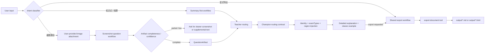
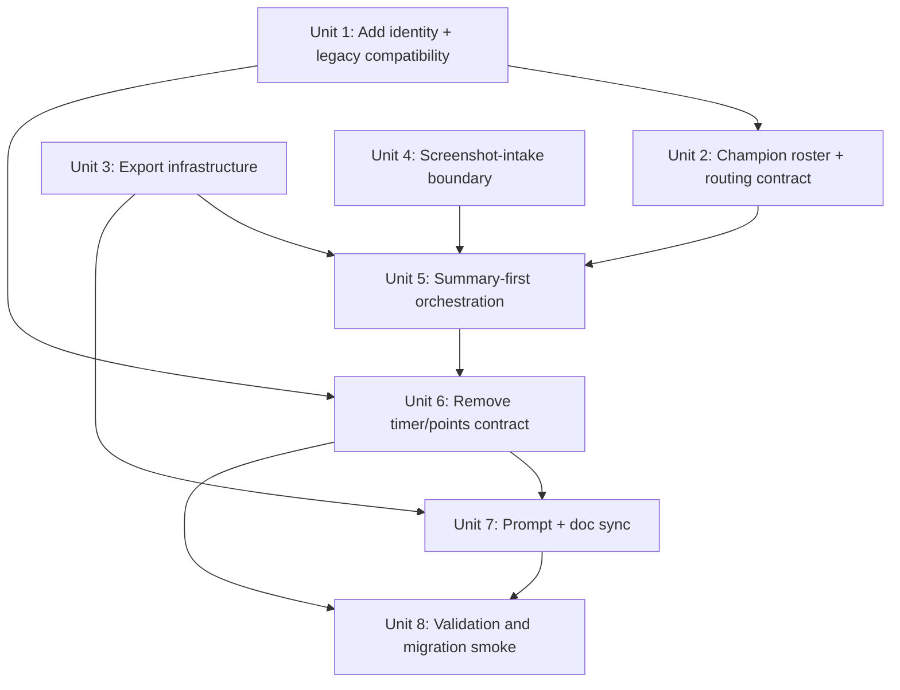

# refactor: Pivot tutoring system to summary-first guidance

## Overview

This plan pivots the project from a practice-loop-first tutoring product into a summary-first, screenshot-capable, persona-aware guidance system. The implementation keeps the recent plugin modularization work, but changes the product center: knowledge summaries, related concept explanation, classic examples, screenshot question explanation, and explicit export become the core experiences; timer-, points-, and reward-driven practice flows are removed from the supported product contract.

## Problem Frame

The latest requirements document reframes the product around knowledge explanation instead of timed practice (see origin: `docs/brainstorms/2026-04-14-001-summary-first-product-shift-requirements.md`). The current codebase has already been refactored into a thin OpenCode plugin entrypoint plus tools/services/storage, but the product surface still reflects the old model in several places:

- `opencode.json`, `.opencode/agents/orchestrator.md`, `.opencode/rules/practice-lifecycle.md`, and multiple tests still center `question-generator -> timer -> grading -> points`.
- `UserProfile` and migration logic still encode score-oriented fields such as points, level, and streak as first-class persisted concepts.
- Champion routing is still based on two static personas (`guokao-champion`, `chongqing-champion`) rather than the new `working/campus` and province-aware requirements.
- There is no explicit export capability for Markdown or HTML, even though `output/` is already used as a repo-root artifact directory.
- Screenshot question explanation is now in scope, but the repo currently has no orchestrated intake path for image-backed question solving.

The new plan therefore has to do more than add features. It must intentionally remove old product assumptions, preserve only the architectural pieces that still serve the new direction, and update prompts/docs/tests together so the repo does not drift back into the removed practice-first model.

## Requirements Trace

### Profile & Identity

- R1. Add an optional persisted `identity` field to user profiles with values `working` and `campus`, and use it to influence routing and guidance.

### Champion Routing

- R2. Replace the current champion setup with four static champion skeletons: working/campus for `guokao` and `shengkao`.
- R3. Make `shengkao` champion behavior province-aware through runtime region/persona injection rather than one static agent file per province.

### Export

- R4. Add Markdown and HTML export capabilities that write under the repo `output/` directory only on explicit export intent.
- R5. Prefer HTML over Markdown when the user explicitly requests HTML or when the exported artifact needs higher layout fidelity, including exported classic examples and richer question sheets.

### Product Contract Removal

- R6. Remove points, levels, streaks, and reward/punishment messaging from the supported product and persisted public profile contract.
- R7. Make knowledge summaries, related concept explanation, framework building, and classic examples the default system behavior rather than timed practice.
- R8. Remove timer-driven practice from the supported product contract and stop depending on timer flows in orchestrator routing.

### Screenshot Guidance

- R9. Add screenshot question explanation for general text, table-heavy, and common mixed-layout question screenshots, with detailed explanation routed through the right teachers.

### Prompt & Docs Alignment

- R10. Update README and all user-visible prompt/doc surfaces so they describe the new summary-first product truth instead of the removed practice-first model.

## Scope Boundaries

- This plan does not redesign the entire teacher roster beyond the champion split and related prompt alignment.
- This plan does not require per-province static champion agent files.
- This plan does not add a new `shiyedanwei` champion roster in v1; that lane falls back to teacher-led guidance unless expanded later.
- This plan does not introduce a database, remote storage, or a full document editor.
- This plan does not promise first-pass support for complex graphical reasoning screenshots such as heavy diagrammatic figure puzzles, handwritten annotations, or multi-page visual inputs.
- This plan does not create files implicitly; export remains an explicit user-triggered side effect.
- This plan does not preserve timer or points as compatibility features; the clarified product decision is full removal, not deprecation.

## Context & Research

### Relevant Code and Patterns

- `.opencode/plugins/coaching-tools.ts` is already a thin plugin entrypoint; the stable registration seam is `.opencode/plugins/coaching-tools/register-tools.ts`.
- The internal runtime has a clear layer split after the recent refactor:
  - `.opencode/plugins/coaching-tools/tools/`
  - `.opencode/plugins/coaching-tools/services/`
  - `.opencode/plugins/coaching-tools/storage/`
  - `.opencode/plugins/coaching-tools/migrations/`
  - `.opencode/plugins/coaching-tools/shared/`
- `UserProfile` currently lives in `.opencode/plugins/coaching-tools/shared/types.ts`, and schema normalization is enforced in `.opencode/plugins/coaching-tools/migrations/profile-schema.ts`.
- Profile creation/update flows already centralize in `.opencode/plugins/coaching-tools/services/profile-service.ts` and `.opencode/plugins/coaching-tools/tools/user-profile.ts`, which is the right extension point for adding `identity`.
- Shared prompt policy already lives in `.opencode/rules/`, and `opencode.json` already loads that directory globally via `instructions`.
- The repo already has contract and smoke tests that can be expanded instead of reinvented:
  - `.opencode/tests/coaching-tools/plugin-registration.test.ts`
  - `.opencode/tests/coaching-tools/tool-contracts.test.ts`
  - `.opencode/tests/coaching-tools/end-to-end-smoke.test.ts`
  - `.opencode/tests/prompts/prompt-assets.test.ts`
  - `.opencode/tests/prompts/opencode-config.test.ts`
- `scripts/repair-user-profiles.ts` and the migration runbooks already establish `output/` as an accepted repo-root artifact destination.

### Institutional Learnings

- There is no formal `docs/solutions/` knowledge base in this repo.
- The most relevant internal prior art is:
  - `docs/brainstorms/2026-04-14-001-summary-first-product-shift-requirements.md`
  - `docs/architecture/coaching-tools-refactor.md`
  - `docs/runbooks/refactor-smoke-checklist.md`
  - `docs/runbooks/profile-migration-policy.md`
- Those docs reveal a useful warning: the repo already invested in a recent attempt/timer architecture, so removing timer/points now is primarily a contract-drift risk across prompts, docs, tests, and schema expectations.

### External References

- OpenCode documentation indicates that agent inventory is a startup/config concern; static agent files plus runtime prompt/context injection are a better fit than runtime agent registration for province/identity variants.
- OpenCode skills are reusable instruction bundles, not new execution capabilities. Safe file export behavior should therefore be enforced by a custom tool or service boundary, with skills acting as the user-facing workflow entrypoints.
- OpenCode supports image attachments as input context, but screenshot solving still needs explicit repo-level routing and confidence handling; image input is an input modality, not a complete workflow by itself.
- OCR/layout-first guidance for mixed screenshots and tables suggests using a structured question artifact and explicit low-confidence fallback rather than asking teachers to reason directly from raw screenshot ambiguity.

## Key Technical Decisions

| Decision | Chosen approach | Rationale |
|---|---|---|
| Profile identity model | Add `identity: "working" | "campus" | null` to `UserProfile`, persist it durably, and allow later edits through the existing profile-update flows | Identity-aware champion routing is not reliable if it lives only in ephemeral conversation memory |
| Legacy profile compatibility | Use an additive-first profile migration: add `identity`, make old score/timer fields readable-but-legacy, and stop new writes before any destructive cleanup | This avoids a half-migrated state where old writers and new readers disagree on what is “core” |
| Legacy analytics policy | Freeze legacy `mastery` / `history` as read-compatible tutoring context in v1, and stop writing new score/timer-derived values until a later schema redesign explicitly replaces them | This prevents semantic drift while still preserving useful weak-topic context from existing users |
| Champion architecture | Replace the current two champion prompts with four static skeleton agents (`guokao-working`, `guokao-campus`, `shengkao-working`, `shengkao-campus`) | This matches repo conventions and keeps the agent inventory reviewable and testable |
| Champion routing contract | Define champion selection once in a shared routing rule/table, then have orchestrator/tests/docs consume that contract | Identity + examType + region routing is now load-bearing product behavior and should not be duplicated across prose surfaces |
| Province-aware `shengkao` personas | Use runtime region/persona injection in orchestrator prompts instead of runtime agent registration or one file per province | OpenCode is better suited to static role files plus contextual prompt injection than dynamic agent inventory |
| `shiyedanwei` routing fallback | Do not invent a new champion lane for `shiyedanwei` in this plan; route those requests through teachers only unless the user explicitly asks for cross-lane comparison later | The requirements only split `guokao` / `shengkao` champions, so a silent new champion lane would exceed scope |
| Missing identity fallback | When `identity` is unset, suppress identity-sensitive champion routing instead of guessing | It is safer to ask for or operate without a champion than to route a user to the wrong life-context persona |
| Multi-exam champion routing | Choose the champion lane from the current request context by default; only do multi-lane comparison when the user explicitly asks for comparison | This avoids repeating the current overly noisy “always call multiple champions” behavior |
| Ambiguous lane fallback | If the current request context is too broad to distinguish `guokao` from `shengkao`, do not guess; answer with teachers first and ask a follow-up only when champion perspective would materially help | This makes multi-exam routing deterministic without forcing noisy or inaccurate champion output |
| Export architecture | Centralize export behavior in one guarded export tool/service and one shared export workflow contract; the required Markdown/HTML skills are thin user-facing wrappers over that shared boundary | This preserves the user-requested two-skill UX without duplicating filesystem safety and content policy logic |
| Export write policy | Write files only on explicit export intent; the system may recommend export or recommend HTML, but it must not infer that export should happen. Explicit intent means the user directly asks to export/save/download/generate a file, or invokes the export skill/tool. | This keeps “format recommendation” separate from “write a file now,” protecting the no-side-effects contract |
| Export path policy | Write to repo-root `output/` using sanitized timestamped filenames and no silent overwrite | This stays aligned with the user request for `output/` while avoiding collisions with existing generated artifacts |
| Screenshot input model | Treat screenshot solving as “user uploads an image whose content is the question”, not as a system screenshot or browser-capture flow | This matches the clarified product requirement and keeps the feature inside the normal multimodal conversation path |
| Screenshot intake boundary | Introduce a dedicated screenshot-question workflow boundary that must emit a `QuestionArtifact` with fields such as `content`, `layoutType`, `confidence`, and `completeness` before orchestrator routing proceeds | Screenshot solving becomes a primary product path, so parsing cannot remain an implicit prompt-era detail |
| Screenshot intake ownership | Put screenshot parsing and completeness/confidence classification in a dedicated orchestrator/skill workflow contract over the user-provided image attachment, and make teachers/champions consumers of the resulting artifact rather than parsers of the raw image | This gives the primary screenshot flow one testable contract without inventing a new plugin-side attachment ingestion layer |
| Screenshot parser backend | Use platform-native multimodal parsing directly on the user-provided image attachment in v1; do not add a separate OCR/layout dependency in this plan | Choosing one concrete backend now keeps Unit 4 implementable and aligned with the clarified “I send you a screenshot” requirement |
| Screenshot solving v1 | Support general text, table-heavy, and common mixed-layout question screenshots; on incomplete or low-confidence parsing, stop and ask the user for a clearer screenshot or supplemental text | Screenshot explanation becomes a primary flow, so correctness is more important than pretending the parser is always certain |
| Screenshot example policy | When the user uploads a single question screenshot, that screenshot becomes the primary example; only add one extra classic example when it materially improves understanding | This keeps the response focused and avoids duplicating the same teaching value twice |
| Product-surface removal | Remove `timer` and `points` from the supported tool/config/prompt surface in the same change stream once the new summary-first routes exist | The user explicitly chose full removal, not a compatibility layer |
| Post-pivot helper boundary | Retain only stateless, non-gamified helper capabilities that support classic examples and answer explanation; do not keep the old attempt/timer/result subsystem under new labels | This keeps the new architecture honest instead of leaving the practice stack half-alive |
| Minimal session continuity | Keep only a small session/profile selection boundary after timer removal, and do not let timer-era attempt/session services survive as hidden compatibility machinery | Profile switching is still useful, but it should not drag the old timer subsystem forward |

## Open Questions

### Resolved During Planning

- Should `timer` stay as a compatibility layer? No. The clarified product decision is full removal.
- When should export write files? Only on explicit export intent, not automatically during ordinary summary/example flows.
- What should screenshot v1 cover? General text, tables, and common mixed-layout question screenshots.
- What should happen when screenshot parsing is low-confidence or incomplete? Stop and ask for a clearer screenshot or supplemental text; do not guess.
- What happens if the user asks for screenshot explanation but does not actually attach a usable image? Ask the user to upload the image or paste the question text; do not enter the screenshot flow without an image.
- Should `identity` be durable and editable later? Yes. Persist it and allow later updates through the normal profile-update path.
- How should champion routing behave when a user is preparing for multiple exam types? Route by the current request context by default; only compare across lanes when the user explicitly asks.
- What happens when the current request context is too broad to distinguish exam lanes? Do not guess; default to teacher-only or ask a follow-up when champion perspective materially matters.
- How should `shengkao` routing behave without a region? Use the generic `shengkao` skeleton without fabricating a province persona.
- How should `shiyedanwei` users be handled? Use teacher-led guidance only in v1; do not fabricate a new champion lane.
- Does README need to move with the product pivot? Yes. README is an explicit deliverable in this plan, not follow-up cleanup.
- Should export format preference imply auto-export? No. HTML preference only decides format once explicit export intent exists.
- What happens to old score/timer/profile fields in v1? They remain readable as legacy fields on disk, but they stop being part of the supported public contract and stop receiving new writes.

### Deferred to Implementation

- The final HTML template and CSS strategy for exported documents. The plan requires static, high-fidelity HTML output, but exact styling can be chosen during implementation.
- Whether legacy `data/attempts/` artifacts are deleted, archived, or retained read-only once the practice subsystem is removed. The plan requires that decision before destructive cleanup, but not before the new core flows are implemented.

## High-Level Technical Design

> *This illustrates the intended approach and is directional guidance for review, not implementation specification. The implementing agent should treat it as context, not code to reproduce.*

The critical shift is that screenshot solving and textual explanation now converge on the same summary-first explanation core, but the screenshot path has an explicit workflow boundary instead of leaving parsing to ad hoc orchestrator prose: the user provides an image attachment, the workflow turns it into a structured `QuestionArtifact`, and only then do teachers/champions explain it. Practice artifacts are no longer the organizing principle. Export remains a separate explicit intent, even when the system recommends a particular format.

## Alternative Approaches Considered

- Runtime registration of per-province champion agents: rejected because it fights the repo’s static agent architecture and adds unnecessary configuration/test complexity.
- Two fully separate export implementations for Markdown and HTML: rejected because the user-facing split does not justify duplicate filesystem logic.
- Keeping `timer` as a hidden compatibility layer: rejected because the user explicitly asked for removal and the new product center no longer justifies timer-first flows.
- Treating screenshot solving as raw multimodal prompt interpretation with no dedicated artifact boundary: rejected because table/mixed-layout screenshots require a testable parsing and fallback contract.

## Success Metrics

- Users can store and later update `identity`, and champion routing reflects it consistently.
- `shengkao` champion output becomes province-aware when `region` exists and remains generic when it does not.
- The repo can export Markdown and HTML artifacts to `output/` only on explicit export intent.
- The supported product no longer surfaces points, levels, streaks, reward text, or timer-driven flows.
- The orchestrator, README, and shared rules all present summary-first and screenshot-explain workflows as the product center.
- A broad summary request and a screenshot-backed question can both complete without invoking timer/points concepts or forcing an export side effect.
- Tests exist for profile migration, champion/config wiring, screenshot artifact handling, export safety, prompt assets, and screenshot-summary smoke flows.

## Dependencies / Prerequisites

- The repo must accept a breaking change to the old `timer`/`points` product surface; this plan assumes that is allowed.
- Legacy `data/users/*.json` fixtures should be extended to cover identity migration and legacy score-field readability before cleanup work lands.
- The export design depends on a safe writable path policy for `output/`; existing generated artifacts like repair reports should not be clobbered.
- If implementation intends to destructively clean up legacy `data/attempts/`, that retention decision must be made before destructive migration or repair scripts are finalized.

## Phased Delivery

### Phase 1

- Land additive-first profile compatibility, champion skeletons, export infrastructure, and screenshot-intake boundaries so the new primitives exist without prematurely deleting old data semantics.

### Phase 2

- Rewrite orchestrator/rules around summary-first and screenshot-explain flows, then remove timer/points and the old attempt/result subsystem from the supported contract.

### Phase 3

- Sync specialist prompts/docs/runbooks and prove the pivot with end-to-end smoke and migration validation.

## Implementation Units

- [x] **Unit 1: Add identity and legacy-read compatibility to the profile schema**

**Goal:** Add durable user identity while preserving readable legacy profile data until the old score-centric contract is fully removed.

**Requirements:** R1, R6, R10

**Dependencies:** None

**Files:**
- Modify: `.opencode/plugins/coaching-tools/shared/types.ts`
- Modify: `.opencode/plugins/coaching-tools/migrations/profile-schema.ts`
- Modify: `.opencode/plugins/coaching-tools/services/profile-service.ts`
- Modify: `.opencode/plugins/coaching-tools/tools/user-profile.ts`
- Modify: `.opencode/skills/update-profile/SKILL.md`
- Modify: `scripts/repair-user-profiles.ts`
- Modify: `docs/runbooks/profile-migration-policy.md`
- Test: `.opencode/tests/coaching-tools/profile-migration.test.ts`
- Test: `.opencode/tests/coaching-tools/profile-service.test.ts`
- Test: `.opencode/tests/coaching-tools/profile-schema-cleanup.test.ts`

**Approach:**
- Add `identity` as a persisted nullable field and make it editable through the existing create/update flows.
- Change migration/repair rules so legacy score/timer fields become readable-but-legacy rather than “core required fields”.
- Define one storage policy for legacy fields during the pivot: readable on disk, excluded from the supported public contract, and not rewritten by new summary-first flows unless a later cleanup unit explicitly does so.
- Keep `mastery` and `history` read-compatible in v1, but freeze their semantics instead of silently redefining them mid-migration.

**Execution note:** Add characterization coverage for legacy profile fixtures before changing migration behavior.

**Patterns to follow:**
- `.opencode/plugins/coaching-tools/services/profile-service.ts`
- `.opencode/plugins/coaching-tools/migrations/profile-schema.ts`
- `scripts/repair-user-profiles.ts`

**Test scenarios:**
- Happy path: create a new profile without `identity`, then update it to `working` or `campus` later through the supported profile flow.
- Edge case: load a legacy profile with no `identity`; migration leaves it as unset rather than fabricating a value.
- Edge case: legacy profiles missing points/level/streak are still readable once those fields stop being core schema.
- Error path: invalid `identity` values are rejected instead of being persisted as arbitrary strings.
- Integration: the repair script reports legacy score-bearing profiles safely and does not misclassify readable-but-upgradable records as quarantined.

**Verification:**
- Profiles can persist `identity`, and new code can read legacy profiles without treating removed score fields as required core state.

- [x] **Unit 2: Replace the champion roster and centralize routing policy**

**Goal:** Replace the fixed champion pair with four static champion skeletons and define one shared routing contract for identity/exam/region selection.

**Requirements:** R1, R2, R3

**Dependencies:** Unit 1

**Files:**
- Remove: `.opencode/agents/guokao-champion.md`
- Remove: `.opencode/agents/chongqing-champion.md`
- Create: `.opencode/agents/guokao-working-champion.md`
- Create: `.opencode/agents/guokao-campus-champion.md`
- Create: `.opencode/agents/shengkao-working-champion.md`
- Create: `.opencode/agents/shengkao-campus-champion.md`
- Create: `.opencode/rules/champion-routing.md`
- Modify: `.opencode/agents/orchestrator.md`
- Modify: `.opencode/rules/exam-context.md`
- Modify: `opencode.json`
- Test: `.opencode/tests/prompts/opencode-config.test.ts`
- Test: `.opencode/tests/prompts/prompt-assets.test.ts`
- Test: `.opencode/tests/prompts/champion-routing.test.ts`

**Approach:**
- Register four static champion agents using repo-standard kebab-case names.
- Define champion selection once in a shared routing rule that covers identity, current request context, mixed exam types, and missing region.
- For `shengkao`, use the generic skeleton when `region` is missing, and inject province-specific persona context only when `region` is present.
- Suppress identity-sensitive champion routing when `identity` is unset rather than guessing.

**Patterns to follow:**
- `AGENTS.md`
- `.opencode/agents/orchestrator.md`
- `.opencode/rules/exam-context.md`

**Test scenarios:**
- Happy path: `working + guokao` routes to the working national-exam champion skeleton.
- Happy path: `campus + shengkao + 重庆` routes to the campus provincial champion skeleton with 重庆 persona injection.
- Happy path: `shiyedanwei`-only users receive teacher-led guidance with no fabricated champion lane.
- Edge case: `shengkao` with no `region` uses the generic provincial skeleton without fabricated province detail.
- Edge case: profiles with both `guokao` and `shengkao` route by current request context rather than automatically inviting both lanes.
- Edge case: mixed `shiyedanwei + guokao/shengkao` profiles ignore `shiyedanwei` for champion selection unless a future comparison flow explicitly requests cross-lane analysis.
- Error path: unset `identity` suppresses champion routing instead of misrouting to the wrong life-context persona.
- Integration: `opencode.json`, prompt assets, and the shared routing rule stay aligned on the new champion inventory.

**Verification:**
- Champion selection becomes deterministic and identity-aware without introducing per-province agent file sprawl or duplicated routing prose.

- [x] **Unit 3: Add explicit Markdown and HTML export infrastructure**

**Goal:** Add export capabilities that safely write Markdown or HTML artifacts under `output/` only when export is explicitly requested.

**Requirements:** R4, R5, R10

**Dependencies:** None

**Files:**
- Create: `.opencode/plugins/coaching-tools/services/export-service.ts`
- Create: `.opencode/plugins/coaching-tools/tools/export-document.ts`
- Modify: `.opencode/plugins/coaching-tools/register-tools.ts`
- Create: `.opencode/skills/export-markdown/SKILL.md`
- Create: `.opencode/skills/export-html/SKILL.md`
- Create: `.opencode/rules/export-workflow.md`
- Modify: `opencode.json`
- Test: `.opencode/tests/coaching-tools/export-service.test.ts`
- Test: `.opencode/tests/coaching-tools/plugin-registration.test.ts`
- Test: `.opencode/tests/prompts/opencode-config.test.ts`

**Approach:**
- Add one guarded export tool/service that accepts format, title, and content, and enforces repo-root `output/`, filename sanitization, and no silent overwrite.
- Implement the two required skills as thin wrappers over the same export workflow contract so Markdown and HTML UX remain separate without duplicating filesystem logic.
- Keep export as an explicit side effect; teachers and orchestrator may recommend export, but only the export intent writes a file.
- Use HTML when the user explicitly requests it or when the export request explicitly asks for higher layout fidelity; use Markdown otherwise.

**Patterns to follow:**
- `scripts/repair-user-profiles.ts`
- `docs/runbooks/profile-migration-policy.md`
- `.opencode/skills/update-profile/SKILL.md`

**Test scenarios:**
- Happy path: explicit Markdown export writes a sanitized `.md` file under `output/`.
- Happy path: explicit HTML export writes a sanitized `.html` file under `output/`.
- Edge case: empty or unsafe titles fall back to a safe timestamped filename.
- Edge case: repeated exports of the same title do not silently overwrite an existing file.
- Error path: path traversal characters, reserved filenames, or directory separators are rejected.
- Integration: the new export tool appears in registration/config tests and the two skills remain thin wrappers over the same safe export boundary.

**Verification:**
- Export works only when explicitly requested, and every generated file lands safely under `output/`.

- [x] **Unit 4: Introduce a dedicated screenshot-intake boundary**

**Goal:** Create one explicit, testable boundary that converts screenshot-backed questions into a structured artifact before teacher routing begins.

**Requirements:** R5, R9, R10

**Dependencies:** None

**Files:**
- Create: `.opencode/rules/question-artifact-contract.md`
- Create: `.opencode/rules/screenshot-question-workflow.md`
- Create: `.opencode/skills/explain-screenshot-question/SKILL.md`
- Test: `.opencode/tests/prompts/screenshot-question-flow.test.ts`

**Approach:**
- Define a `QuestionArtifact` contract with at least `content`, `layoutType`, `confidence`, `completeness`, and any unresolved-region metadata needed for fallback decisions.
- Make screenshot-question explanation a dedicated orchestrator/skill workflow that operates directly on the user-provided image attachment.
- Require that workflow to produce the artifact before the orchestrator can route to teachers or champions.
- Distinguish complete, partial, and low-confidence parse outcomes so the product does not collapse everything into a binary success/fail guess.
- Use platform-native multimodal parsing behind the screenshot workflow in v1, while keeping the artifact boundary and return statuses fixed.

**Technical design:** *(directional guidance, not implementation specification)* Treat screenshot explanation as `user image attachment -> QuestionArtifact -> teacher/champion explanation`, not `attachment -> teacher`. Any route that cannot produce a complete-enough artifact must fall back to user clarification instead of entering the explanation chain.

**Patterns to follow:**
- `.opencode/rules/prompt-authoring.md`
- `.opencode/agents/orchestrator.md`

**Test scenarios:**
- Happy path: a readable mixed text/table screenshot produces a complete-enough artifact with route hints.
- Edge case: a partially parsed screenshot marks unresolved regions instead of pretending to be complete.
- Edge case: multi-question screenshots identify only the first complete question or require user cropping.
- Edge case: a screenshot request without an attached image immediately asks the user to upload the image or paste the text instead of entering the explanation flow.
- Error path: low-confidence parsing halts and requests clearer input rather than returning a fake explanation path.
- Integration: the screenshot workflow is the only path that turns a user-provided image into a `QuestionArtifact`, and teachers/champions consume only the resulting artifact.

**Verification:**
- Screenshot solving now has a concrete contract boundary that tests and prompts can share.

- [x] **Unit 5: Rewrite orchestrator around summary-first and screenshot explanation flows**

**Goal:** Make knowledge summary, screenshot explanation, champion-aware guidance, and explicit export the primary product routes.

**Requirements:** R3, R5, R7, R9, R10

**Dependencies:** Units 2, 3, and 4

**Files:**
- Modify: `.opencode/agents/orchestrator.md`
- Remove: `.opencode/rules/practice-lifecycle.md`
- Create: `.opencode/rules/summary-first-workflow.md`
- Modify: `.opencode/rules/output-format.md`
- Test: `.opencode/tests/prompts/prompt-assets.test.ts`
- Test: `.opencode/tests/prompts/screenshot-question-flow.test.ts`

**Approach:**
- Promote “总结 / 梳理 / 解释相关知识点 / 截图讲解 / 导出” into the orchestrator’s primary routing table.
- Use the `QuestionArtifact` boundary from Unit 4 so orchestrator logic consumes normalized screenshot input rather than parsing raw screenshots ad hoc.
- When a user uploads a single question screenshot, treat that screenshot as the primary example; only add one extra classic example when it materially improves the explanation.
- If the request context is too broad to select `guokao` vs `shengkao`, do not guess a champion lane; answer with teachers first and only ask a follow-up when champion context would materially improve the answer.
- Allow the workflow to recommend export, but not to write files until the user explicitly asks.

**Patterns to follow:**
- `.opencode/agents/orchestrator.md`
- `.opencode/rules/output-format.md`
- `.opencode/rules/champion-routing.md`

**Test scenarios:**
- Happy path: a readable screenshot routes into a detailed explanation with a knowledge summary and the screenshot question as the primary example.
- Edge case: `shengkao` screenshot explanation with no `region` still routes cleanly through the generic provincial champion skeleton.
- Edge case: a broad “帮我讲讲这个题” request from a dual-exam user avoids incorrect champion guesses when the lane is ambiguous.
- Edge case: screenshot explanation can recommend export without creating a file.
- Error path: incomplete artifacts fall back to user clarification instead of entering teacher routing.
- Integration: champion routing consumes the same identity/exam/region contract as the non-screenshot summary flows.

**Verification:**
- Summary-first and screenshot-backed explanation are now first-class orchestrator behaviors instead of add-on hacks.

- [x] **Unit 6: Remove timer/points and lock the post-pivot helper boundary**

**Goal:** Fully remove timer-driven practice and reward mechanics from the supported product surface, and explicitly choose which helper capabilities remain after the pivot.

**Requirements:** R6, R7, R8, R10

**Dependencies:** Units 1 and 5

**Files:**
- Modify: `.opencode/plugins/coaching-tools/register-tools.ts`
- Create: `.opencode/plugins/coaching-tools/services/session-service.ts`
- Remove: `.opencode/plugins/coaching-tools/tools/timer.ts`
- Remove: `.opencode/plugins/coaching-tools/tools/points.ts`
- Remove or archive: `.opencode/plugins/coaching-tools/services/timer-service.ts`
- Remove or archive: `.opencode/plugins/coaching-tools/services/result-service.ts`
- Remove or archive: `.opencode/plugins/coaching-tools/services/practice-service.ts`
- Modify: `.opencode/plugins/coaching-tools/tools/question-generator.ts`
- Modify: `.opencode/plugins/coaching-tools/tools/grading.ts`
- Modify: `.opencode/plugins/coaching-tools/tools/user-profile.ts`
- Modify: `.opencode/tests/coaching-tools/plugin-registration.test.ts`
- Modify: `.opencode/tests/coaching-tools/tool-contracts.test.ts`
- Modify: `.opencode/tests/coaching-tools/end-to-end-smoke.test.ts`
- Modify: `.opencode/tests/prompts/opencode-config.test.ts`

**Approach:**
- Remove `timer` and `points` from the public tool registry, orchestrator assumptions, and prompt/config tests.
- Extract `switchSessionProfile` and any current-user-selection logic that still matters into a minimal non-timer session service before removing `timer-service`, then repoint `user-profile` at that new boundary.
- Delete or archive the attempt/timer/result subsystem instead of keeping it hidden under new labels.
- Keep only clearly named, stateless helper capabilities that still serve the new product: summary/example generation and optional answer checking where appropriate.
- Ensure no new summary-first flow writes score-, streak-, timer-, or pseudo-practice-derived data back into profile storage.

**Execution note:** Add characterization coverage around the old public tool registry and smoke flows before deleting timer/points surfaces.

**Patterns to follow:**
- `.opencode/plugins/coaching-tools/register-tools.ts`
- `.opencode/tests/coaching-tools/plugin-registration.test.ts`
- `.opencode/tests/coaching-tools/end-to-end-smoke.test.ts`

**Test scenarios:**
- Happy path: plugin registration no longer exposes `timer` or `points`, while remaining supported tools still register cleanly.
- Edge case: legacy profiles with old score-centric fields still load without surfacing removed concepts to users.
- Error path: prompt/config tests fail if removed timer/points references are accidentally reintroduced.
- Integration: the end-to-end smoke path supports summary/example flows without any timer or reward dependency.

**Verification:**
- The supported product contract no longer exposes timer or points in code, config, prompts, or tests, and the remaining helper boundary is explicit.

- [x] **Unit 7: Sync specialist prompts, README, and operational docs to the new product truth**

**Goal:** Make every user-visible and contributor-visible document describe the same summary-first, screenshot-capable product without redesigning the wider teacher roster.

**Requirements:** R2, R5, R7, R8, R9, R10

**Dependencies:** Units 2-6

**Files:**
- Modify: `.opencode/agents/xingce-zong-teacher.md`
- Modify: `.opencode/agents/xingce-yanyu-teacher.md`
- Modify: `.opencode/agents/xingce-shuliang-teacher.md`
- Modify: `.opencode/agents/xingce-panduan-teacher.md`
- Modify: `.opencode/agents/xingce-ziliao-teacher.md`
- Modify: `.opencode/agents/xingce-changshi-teacher.md`
- Modify: `.opencode/agents/xingce-zhengzhi-teacher.md`
- Modify: `README.md`
- Modify: `AGENTS.md`
- Modify: `docs/architecture/coaching-tools-refactor.md`
- Modify: `docs/runbooks/profile-migration-policy.md`
- Modify: `docs/runbooks/refactor-smoke-checklist.md`
- Test: `.opencode/tests/prompts/prompt-assets.test.ts`

**Approach:**
- Restrict specialist prompt changes to contract-alignment edits only: remove practice-first/timer-first wording, strengthen summary-first framing, and add classic-example/screenshot-explanation emphasis where relevant.
- Update README to present screenshot explanation, summary-first guidance, identity-aware champions, and explicit export as core use cases.
- Update AGENTS and architecture/runbook docs to reflect the new role of shared rules, champion routing, export workflows, and the removal of timer/points.
- Keep the documentation sync in the same unit so contract drift does not reappear.

**Patterns to follow:**
- `.opencode/rules/prompt-authoring.md`
- `README.md`
- `AGENTS.md`

**Test scenarios:**
- Happy path: prompt asset tests confirm the shared-rule architecture and new summary-first wording remain intact.
- Edge case: README and runbooks no longer present timer/points as core capabilities.
- Error path: prompt tests catch accidental reintroduction of removed practice-first wording in specialist prompts.
- Integration: README, orchestrator, rules, and skills describe the same export and screenshot-explanation contract.

**Verification:**
- A contributor reading the docs and prompts sees one coherent product, not a mixture of old and new models.

- [x] **Unit 8: Prove the pivot with end-to-end and migration validation**

**Goal:** Validate that the new summary-first product works end-to-end and that legacy data/tools do not silently reassert the old model.

**Requirements:** R1-R10

**Dependencies:** Units 1-7

**Files:**
- Modify: `.opencode/tests/coaching-tools/end-to-end-smoke.test.ts`
- Create: `.opencode/tests/coaching-tools/screenshot-explain-smoke.test.ts`
- Modify: `docs/runbooks/refactor-smoke-checklist.md`

**Approach:**
- Replace the old attempt/timer/points end-to-end smoke with a new smoke suite that covers profile identity, screenshot explanation, classic examples, export, and generic-vs-province `shengkao` routing.
- Add focused validation around migration behavior so old score-centric fields do not leak back into public flows.
- Treat export-service tests as Unit 3 ownership; Unit 8 should consume that boundary in end-to-end coverage rather than duplicating its lower-level responsibility.
- Ensure the smoke checklist covers both successful explanation/export flows and failure cases such as low-confidence screenshot parsing.

**Execution note:** Start with a failing smoke path that reflects the desired screenshot-and-export product flow before final cleanup of the old smoke suite.

**Patterns to follow:**
- `.opencode/tests/coaching-tools/end-to-end-smoke.test.ts`
- `docs/runbooks/refactor-smoke-checklist.md`

**Test scenarios:**
- Happy path: create/load a profile, set identity, explain a screenshot-backed question, and explicitly export the result as Markdown or HTML.
- Happy path: `shengkao` routing with and without `region` uses the correct champion behavior.
- Edge case: low-confidence screenshot parsing halts and requests better input instead of producing a fabricated explanation.
- Edge case: explicit export with duplicate titles creates a non-overwriting output file.
- Error path: removed timer/points tool references are absent from smoke coverage and public contract checks.
- Integration: legacy migrated profiles still load under the new schema without exposing removed points/timer concepts.

**Verification:**
- The new product direction is proven by end-to-end tests and manual smoke docs, not just by prompt edits.

## System-Wide Impact

- **Interaction graph:** The pivot touches `UserProfile` schema and migrations, champion agent inventory, a new shared champion-routing contract, export workflows, screenshot-intake boundaries, orchestrator routing, prompt asset tests, and README/runbooks.
- **Error propagation:** Screenshot parsing uncertainty must fail closed into user clarification rather than flowing downstream into a teacher explanation based on guessed content.
- **State lifecycle risks:** The plan intentionally creates an additive-first compatibility window where legacy score/timer fields remain readable on disk while new summary-first flows stop writing them. That boundary must stay explicit so mixed old/new records do not get misinterpreted.
- **Schema minimization:** `mastery` and `history` remain read-compatible in v1, but their semantics are frozen rather than silently repurposed. Any later redesign should be a new explicit schema change, not an incidental side effect of this pivot.
- **Routing certainty:** Champion selection must come from the shared routing contract, not from weak inference spread across prompts.
- **API surface parity:** `opencode.json`, orchestrator prompts, shared rules, skills, README, and tests must all agree on the new core flows and removed tool surfaces.
- **Integration coverage:** Unit tests alone are insufficient; the plan requires smoke validation across profile identity, screenshot explanation, champion routing, and export behavior.
- **Unchanged invariants:** The system remains an OpenCode-based multi-agent tutoring repo with local JSON persistence under `data/` and generated artifacts under `output/`. The plan changes the product center, not the repo’s fundamental local-first architecture.

## Risks & Dependencies

| Risk | Mitigation |
|------|------------|
| Screenshot parsing is too uncertain for mixed layouts | Add a confidence gate and explicit fallback to clearer screenshot/text instead of guessing |
| Removing timer/points breaks prompts/tests/docs unevenly | Land additive-first profile compatibility and summary-first routing before deletion, then remove contract surfaces and update docs/tests in the same stream |
| Province-aware persona injection drifts from static agent files | Keep province behavior in orchestrator/runtime context injection and keep the skeleton inventory static |
| Export writes unsafe or conflicting filenames | Centralize export writes in one guarded service/tool with sanitized timestamped filenames and no silent overwrite |
| Legacy score-bearing profiles or attempt artifacts leak removed concepts into the new UX | Make schema migration and smoke validation explicitly cover legacy data read behavior, no-new-write policy, and public-response cleanup |

## Risk Analysis & Mitigation

| Risk | Likelihood | Impact | Mitigation |
|------|-----------|--------|------------|
| Screenshot explanation on partial OCR | Medium | High | Dedicated screenshot-intake boundary + confidence/completeness contract + screenshot smoke tests |
| Contract drift during timer/points removal | High | High | Update orchestrator, rules, tests, config, README, and runbooks in coordinated units after the new core flows exist |
| Identity-aware champion routing misfires on unset identity | Medium | Medium | Nullable identity with suppression fallback and routing tests |
| Export path safety bugs | Medium | Medium | Guarded export tool, no overwrite by default, explicit path/filename tests |
| Legacy data migration surprises | Medium | Medium | Extend migration fixtures, repair script reporting, readable-legacy-field policy, and smoke checklist before final cleanup |

## Documentation Plan

- Update `README.md` to make summary-first guidance, screenshot explanation, and explicit export the headline product paths.
- Update `AGENTS.md` to reflect the new champion inventory, shared-rule responsibilities, and removed timer/points contract.
- Update `docs/architecture/coaching-tools-refactor.md` so it stops presenting attempt/timer/points as the product center.
- Update `docs/runbooks/profile-migration-policy.md` and `docs/runbooks/refactor-smoke-checklist.md` to describe schema cleanup, export validation, and screenshot explanation smoke steps.

## Operational / Rollout Notes

- Treat the removal of `timer` and `points` as a coordinated breaking-change rollout inside the repo, not as a silent partial migration.
- Do not ship screenshot explanation in a “best effort” mode that guesses through low-confidence inputs.
- Keep export explicit; if implementation finds places where the system wants to auto-export, that should be treated as a follow-up product decision, not folded into this plan.
- Update README in the same merge as the code and prompt changes so new contributors do not bootstrap from obsolete product assumptions.

## Sources & References

- **Origin document:** `docs/brainstorms/2026-04-14-001-summary-first-product-shift-requirements.md`
- Related plan: `docs/plans/2026-04-14-001-refactor-coaching-tools-prompt-architecture-plan.md`
- Related code: `.opencode/plugins/coaching-tools/register-tools.ts`
- Related code: `.opencode/plugins/coaching-tools/shared/types.ts`
- Related code: `.opencode/plugins/coaching-tools/services/profile-service.ts`
- Related code: `.opencode/agents/orchestrator.md`
- Related docs: `docs/architecture/coaching-tools-refactor.md`
- External docs: `https://opencode.ai/docs/agents`
- External docs: `https://opencode.ai/docs/skills`
- External docs: `https://opencode.ai/docs/plugins`
