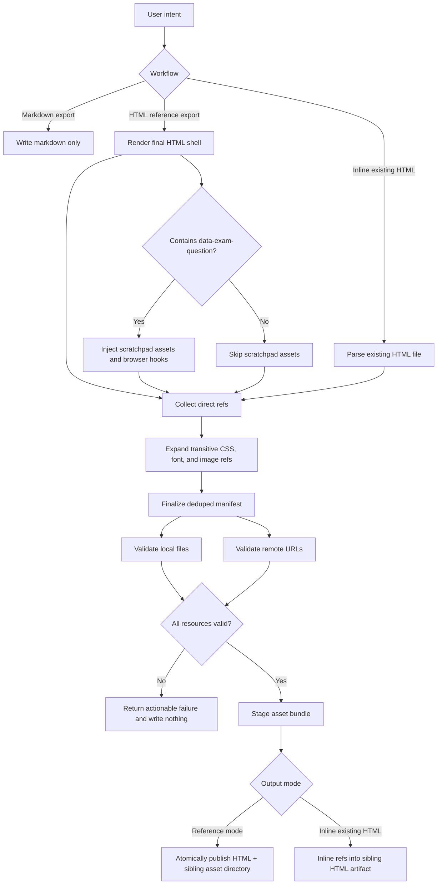
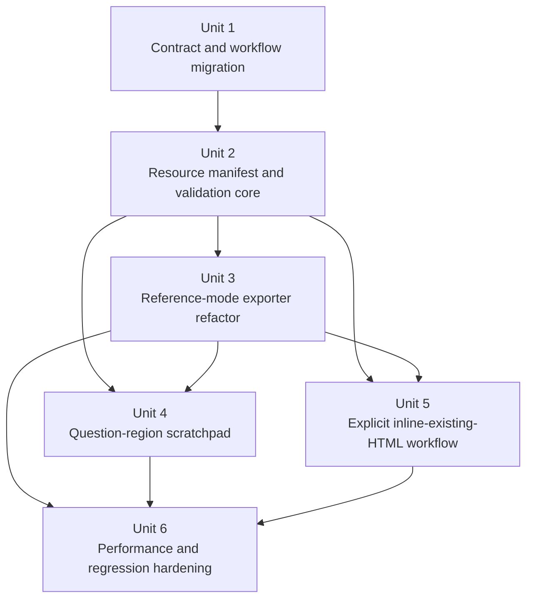
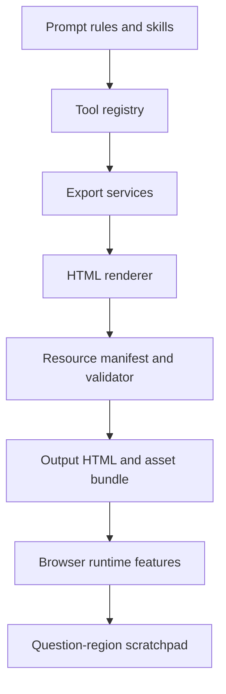

# feat: Refactor HTML Export for Validated Resource References and Scratchpad Support

## Overview

This plan changes HTML export from the current inline-first, single-file strategy to a validated reference-based strategy, while adding a mouse scratchpad that only activates inside explicitly marked exam-question regions. It also introduces a separate opt-in workflow for inlining an existing HTML file's resources when the user explicitly asks for that outcome.

| Mode | Trigger | Resource strategy | Validation policy | Primary goal |
|---|---|---|---|---|
| Markdown export | Default non-HTML export | No HTML runtime assets | None beyond current file-write checks | Preserve current behavior |
| HTML reference export | `export-html` skill and normal HTML export path | Reference runtime/local assets instead of inlining | Mandatory pre-write validation for all required resources | Fast default export |
| HTML inline existing file | New explicit skill for existing HTML | Inline referenced resources into a sibling HTML artifact | Mandatory validation before inlining; fail on any inaccessible resource | Explicit offline packaging |

## Problem Frame

The current export contract is the opposite of the new requirement. `.opencode/plugins/coaching-tools/services/html-renderer/index.ts` still inlines local images via `inlineLocalImagesInHtml(...)`, `.opencode/plugins/coaching-tools/services/html-renderer/runtime-assets.ts` still embeds runtime JS/CSS/fonts into the HTML shell, and `.opencode/rules/export-workflow.md` plus `.opencode/skills/export-html/SKILL.md` both promise single-file inline-first HTML. Existing tests in `.opencode/tests/coaching-tools/export-service.test.ts` encode that behavior.

The new requirement introduces three cross-cutting changes at once:

1. Exported HTML question sections need browser-side scratch work support.
2. HTML export must stop inlining by default and instead emit validated resource references.
3. Explicit HTML inlining must become a separate, opt-in workflow with failure on inaccessible resources.

Because this changes tool contracts, prompt rules, renderer output shape, browser runtime behavior, and performance expectations, it needs a coordinated deep plan instead of a renderer-only patch.

## Requirements Trace

- R1. Exported HTML supports mouse-based scratch work only inside explicitly marked exam-question regions.
- R2. Scratch work is ephemeral by default: no persistence across refresh, reopen, or re-export.
- R3. Default HTML export no longer inlines local images, runtime libraries, fonts, or stylesheets.
- R4. Every resource referenced by the exported HTML is validated before any output file is written.
- R5. Validation covers both local file existence/readability and remote URL reachability.
- R6. If any required resource is inaccessible, export fails with actionable feedback and does not emit a partial artifact.
- R7. A new explicit skill exists for inlining resources in an existing HTML file; it only runs on explicit user intent.
- R8. The inline-existing-HTML workflow fails on inaccessible resources instead of falling back to best effort.
- R9. Export speed is a first-class metric; the default export path must remain noticeably faster than the explicit inline path, while acknowledging that remote references add validation latency.
- R10. Markdown export remains unchanged, and HTML documents without `data-exam-question` markers do not receive scratchpad assets or behavior.

## Scope Boundaries

- No automatic exam-question detection heuristics in the initial implementation.
- No scratchpad persistence via `localStorage`, `sessionStorage`, IndexedDB, query params, or exported stroke data.
- No fallback from validation failure to silent best-effort output.
- No browser-side URL reachability checks inside the exported page.
- No change to the rule that files are only written when the user explicitly asks to export or inline HTML.
- No new “one-step inline newly generated HTML” workflow in this phase; users who want standalone HTML will export first, then explicitly run the inline-existing-HTML workflow.

### Deferred to Separate Tasks

- Advanced scratchpad tooling such as eraser modes, color palettes, stroke history, or exportable annotations.
- Policy-driven remote domain allowlists or tenant-specific resource governance.
- Garbage-collection or cleanup tooling for old per-export asset directories under `output/`.

## Context & Research

### Relevant Code and Patterns

- `.opencode/plugins/coaching-tools/tools/export-document.ts` is the current thin tool adapter and defines the user-facing export contract.
- `.opencode/plugins/coaching-tools/services/export-service.ts` owns output path generation and the single write point.
- `.opencode/plugins/coaching-tools/services/html-renderer/index.ts` is the renderer entry that currently converts Markdown to HTML and injects runtime assets.
- `.opencode/plugins/coaching-tools/services/html-renderer/assets.ts` and `.opencode/plugins/coaching-tools/services/html-renderer/runtime-assets.ts` currently inline local images and browser runtime assets.
- `.opencode/plugins/coaching-tools/register-tools.ts` and `.opencode/plugins/coaching-tools.ts` are the stable tool registration surfaces.
- `.opencode/rules/export-workflow.md`, `.opencode/skills/export-html/SKILL.md`, and `.opencode/agents/orchestrator.md` define the shared export workflow and user-triggered skill routing.
- `.opencode/tests/coaching-tools/export-service.test.ts`, `.opencode/tests/coaching-tools/plugin-registration.test.ts`, `.opencode/tests/coaching-tools/tool-contracts.test.ts`, and `.opencode/tests/prompts/prompt-assets.test.ts` are the contract tests that must move with the behavior change.

### Institutional Learnings

- There is no `docs/solutions/` directory in this repo, so no prior learnings artifact exists to inherit directly.
- The repo consistently keeps workflow policy in `.opencode/rules/` and uses skills as thin operational entry points; `AGENTS.md` and `.opencode/rules/prompt-authoring.md` explicitly discourage duplicating shared workflow text.
- Current tests encode product policy, not just implementation detail. Changing export semantics without changing tests and prompt assets will create drift quickly.

### External References

- MDN Pointer Events, `setPointerCapture()`, `touch-action`, and Canvas optimization guidance support a scoped overlay-canvas scratchpad pattern for static HTML.
- Mermaid 11 usage docs recommend `initialize({ startOnLoad: false })` plus `mermaid.run(...)`, which matches the current browser runtime pattern.
- Chart.js responsive docs confirm the need for a dedicated container sizing strategy, which matters when a scratchpad overlay shares the same question region.
- Markmap docs (`markmap-lib`, `markmap-view`, `markmap-toolbar`) support feature-aware runtime asset emission and separate toolbar assets.
- KaTeX browser docs highlight that referenced CSS plus font-path correctness matter more than client-side KaTeX JS for this renderer, since formulas are server-rendered today.
- MDN Fetch / HEAD docs and browser CORS caveats support validating remote URLs at export time in Node instead of inside the exported HTML.

## Key Technical Decisions

- **Default HTML export becomes a validated reference-mode export**: the normal `export-document` HTML path will emit referenced runtime and content assets instead of inline payloads, because this is the fastest way to satisfy the new contract without forcing expensive file inflation on every export.
- **Exam-question scratchpad uses an explicit marker contract**: the canonical marker is `data-exam-question` on a raw HTML wrapper in the Markdown content, because `marked` already passes raw HTML through and the user explicitly chose explicit marking over heuristics.
- **Scratchpad stays memory-only**: scratch strokes live only in browser memory and disappear on refresh/reopen, which matches the chosen product behavior and avoids write-time or runtime persistence cost.
- **Validation runs in Node before any write**: local existence/readability checks and remote reachability checks will happen in export services, not browser runtime, because browser validation is unreliable under CORS and `file://` execution.
- **Reference-mode export uses one same-stem sibling asset directory per HTML file**: each exported HTML artifact writes one asset directory containing the runtime libraries and copied local resources required by that HTML file. This keeps the packaging contract simple and portable.
- **Resource classes stay explicit**: the manifest must distinguish owned/generated runtime assets, local referenced/copied assets, and remote referenced assets because each class has different validation, bundling, and failure semantics.
- **Remote reference semantics are explicit**: successful validation only proves reachability at export time. Default reference-mode HTML is not guaranteed to remain offline-safe later; users needing that guarantee must use the explicit inline-existing-HTML flow.
- **Remote validation is security-bounded**: only `http:` and `https:` remote references are eligible for validation or inlining; redirect hops must be revalidated, and loopback, private, link-local, and metadata-network targets are rejected.
- **Local resource resolution is root-bounded**: local file reads must stay inside an allowed root set (the current worktree for exported content and the input HTML directory tree for explicit existing-HTML inlining) after canonicalization; `file:` URLs and traversal outside allowed roots are rejected.
- **Trusted-authoring HTML stance is explicit**: this phase does not add a general sanitizer for arbitrary active HTML/JS. Exported HTML remains a trusted-authoring workflow, and docs/tool messaging must warn that active content is preserved rather than neutralized.
- **No-marker scratchpad behavior is non-fatal**: if an HTML export contains no `data-exam-question` markers, export still succeeds as normal HTML and the user-facing response should state that scratchpad was not enabled because no marked question region was found.
- **Reference-mode success response is multi-artifact aware**: the user-facing success message must return the HTML path plus the sibling asset-directory path and explicitly say they must be kept together.
- **Inline-existing-HTML uses dedicated parsers**: the existing-HTML workflow must use proper HTML and CSS parsing rather than regex-only traversal so `src`, `href`, `@import`, and `url(...)` references are resolved consistently.
- **Inline-existing-HTML is a separate tool and skill**: explicit intent must remain visible in the workflow and must not be hidden behind a flag inside normal export, because the repo consistently favors distinct, explicit user-triggered workflows and the current `export-document` contract is Markdown-in, renderer-owned HTML-out.

### Packaging Contract

- Reference-mode export publishes a bundle, not a lone file: one HTML file plus one same-stem sibling asset directory containing both required runtime libraries and copied local content assets.
- The HTML file is only valid when moved together with its sibling asset directory. The plan does not promise that moving the HTML file alone preserves correctness.
- Generated runtime assets are staged inside the sibling asset directory and published atomically; referenced external/local dependencies are validated before publish, while owned/generated runtime artifacts only become visible after a successful final publish step.
- Failed publishes must clean up staged HTML and staged asset directories so users never see a mismatched HTML-to-asset bundle.

## Open Questions

### Resolved During Planning

- **Should scratchpad annotations persist?** No. Default behavior is ephemeral-only, with no persistence across refresh or reopen.
- **How is the scratchpad region selected?** Only explicitly marked question regions participate. The plan standardizes on `data-exam-question` markers.
- **Where should resource validation run?** In Node during export/inlining, not in the browser.
- **Is export speed a first-class constraint?** Yes. The plan treats reference-mode export as the fast path and inline-existing-HTML as a slower explicit path.

### Deferred to Implementation

- **CSS dependency parser choice**: a fast parser-first approach is preferred, but the exact library or fallback strategy can be decided during execution once the existing CSS reference patterns are inspected.
- **Remote validation constants**: timeout values, redirect caps, and concurrency numbers should be set during implementation using the agreed performance budget below, not frozen in the plan as magic numbers.

## Output Structure

```text
docs/plans/
  2026-04-16-001-feat-html-export-resource-modes-plan.md

.opencode/plugins/coaching-tools/
  register-tools.ts
  tools/
    export-document.ts
    inline-html-resources.ts
  services/
    export-service.ts
    inline-html-resources-service.ts
    html-renderer/
      index.ts
      assets.ts
      runtime-assets.ts
      client-scripts.ts
      css-template.ts
      code-blocks.ts
      resource-manifest.ts
      resource-validator.ts
      resource-bundler.ts

.opencode/skills/
  export-html/SKILL.md
  export-markdown/SKILL.md
  inline-html/SKILL.md

.opencode/rules/
  export-workflow.md

.opencode/tests/
  coaching-tools/
    export-service.test.ts
    inline-html-resources.test.ts
    plugin-registration.test.ts
    tool-contracts.test.ts
  prompts/
    prompt-assets.test.ts
    opencode-config.test.ts
```

## High-Level Technical Design

> *This illustrates the intended approach and is directional guidance for review, not implementation specification. The implementing agent should treat it as context, not code to reproduce.*



## Implementation Units



- [ ] **Unit 1: Migrate the Export Contract to Reference-Mode by Default**

**Goal:** Update the shared workflow, skills, tool description, and orchestrator-facing contract so the repo consistently describes HTML export as validated reference-mode by default and explicit HTML inlining as a separate opt-in workflow.

**Requirements:** R3, R7, R8, R9, R10

**Dependencies:** None

**Files:**
- Modify: `.opencode/rules/export-workflow.md`
- Modify: `.opencode/skills/export-html/SKILL.md`
- Modify: `.opencode/skills/export-markdown/SKILL.md`
- Modify: `.opencode/plugins/coaching-tools/tools/export-document.ts`
- Test: `.opencode/tests/prompts/prompt-assets.test.ts`

**Approach:**
- Change the default HTML wording from “single-file/offline-first” to “validated references by default”.
- Define the explicit marker contract for scratch-enabled question regions so the documentation and later implementation align.
- Document that HTML inlining applies only to existing HTML and only when the user explicitly asks for it.
- Clarify that `export-markdown` changes are documentation-only drift control, not a Markdown behavior change.
- Document the user-facing bundle success wording and the non-fatal “no marked question region found” behavior for scratchpad-aware exports.
- Keep shared policy in `.opencode/rules/` and skill docs operational, following repo conventions.

**Patterns to follow:**
- `.opencode/rules/export-workflow.md`
- `.opencode/skills/export-html/SKILL.md`
- `.opencode/skills/export-markdown/SKILL.md`

**Test scenarios:**
- Happy path: prompt asset tests confirm HTML export is described as reference-mode by default and explicit inline HTML is described as a separate flow.
- Happy path: prompt asset tests confirm the new scratchpad marker syntax appears in the HTML export skill guidance.
- Integration: prompt assets describe the multi-artifact success contract and the “no marker, no scratchpad” result without contradicting renderer behavior.
- Edge case: prompt assets continue to preserve the “only write files on explicit user intent” rule after the contract migration.

**Verification:**
- Shared rules, skills, and tool description all describe the same export defaults and explicit inline path, with no contradictory inline-first language left in prompt assets.

- [ ] **Unit 2: Build a Resource Manifest and Validation Core**

**Goal:** Introduce a reusable manifest/validator layer that can enumerate required HTML resources, validate them before write, and report failures consistently for both default export and explicit HTML inlining.

**Requirements:** R4, R5, R6, R8, R9

**Dependencies:** Unit 1

**Files:**
- Create: `.opencode/plugins/coaching-tools/services/html-renderer/resource-manifest.ts`
- Create: `.opencode/plugins/coaching-tools/services/html-renderer/resource-validator.ts`
- Modify: `.opencode/plugins/coaching-tools/services/html-renderer/assets.ts`
- Modify: `.opencode/plugins/coaching-tools/services/html-renderer/runtime-assets.ts`
- Modify: `.opencode/plugins/coaching-tools/services/export-service.ts`
- Test: `.opencode/tests/coaching-tools/resource-validation.test.ts`
- Test: `.opencode/tests/coaching-tools/export-service.test.ts`

**Approach:**
- Define a manifest model that can represent runtime assets, local content assets, remote URLs, and transitive CSS dependencies.
- Make resource classes explicit in the manifest: owned/generated runtime assets, local referenced/copied assets, and remote referenced assets.
- Normalize and deduplicate resource entries before validation so repeated references are checked once.
- Validate local assets with real filesystem operations and path normalization, not best-effort existence probing.
- Validate remote assets in Node via URL parsing plus `HEAD` and `GET` fallback with timeout and redirect handling.
- Reject loopback, private, link-local, metadata-network, `file:`, and traversal-escaped targets as invalid resources before any fetch or read occurs.
- Aggregate failures by resource and referring surface so the tool can return actionable messages.
- Add pre-publish failure cleanup rules at the service boundary so a validation failure leaves behind neither HTML nor per-export asset directories.

**Execution note:** Start with failing validation tests that assert no HTML file is written when any required resource is invalid.

**Technical design:** *(directional guidance, not implementation specification)*

Use a manifest pipeline with three passes: (1) collect direct refs from final HTML, (2) expand transitive refs from referenced CSS files, (3) validate deduplicated refs with separate local and remote strategies. The validator should return a structured report that the export and inline services can render into user-facing failures.

**Patterns to follow:**
- `.opencode/plugins/coaching-tools/services/export-service.ts`
- `.opencode/plugins/coaching-tools/services/html-renderer/assets.ts`
- `.opencode/tests/setup/temp-worktree.ts`

**Test scenarios:**
- Happy path: local runtime CSS/JS/font assets required by the exported HTML validate successfully and produce a complete manifest report.
- Happy path: duplicate references to the same local image or runtime asset validate only once within one export.
- Edge case: CSS files that reference fonts or nested images add those transitive dependencies to the manifest.
- Edge case: Windows-style paths, spaces in filenames, and sibling relative assets resolve into a valid normalized manifest entry.
- Error path: a local path that resolves outside the allowed root set is rejected before read or inline.
- Error path: a remote URL that resolves to a blocked private or loopback target is rejected before validation or fetch.
- Error path: a missing local image, stylesheet, script, or font returns a structured failure tied to the referring resource.
- Error path: an invalid remote URL, timeout, redirect loop, or non-OK status produces a distinct validation failure reason.
- Integration: export service refuses to write any HTML file or per-export asset directory when the validator reports a failure.

**Verification:**
- Both export and inline workflows can call one validation layer and receive structured pass/fail results without duplicating resource traversal logic.

- [ ] **Unit 3: Refactor Default HTML Export to Fast Reference Mode**

**Goal:** Replace inline-by-default export with a reference-mode package that writes HTML plus a sibling asset directory of validated referenced assets while keeping export latency low.

**Requirements:** R3, R4, R5, R6, R9, R10

**Dependencies:** Unit 2

**Files:**
- Create: `.opencode/plugins/coaching-tools/services/html-renderer/resource-bundler.ts`
- Modify: `.opencode/plugins/coaching-tools/services/export-service.ts`
- Modify: `.opencode/plugins/coaching-tools/services/html-renderer/index.ts`
- Modify: `.opencode/plugins/coaching-tools/services/html-renderer/runtime-assets.ts`
- Modify: `.opencode/plugins/coaching-tools/services/html-renderer/assets.ts`
- Modify: `.opencode/plugins/coaching-tools/services/html-renderer/code-blocks.ts`
- Test: `.opencode/tests/coaching-tools/export-service.test.ts`

**Approach:**
- Change the renderer result to emit references instead of data URLs or inline `<script>/<style>` payloads.
- Write one same-stem sibling asset directory per HTML artifact and place both runtime libraries and copied local assets there.
- Keep remote URLs as remote references only after Node-side validation succeeds.
- Move write sequencing to “render -> finalize manifest -> validate -> stage bundle -> atomic publish” so no broken partial file is emitted.
- Preserve Markdown export behavior and current filename/path safety rules.
- Return both the HTML path and sibling asset-directory path from the user-facing export contract so the bundle shape is explicit to callers.

**Execution note:** Start with failing service tests for “no inline data URLs by default”, “no write on validation failure”, and “single HTML plus sibling asset directory output”.

**Patterns to follow:**
- `.opencode/plugins/coaching-tools/services/export-service.ts`
- `.opencode/plugins/coaching-tools/services/html-renderer/index.ts`
- `.opencode/tests/coaching-tools/export-service.test.ts`

**Test scenarios:**
- Happy path: HTML export with local images, Mermaid, Chart.js, Markmap, and KaTeX writes an HTML file plus referenced asset files instead of inline payloads.
- Happy path: repeated exports keep the same simple `html + sibling asset directory` contract without introducing an additional runtime lookup layer.
- Edge case: documents with only plain text and no HTML runtime features avoid copying unnecessary runtime assets.
- Edge case: relocating the full HTML bundle together with its sibling asset directory preserves relative references.
- Edge case: exporting a document that asks for scratchpad-aware content but contains no `data-exam-question` markers succeeds and returns a “scratchpad not enabled” notice.
- Error path: a missing local asset or unreachable remote URL prevents HTML write and reports all failing resources.
- Error path: a bundling or publish failure cleans up staged HTML and staged asset directories instead of leaving orphans behind.
- Integration: Markdown export still writes directly to `output/` and does not trigger HTML asset validation.
- Integration: TOC, chart initialization, markmap rendering, and image references still resolve correctly after the switch to referenced assets.
- Integration: end-to-end export through the public tool writes the expected output tree shape under `output/`.

**Verification:**
- The default HTML export path emits a complete, portable `html + sibling asset directory` bundle and remains the fastest export mode for normal use.

- [ ] **Unit 4: Add Question-Scoped Ephemeral Scratchpad Support**

**Goal:** Add a lightweight scratchpad overlay that activates only inside explicitly marked question regions and disappears on reload.

**Requirements:** R1, R2, R9, R10

**Dependencies:** Unit 1, Unit 2, Unit 3

**Files:**
- Modify: `.opencode/plugins/coaching-tools/services/html-renderer/index.ts`
- Modify: `.opencode/plugins/coaching-tools/services/html-renderer/client-scripts.ts`
- Modify: `.opencode/plugins/coaching-tools/services/html-renderer/css-template.ts`
- Modify: `.opencode/plugins/coaching-tools/services/html-renderer/runtime-assets.ts`
- Modify: `.opencode/plugins/coaching-tools/services/html-renderer/resource-manifest.ts`
- Modify: `.opencode/plugins/coaching-tools/services/html-renderer/resource-bundler.ts`
- Modify: `.opencode/skills/export-html/SKILL.md`
- Test: `.opencode/tests/coaching-tools/export-service.test.ts`
- Test: `.opencode/tests/coaching-tools/html-scratchpad.test.ts`

**Approach:**
- Standardize on raw HTML wrappers such as `<section data-exam-question>` as the marker contract.
- Detect marker presence in the finalized HTML and inject scratchpad assets only when at least one question region exists.
- Use a per-question overlay canvas with Pointer Events, pointer capture, and `devicePixelRatio` sizing so drawing remains crisp without forcing heavy runtime code into all exports.
- Keep the UI intentionally narrow: toggle on/off, draw, clear, and exit. No persistence or implicit export of strokes.
- Ensure scratchpad is opt-in at the region level and does not interfere with reading, scrolling, or text selection when inactive.
- Make the skill docs teach the marker wrapper directly, because current teacher-answer exports do not produce these markers automatically.
- Make the skill docs teach the marker wrapper directly, because current teacher-answer exports do not produce these markers automatically.

**Marker contract:**
- Only block containers are supported marker hosts in v1, using `data-exam-question`.
- Nested markers resolve with the outermost marker winning so one visible scratch surface owns one logical question region.
- Scratchpad assets are added to the resource manifest only when at least one marked region exists.
- Inactive scratch mode must preserve scrolling, text selection, and link clicking inside the marked region.
- Mouse is the primary supported input in v1; Pointer Events may enable touch/stylus opportunistically, but mobile-specific UX is not part of the contract.
- Mouse is the primary supported input in v1; Pointer Events may enable touch/stylus opportunistically, but mobile-specific UX is not part of the contract.

**Technical design:** *(directional guidance, not implementation specification)*

Each `data-exam-question` container becomes `position: relative` in the HTML shell. On page load, the browser script scans only those containers, appends an overlay canvas plus a small control strip, and keeps stroke state in memory only. Unmarked documents skip scratchpad bootstrapping entirely.

**Patterns to follow:**
- `.opencode/plugins/coaching-tools/services/html-renderer/client-scripts.ts`
- `.opencode/plugins/coaching-tools/services/html-renderer/css-template.ts`
- `.opencode/skills/export-html/SKILL.md`

**Test scenarios:**
- Happy path: an exported document containing `data-exam-question` markers includes scratchpad hooks and scoped browser initialization for those regions only.
- Happy path: multiple marked question regions each receive an independent scratchpad overlay.
- Edge case: documents without any markers do not include scratchpad UI or listeners.
- Edge case: nested or duplicate markers resolve to one active overlay per top-level marked region.
- Error path: scratchpad activation failure in one region does not prevent the rest of the document from loading.
- Integration: the scratchpad overlay does not write to browser storage and disappears after reload or reopening the file.
- Integration: marked regions that also contain charts, mermaid diagrams, or markmaps still render those features correctly beneath the inactive scratchpad overlay.

**Verification:**
- Marked question blocks can be drafted on with the mouse, while normal note content remains read-only and unaffected.

- [ ] **Unit 5: Add the Explicit Existing-HTML Resource Inlining Workflow**

**Goal:** Create a separate tool and skill that inline resources in an existing HTML file only when the user explicitly asks for that workflow.

**Requirements:** R7, R8, R9

**Dependencies:** Unit 1, Unit 2, Unit 3

**Files:**
- Create: `.opencode/plugins/coaching-tools/services/inline-html-resources-service.ts`
- Create: `.opencode/plugins/coaching-tools/tools/inline-html-resources.ts`
- Modify: `.opencode/plugins/coaching-tools/register-tools.ts`
- Modify: `.opencode/plugins/coaching-tools.ts`
- Modify: `.opencode/package.json`
- Create: `.opencode/skills/inline-html/SKILL.md`
- Modify: `opencode.json`
- Modify: `.opencode/agents/orchestrator.md`
- Test: `.opencode/tests/coaching-tools/inline-html-resources.test.ts`
- Test: `.opencode/tests/coaching-tools/plugin-registration.test.ts`
- Test: `.opencode/tests/coaching-tools/tool-contracts.test.ts`
- Test: `.opencode/tests/prompts/prompt-assets.test.ts`
- Test: `.opencode/tests/prompts/opencode-config.test.ts`

**Approach:**
- Add a dedicated public tool for “inline resources from an existing HTML file”, rather than overloading `export-document`.
- Reuse the shared manifest and validator to parse an existing HTML file, validate every referenced resource, and inline only after the resource graph is fully valid.
- Write the result as a sibling artifact (for example, `*-inlined.html`) so the original HTML remains intact.
- Keep the skill narrow: it should only run when the user explicitly requests HTML inlining.
- Preserve the default workflow split explicitly in docs and verification: users who want newly generated standalone HTML must export first, then run this explicit inline tool on the result.
- Introduce explicit HTML/CSS parsing dependencies in `.opencode/package.json` as part of this unit so base-path resolution and transitive resource extraction are grounded, not deferred.

**Execution note:** Implement new public-tool contract tests before wiring the skill and orchestrator guidance.

**Patterns to follow:**
- `.opencode/plugins/coaching-tools/tools/export-document.ts`
- `.opencode/plugins/coaching-tools/register-tools.ts`
- `.opencode/tests/coaching-tools/plugin-registration.test.ts`
- `.opencode/tests/coaching-tools/tool-contracts.test.ts`

**Test scenarios:**
- Happy path: given an existing HTML file with reachable local and remote resources, the new tool writes a sibling inlined artifact and leaves the original untouched.
- Happy path: repeated references inside the same HTML file are inlined once per occurrence without re-validating the resource multiple times.
- Edge case: HTML files with mixed local references, remote URLs, and already-inlined `data:` assets preserve already-inlined assets and only process referenced resources.
- Error path: if any referenced local file is missing, the workflow returns a failure and writes no inlined output.
- Error path: if any remote URL is unreachable or times out, the workflow returns a failure and writes no inlined output.
- Integration: plugin registry, tool contracts, orchestrator guidance, and skill assets all expose the new explicit inline-html workflow without changing existing export behavior.

**Verification:**
- Users have a separate, explicit way to request standalone HTML inlining, and the workflow never produces a half-inlined artifact.

- [ ] **Unit 6: Lock In Performance and Regression Guardrails**

**Goal:** Codify the new default/reference-mode behavior, performance-sensitive packaging choices, and failure semantics so the contract does not drift back toward slow inline-by-default exports.

**Requirements:** R3, R4, R6, R7, R8, R9, R10

**Dependencies:** Unit 3, Unit 4, Unit 5

**Files:**
- Modify: `.opencode/tests/coaching-tools/export-service.test.ts`
- Modify: `.opencode/tests/coaching-tools/inline-html-resources.test.ts`
- Modify: `.opencode/tests/prompts/prompt-assets.test.ts`
- Modify: `.opencode/tests/prompts/opencode-config.test.ts`
- Modify: `.opencode/plugins/coaching-tools/tools/export-document.ts`
- Modify: `.opencode/skills/export-html/SKILL.md`
- Modify: `.opencode/rules/export-workflow.md`

**Approach:**
- Replace today’s inline-first assertions with structural guards that encode the new contract: referenced assets by default, no write on validation failure, explicit inline path, and conditional scratchpad injection.
- Add performance-oriented regression checks that avoid brittle wall-clock timing but still prove the fast path is structured correctly, such as deduped validation, stable sibling-asset packaging, and no scratchpad assets in documents without marked question regions.
- Document measurable performance budgets so implementation can tune timeouts and bundling choices against a clear target.
- Add an end-to-end smoke path that exercises skill/orchestrator guidance, tool contract, export write, and output tree shape together.

**Patterns to follow:**
- `.opencode/tests/coaching-tools/export-service.test.ts`
- `.opencode/tests/prompts/prompt-assets.test.ts`

**Test scenarios:**
- Happy path: local-only HTML export keeps the stable `html + sibling asset directory` layout and avoids inline payloads.
- Happy path: documents without marked question regions do not pay the scratchpad asset cost.
- Edge case: repeated remote references are validated once per export job and surfaced once in failure reporting.
- Error path: validation failures for default export and inline-existing-HTML produce actionable failure text and no artifact writes.
- Error path: failure cleanup leaves behind neither the HTML file nor a staged per-export asset directory.
- Integration: prompt assets, tool descriptions, and code-level tests all agree on the same default/reference and explicit/inline contract.
- Integration: an end-to-end smoke case verifies relative resource paths and output layout through the public export surface.

**Verification:**
- The test suite becomes the durable contract for both correctness and the intended performance-oriented export structure.

## System-Wide Impact



- **Interaction graph:** `.opencode/rules/export-workflow.md` and skill assets define when HTML export vs inline-existing-HTML is selected; the tool registry exposes those flows; the export services build and validate manifests; the browser runtime only hydrates features declared in the final HTML.
- **Error propagation:** local/remote validation failures should bubble from validator -> service -> tool return string without writing partial artifacts or silently downgrading to inline mode. Bundle staging failures should also surface before publish, with cleanup of staged outputs.
- **State lifecycle risks:** partial write avoidance, per-export asset directory naming, remote-reference availability drift, and staged-output cleanup all need careful sequencing to avoid broken references, file collisions, or orphaned staged assets.
- **API surface parity:** the new `inline-html-resources` tool, the new skill, orchestrator routing, and `export-document` description must all describe the same split between default reference mode and explicit inline mode.
- **Integration coverage:** service tests must prove that renderer output, asset bundling, validation, and tool-facing failure messages all agree; browser feature tests must cover scratchpad boot only in marked regions; end-to-end smoke coverage should assert the output tree shape and relative reference integrity.
- **Unchanged invariants:** Markdown export remains unchanged; export still requires explicit user intent; unmarked HTML documents do not activate scratchpad behavior; canvas code blocks remain separate from the built-in question scratchpad.

## Success Metrics

- Local-only reference-mode export with up to 20 referenced assets should target a p50 budget under 500 ms and a p95 budget under 1.5 s on a normal developer machine, excluding intentional filesystem cold-start anomalies.
- Remote-containing reference-mode export should target a total remote-validation wall-clock budget under 5 s by default, using bounded concurrency and per-request timeout caps rather than serial waits.
- Explicit inline-existing-HTML should target a p95 budget under 10 s for moderate documents and may be slower than reference mode, but that higher cost must remain isolated to the explicit inline workflow.
- The default exporter should never inline runtime libraries or images into the HTML body, and it should avoid unnecessary recopying of identical resources within a single export job.
- Documents without `data-exam-question` markers must include no scratchpad listeners or scratchpad asset references.
- Documents with up to 5 marked question regions should target scratchpad initialization under 100 ms after DOM ready, with no persistent storage and no visible layout shift when scratch mode is inactive.

## Risk Analysis & Mitigation

| Risk | Likelihood | Impact | Mitigation |
|------|-----------|--------|------------|
| Default export becomes slower than current behavior due to validation overhead | Medium | High | Make reference mode the fast path, dedupe validations, keep packaging to one sibling asset directory, and cap remote validation concurrency/timeouts |
| Relative asset packaging breaks portability of exported HTML | Medium | High | Standardize a predictable output asset layout and test it with real temp worktrees |
| Remote URL validation becomes flaky because of HEAD/CORS assumptions | Medium | Medium | Run validation in Node, use HEAD with GET fallback, and aggregate explicit failure reasons |
| Scratchpad overlay interferes with reading or selection | Medium | Medium | Restrict activation to `data-exam-question` regions and keep overlay inactive unless scratch mode is toggled |
| Contract drift between rules, skills, tools, and tests | High | High | Make Unit 1 and Unit 6 first-class workstreams and keep prompt assets under test |
| Atomic publish fails across HTML plus asset directories and leaves orphaned output | Medium | High | Stage the whole bundle first, publish atomically where possible, and remove staged artifacts on any failure |
| Users move only the HTML file and break sibling relative references | High | Medium | Document the bundle layout clearly, add relocation tests for moving the full bundle together, and point users to inline-existing-HTML when they need a single-file artifact |
| High-cardinality remote references cause slow or noisy failures | Medium | Medium | Bound concurrency, cancel outstanding checks after terminal failure when safe, dedupe repeated URLs, and aggregate failures in one report |

## Phased Delivery

### Phase 1

- Migrate the shared contract and build the reusable resource manifest/validator.
- This creates the foundation for both fast reference-mode export and explicit inline-existing-HTML.

### Phase 2

- Refactor default HTML export to reference mode and wire pre-write validation into the normal export path.
- This is the highest-value product change and the main performance-sensitive path.

### Phase 3

- Add question-scoped scratchpad support and the explicit inline-existing-HTML workflow.
- Finish with regression/performance hardening so the new contract stays stable.

## Documentation Plan

- Update the shared export rule to describe reference-mode as the default HTML contract.
- Update `export-html` and `export-markdown` skills to explain the new default, the explicit `data-exam-question` marker, and the separate inline-existing-HTML skill.
- Add the new inline-existing-HTML skill and route references in `.opencode/agents/orchestrator.md`.
- Refresh user-facing tool descriptions and prompt asset tests so the new resource strategy is discoverable and enforced.

## Documentation / Operational Notes

- The output layout of referenced assets should be documented clearly because users will now receive an HTML file plus referenced resources rather than a single-file document by default.
- Failure messages should identify both the resource and its referring surface so users can correct missing local files or dead remote URLs quickly.
- Because export speed is a named requirement, implementation should prefer structural regression checks and bounded timeout budgets over brittle wall-clock assertions in tests.
- This is a contract migration from offline-first HTML to validated reference-mode HTML. User-facing release notes, skill text, and tool descriptions should all explain that default HTML is no longer guaranteed offline-safe and that explicit inlining is the path for standalone artifacts.

## Sources & References

- Related code: `.opencode/plugins/coaching-tools/services/export-service.ts`
- Related code: `.opencode/plugins/coaching-tools/services/html-renderer/index.ts`
- Related code: `.opencode/plugins/coaching-tools/tools/export-document.ts`
- Related code: `.opencode/rules/export-workflow.md`
- Related code: `.opencode/skills/export-html/SKILL.md`
- Related tests: `.opencode/tests/coaching-tools/export-service.test.ts`
- Related tests: `.opencode/tests/prompts/prompt-assets.test.ts`
- External docs: MDN Pointer Events, MDN `setPointerCapture()`, MDN `touch-action`, MDN Canvas optimization, MDN Fetch / HEAD / `URL.canParse()`
- External docs: Mermaid usage docs, Chart.js responsive docs, Markmap package docs, KaTeX browser docs
