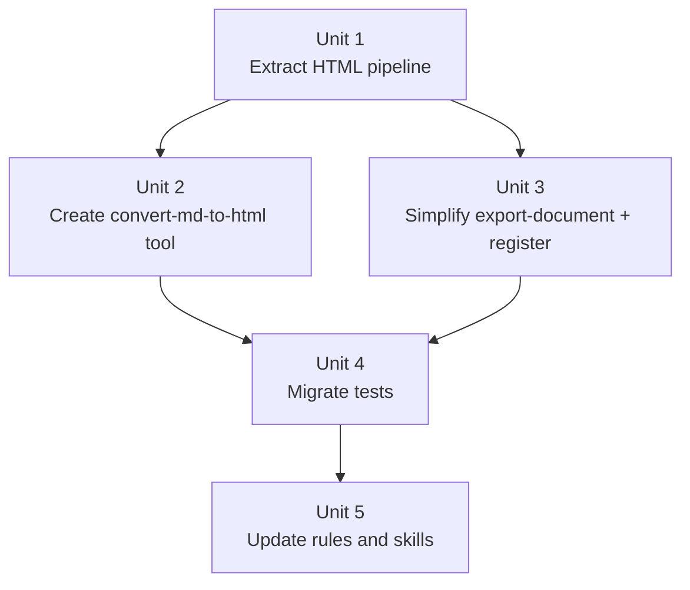

# refactor: Export-First-Markdown Pipeline Restructure

## Overview

Refactor the export workflow so that **every export always produces a .md file first**, and HTML is generated as a second conversion step from that .md file. This separates "content authoring" from "presentation rendering" and gives users an editable source artifact they can tweak and re-render.

The current `export-document(format="html")` path will be removed. A new `convert-md-to-html` tool will read an existing .md file and run it through the existing HTML rendering pipeline, which is extracted into a standalone, reusable function.

## Problem Frame

The current export flow is one-shot: markdown content goes into `export-document` and either a .md or HTML+assets bundle comes out. Once HTML is exported, the user cannot easily edit the content and re-export — the original markdown is only recoverable from conversation history.

The user's core need is an **edit → re-render loop**: export .md, review HTML, tweak .md, re-convert to HTML. The .md file should be the durable source of truth; HTML is a rendered product.

Additionally, the HTML rendering pipeline (render markdown → collect images → build manifest → validate → bundle) is currently inlined in `export-service.ts` lines 110–167. Extracting it into a standalone function improves maintainability and makes it callable from both the old code path and the new `convert-md-to-html` tool without duplication.

## Requirements Trace

- R1. Every export (regardless of format intent) MUST first write a .md file to `output/`.
- R2. HTML is always generated by converting an existing .md file, never by skipping the .md step.
- R3. When the user says "导出" (export, no format specified), only .md is exported and the user is prompted: "已导出 .md，是否需要转 HTML？".
- R4. When the user says "导出html" (export HTML), both steps execute consecutively: .md export → HTML conversion, with no intermediate prompt.
- R5. The `export-document` tool no longer accepts `format="html"`. Its only format is `"markdown"`.
- R6. A new `convert-md-to-html` tool reads an existing .md file path and produces the HTML+assets bundle using the same rendering pipeline.
- R7. The HTML rendering pipeline is extracted into a reusable standalone function (`html-pipeline.ts`) that both the legacy code and the new tool can call.
- R8. Performance must not regress: the .md write step adds < 60ms overhead, and the HTML conversion step uses the same pipeline with the same cost.
- R9. All existing tests continue to pass after refactoring, with test code updated to use the new two-step flow where needed.

## Scope Boundaries

- No change to the HTML rendering output (same CSS, same client scripts, same asset bundle structure).
- No change to `inline-html-resources` tool or skill.
- No change to the scratchpad or any runtime feature behavior.
- No new markdown-to-HTML conversion beyond what the existing renderer already supports.
- The existing `export-service.ts` function signature for `exportDocument` changes (removes HTML support), which is a breaking change — but this is an internal plugin API, not a public API.

### Deferred to Separate Tasks

- Garbage collection or cleanup tooling for old .md files under `output/`.
- Batch conversion of multiple .md files.
- Watch-mode auto-reconvert when .md changes on disk.

## Context & Research

### Relevant Code and Patterns

- `.opencode/plugins/coaching-tools/services/export-service.ts` — the current service with HTML pipeline inlined (lines 87–182). The HTML branch (lines 110–167) is what gets extracted.
- `.opencode/plugins/coaching-tools/services/html-renderer/index.ts` — `renderMarkdown()` and `buildHtmlDocument()` are the core rendering functions.
- `.opencode/plugins/coaching-tools/services/html-renderer/assets.ts` — `collectLocalImages()` and `rewriteImageRefsToAssetDir()`.
- `.opencode/plugins/coaching-tools/services/html-renderer/resource-manifest.ts` — `buildManifest()` and `expandCssTransitiveRefs()`.
- `.opencode/plugins/coaching-tools/services/html-renderer/resource-validator.ts` — `validateResources()`.
- `.opencode/plugins/coaching-tools/services/html-renderer/resource-bundler.ts` — `publishBundle()`.
- `.opencode/plugins/coaching-tools/services/html-renderer/runtime-assets.ts` — `getRuntimeAssetPaths()` and `buildRuntimeAssetRefs()`.
- `.opencode/plugins/coaching-tools/tools/export-document.ts` — tool entry point, currently accepts `format: "markdown" | "html"`.
- `.opencode/plugins/coaching-tools/register-tools.ts` — tool registry; needs new `convert-md-to-html` entry.
- `.opencode/tools/inline-html-resources.ts` — pattern to follow for the new tool (path resolution, validation, error handling).
- `.opencode/skills/export-html/SKILL.md` — skill doc; redefined to describe .md → HTML conversion.
- `.opencode/skills/export-markdown/SKILL.md` — skill doc; minor update.
- `.opencode/rules/export-workflow.md` — shared workflow rule; rewritten for two-step flow.

### Test Infrastructure

- `.opencode/tests/coaching-tools/export-service.test.ts` — 24 tests covering markdown export, HTML export, asset bundles, validation failures, scratchpad, and edge cases. All HTML tests must be migrated to call the new pipeline function or the new tool.
- `.opencode/tests/coaching-tools/plugin-registration.test.ts` — asserts the exact tool registry key set. Must be updated to include `convert-md-to-html`.
- `.opencode/tests/coaching-tools/tool-contracts.test.ts` — exercises `export-document` through the plugin. The `format="markdown"` test stays; the `format="html"` pattern must change to use `convert-md-to-html`.
- `.opencode/tests/prompts/prompt-assets.test.ts` — asserts prompt asset content matches tool contracts. Multiple assertions reference `export-document` description and the export workflow rule. Must be updated.
- `.opencode/tests/setup/temp-worktree.ts` — `createTempWorktree()` and `cleanupTempWorktree()` are the standard test helpers.

### Institutional Learnings

- No `docs/solutions/` directory exists in this repo.
- The repo consistently keeps workflow policy in `.opencode/rules/` and uses skills as thin operational entry points.
- Prompt asset tests encode product policy and must be updated in lockstep with code changes.

## Key Technical Decisions

- **.md is the source of truth**: HTML is always derived from a .md file on disk, never from in-memory content. This means `convert-md-to-html` reads the file from `output/`, not from the conversation.
- **Title inference from .md filename**: When converting .md → HTML, the title is derived from the .md filename stem (the sanitized title used during .md export). The `convert-md-to-html` tool does not accept a separate title parameter — the stem IS the title.
- **Pipeline extraction, not duplication**: The HTML rendering logic currently in `export-service.ts` lines 110–167 becomes `renderToHtmlBundle()` in a new `services/html-pipeline.ts`. The old `exportDocument()` no longer has any HTML code.
- **File path validation**: `convert-md-to-html` only accepts .md files under `output/` within the worktree. This prevents accidental reads from arbitrary filesystem locations.
- **Back-to-back execution**: When user says "导出html", the LLM calls `export-document(format="markdown")` then immediately `convert-md-to-html(mdFilePath=...)`. The plan documents this flow in the updated rules and skills; it does not require a combined tool.
- **Tool naming follows registry conventions**: The new tool is `convert-md-to-html` (kebab-case, matches existing `inline-html-resources` pattern).
- **Schema simplification**: `export-document` drops the `format` parameter entirely — it always exports markdown. This is a cleaner API than keeping a single-value enum.
- **Shared helper function strategy**: `export-service.ts` 中的辅助函数（`sanitizeTitle()`、`buildTimestamp()`、`pathExists()`、`buildUniquePath()`）保留在原文件中并导出。`html-pipeline.ts` 从 `export-service.ts` 导入所需函数（`buildTimestamp`、`pathExists`）。`buildUniqueStem()` 仅被 HTML 管线使用，移入 `html-pipeline.ts`。这样不产生循环依赖：html-pipeline → export-service → html-renderer，方向单一。
- **文件名标题提取策略**: .md 文件名格式为 `{safeTitle}-{timestamp}.md`，其中时间戳由 `buildTimestamp()` 生成，格式为 `\d{4}-\d{2}-\d{2}-\d{2}-\d{2}-\d{2}Z`（如 `2026-04-16-12-30-45Z`）。`convert-md-to-html` 工具从文件名 stem 末尾剥离匹配 `-\d{4}-\d{2}-\d{2}-\d{2}-\d{2}-\d{2}Z` 的部分来恢复 `safeTitle`。若无匹配则使用完整 stem 作为标题。

## Open Questions

### Resolved During Planning

- **Should `export-document` keep `format="markdown"` as an enum or drop it entirely?** Drop it. The tool only does one thing now; no need for a format parameter. The tool description already says "导出 Markdown 文件".
- **Should the two steps be separate tools or one combined tool?** Separate tools. This gives the LLM the flexibility to ask the user between steps, or run them back-to-back. A combined tool would hide the intermediate .md artifact.
- **Should `convert-md-to-html` accept content directly or only a file path?** File path only. Reading from disk enforces .md as source of truth and avoids duplicating content in memory.

### Deferred to Implementation

- **Exact error message wording** for edge cases like non-.md files, files outside `output/`, or corrupt content — implementation-time decision.

## High-Level Technical Design

> *This illustrates the intended approach and is directional guidance for review, not implementation specification. The implementing agent should treat it as context, not code to reproduce.*

```mermaid
flowchart TB
    A[User says "导出" or "导出html"] --> B[export-document tool]
    B -->|Always| C[Write .md to output/]
    C --> D{User intent}
    D -->|"导出" only| E[Tell user .md path<br/>Ask "Need HTML?"]
    D -->|"导出html"| F[convert-md-to-html tool]
    E -->|User confirms| F
    F --> G[Read .md from output/]
    G --> H[html-pipeline:<br/>renderToHtmlBundle()]
    H --> I[renderMarkdown → collectImages → buildManifest → validate → publishBundle]
    I --> J[HTML + assets bundle in output/]
```

## Implementation Units



- [ ] **Unit 1: Extract HTML Rendering Pipeline into `html-pipeline.ts`**

**Goal:** Extract the HTML rendering pipeline from `export-service.ts` into a standalone, reusable function so it can be called from both the (now-removed) HTML export path and the new `convert-md-to-html` tool without code duplication.

**Requirements:** R7, R8

**Dependencies:** None

**Files:**
- Create: `.opencode/plugins/coaching-tools/services/html-pipeline.ts`
- Modify: `.opencode/plugins/coaching-tools/services/export-service.ts`
- Test: `.opencode/tests/coaching-tools/html-pipeline.test.ts`

**Approach:**
- Create `html-pipeline.ts` with a `renderToHtmlBundle(worktree, outputDir, markdownContent, safeTitle)` function that encapsulates the current `export-service.ts` lines 110–167: render markdown → collect local images → get runtime asset paths → build manifest → expand CSS transitive refs → validate resources → rewrite image refs → build HTML document → copy runtime assets + local images to bundle → write HTML.
- The function returns the same `ExportResult` shape (with `relativePath`, `absolutePath`, and optional `assetDir`).
- **辅助函数迁移**: `buildUniqueStem()` 从 `export-service.ts` 移入 `html-pipeline.ts`（仅 HTML 管线使用）。`buildTimestamp()` 和 `pathExists()` 保留在 `export-service.ts` 并导出，`html-pipeline.ts` 从中导入。`sanitizeTitle()` 和 `buildUniquePath()` 不动。
- Remove the HTML branch from `exportDocument()` in `export-service.ts`. After this change, `exportDocument()` only handles markdown export.
- Remove the `ExportFormat` type if it becomes unused, or keep it as `"markdown"` literal if still referenced.
- Export `ExportResult` from `html-pipeline.ts` instead of `export-service.ts` so the new tool can import it.

**Patterns to follow:**
- `.opencode/plugins/coaching-tools/services/export-service.ts` (the code being extracted)
- `.opencode/plugins/coaching-tools/services/html-renderer/index.ts` (function structure pattern)
- `.opencode/tests/setup/temp-worktree.ts` (test helper pattern)

**Test scenarios:**
- Happy path: `renderToHtmlBundle()` with plain text content produces an HTML file with no asset directory.
- Happy path: `renderToHtmlBundle()` with mermaid + chart + markmap content produces an HTML file with a sibling asset directory containing runtime libraries.
- Happy path: `renderToHtmlBundle()` with a local image reference copies the image to the content subdirectory and rewrites the src attribute.
- Happy path: `renderToHtmlBundle()` with `data-exam-question` markers injects scratchpad hooks.
- Edge case: `renderToHtmlBundle()` with a missing local image throws a resource validation error and writes no files.
- Edge case: `renderToHtmlBundle()` with empty content throws an appropriate error.
- Integration: output bundle structure matches the existing contract (HTML + `-assets/` sibling with `runtime/` and `content/` subdirectories).

**Verification:**
- The extracted function produces identical output to the old inline pipeline for the same inputs.
- `export-service.ts` no longer contains any HTML rendering logic.

- [ ] **Unit 2: Create `convert-md-to-html` Tool**

**Goal:** Create a new tool that reads an existing .md file from `output/` and converts it to an HTML+assets bundle using the extracted pipeline.

**Requirements:** R2, R6, R7

**Dependencies:** Unit 1

**Files:**
- Create: `.opencode/plugins/coaching-tools/tools/convert-md-to-html.ts`
- Test: `.opencode/tests/coaching-tools/convert-md-to-html.test.ts`

**Approach:**
- The tool accepts a single `mdFilePath` parameter (relative to worktree or absolute path).
- Validation steps: (1) resolve to absolute path, (2) verify it's under `output/` within worktree, (3) verify the file exists and is a file, (4) verify the extension is `.md`.
- Read the .md content from disk.
- Extract `safeTitle` from the filename stem (the portion before the timestamp suffix, or the full stem if no pattern matches).
- Call `renderToHtmlBundle(worktree, outputDir, content, safeTitle)`.
- Return the HTML path and optional asset directory path to the user.
- Follow the same error handling pattern as `inline-html-resources.ts` (return descriptive error strings).

**Patterns to follow:**
- `.opencode/plugins/coaching-tools/tools/inline-html-resources.ts` (path validation, security checks, error handling pattern)
- `.opencode/plugins/coaching-tools/tools/export-document.ts` (tool structure pattern)

**Test scenarios:**
- Happy path: given a valid .md file in `output/`, the tool reads it, converts to HTML, and returns the HTML path.
- Happy path: the generated HTML references the correct sibling asset directory.
- Happy path: the original .md file is not modified.
- Edge case: .md file with mermaid, chart, markmap, KaTeX, images, and scratchpad markers all renders correctly through the conversion tool.
- Error path: a non-existent file path returns a clear "文件不存在" error.
- Error path: a file outside `output/` returns a "超出范围" error.
- Error path: a non-.md file returns a "不是 Markdown 文件" error.
- Error path: a directory path instead of a file returns an appropriate error.
- Error path: a .md file referencing a missing local image returns a resource validation error (no HTML written).
- Integration: round-trip — export .md via `exportDocument`, then convert via tool, both artifacts coexist in `output/`.

**Verification:**
- The tool successfully converts any .md file produced by `exportDocument` into a correct HTML bundle.

- [ ] **Unit 3: Simplify `export-document` and Update Registration**

**Goal:** Remove HTML support from `export-document`, remove the `format` parameter, and register the new tool.

**Requirements:** R1, R5, R6

**Dependencies:** Unit 1, Unit 2

**Files:**
- Modify: `.opencode/plugins/coaching-tools/tools/export-document.ts`
- Modify: `.opencode/plugins/coaching-tools/register-tools.ts`
- Modify: `.opencode/plugins/coaching-tools/services/export-service.ts`
- Test: `.opencode/tests/coaching-tools/plugin-registration.test.ts`

**Approach:**
- In `export-document.ts`: remove the `format` arg from the schema. The tool always exports markdown. Update the description to reflect this.
- In `export-service.ts`: remove the `format` field from the `exportDocument` input type. Remove the `ExportFormat` type. The function now only writes .md files.
- In `register-tools.ts`: add `"convert-md-to-html": createConvertMdToHtmlTool()` to the registry.
- Update `plugin-registration.test.ts` to assert the new registry key set includes `convert-md-to-html`.

**Patterns to follow:**
- `.opencode/plugins/coaching-tools/tools/export-document.ts`
- `.opencode/plugins/coaching-tools/register-tools.ts`

**Test scenarios:**
- Happy path: `registerCoachingTools()` returns the updated key set including `convert-md-to-html` and `export-document`.
- Happy path: `export-document` tool executes with only `title` and `content` args (no `format`) and writes a .md file.
- Edge case: plugin registry key count matches expectation (6 tools after adding `convert-md-to-html`).

**Verification:**
- The plugin registry contains both `export-document` and `convert-md-to-html`.
- `export-document` no longer accepts or processes a `format` parameter.

- [ ] **Unit 4: Migrate Tests to Two-Step Flow**

**Goal:** Update all existing tests to work with the refactored two-step export flow, maintaining the same test coverage.

**Requirements:** R9

**Dependencies:** Unit 1, Unit 2, Unit 3

**Files:**
- Modify: `.opencode/tests/coaching-tools/export-service.test.ts`
- Modify: `.opencode/tests/coaching-tools/tool-contracts.test.ts`
- Modify: `.opencode/tests/prompts/prompt-assets.test.ts`

**Approach:**
- In `export-service.test.ts`: remove `format: "html"` from `exportDocument` calls. All HTML-specific tests (TOC, mermaid, chart, markmap, KaTeX, images, scratchpad, bundle structure, validation, etc.) should call `renderToHtmlBundle()` from `html-pipeline.ts` directly instead. This preserves test coverage for the rendering pipeline while testing it through the new entry point.
- In `tool-contracts.test.ts`: the `export-document` test should use the simplified API (no `format` param). Add a new test for `convert-md-to-html` that first exports .md then converts it.
- In `prompt-assets.test.ts`: update assertions that check tool description for `export-document` (no longer mentions HTML). Add assertions for `convert-md-to-html` tool description. Update export-workflow assertions to match the new two-step rule text.
- Tests should verify that the `exportDocument` function signature no longer accepts a `format` parameter (TypeScript compilation will enforce this).

**Patterns to follow:**
- `.opencode/tests/coaching-tools/export-service.test.ts` (existing test structure)
- `.opencode/tests/setup/temp-worktree.ts` (test helpers)

**Test scenarios:**
- Happy path: all previously passing HTML rendering tests pass when calling `renderToHtmlBundle()` directly.
- Happy path: all previously passing markdown export tests pass with the simplified `exportDocument` API.
- Happy path: tool contract test for `convert-md-to-html` goes through the plugin and produces HTML.
- Integration: prompt assets agree with the new tool descriptions and workflow rule.
- Edge case: `exportDocument` with `format` parameter causes a TypeScript compilation error (type safety).

**Verification:**
- The full test suite passes with no regressions in coverage.
- All HTML rendering behavior is tested through the new pipeline function.

- [ ] **Unit 5: Update Export Workflow Rules and Skills**

**Goal:** Rewrite the shared export rules and skill documents to reflect the two-step flow: always .md first, then optionally convert to HTML.

**Requirements:** R3, R4, R5, R6

**Dependencies:** Unit 3 (tool must exist before skills can reference it)

**Files:**
- Modify: `.opencode/rules/export-workflow.md`
- Modify: `.opencode/skills/export-html/SKILL.md`
- Modify: `.opencode/skills/export-markdown/SKILL.md`
- Test: `.opencode/tests/prompts/prompt-assets.test.ts`

**Approach:**
- **`export-workflow.md`**: Replace the format auto-selection logic with the new flow: (1) always call `export-document` to write .md, (2) if user said "导出html", immediately call `convert-md-to-html`, (3) if user said "导出" without format, tell them the .md path and ask if they want HTML. Remove the "format 自动选择规则" section entirely. Keep content extraction rules, TOC rules, scratchpad rules, performance budget, and inline-html separation unchanged.
- **`export-html/SKILL.md`**: Redefine as a conversion skill. Steps: (1) confirm user wants HTML from .md, (2) call `convert-md-to-html` with the .md file path, (3) report result. Keep all Markdown extension syntax documentation (KaTeX, Mermaid, Chart.js, etc.) since the content is still authored in Markdown. Remove the "何时用 HTML" decision section (that's now in the workflow rule).
- **`export-markdown/SKILL.md`**: Add a note at the end: "导出完成后，如需带公式渲染、图表、涂鸦板等交互功能，可继续请求转换为 HTML。" Remove the "应改用 HTML 的场景" section (that decision is now in the workflow rule).
- Update `prompt-assets.test.ts` assertions to match the new text in these files.

**Patterns to follow:**
- `.opencode/rules/export-workflow.md` (current structure)
- `.opencode/skills/export-html/SKILL.md` (current structure)

**Test scenarios:**
- Happy path: prompt asset tests confirm the workflow rule describes the two-step flow (always .md first).
- Happy path: prompt asset tests confirm `export-html` skill references `convert-md-to-html` tool.
- Happy path: prompt asset tests confirm `export-markdown` skill mentions the option to convert to HTML.
- Integration: workflow rule, export-html skill, and export-markdown skill all agree on the same flow with no contradictions.
- Edge case: no leftover references to `export-document(format="html")` in any prompt asset.

**Verification:**
- All prompt asset tests pass with the updated rule and skill text.

## System-Wide Impact

- **Interaction graph:** `.opencode/rules/export-workflow.md` → LLM decides which tools to call → `export-document` (always) → optionally `convert-md-to-html`. The `inline-html-resources` flow is unaffected.
- **Error propagation:** `convert-md-to-html` surface the same validation errors as the old HTML path. Failures in the .md export step (empty content, path traversal) are unchanged.
- **State lifecycle risks:** .md file must exist on disk before `convert-md-to-html` can run. If the user deletes the .md between steps, the tool returns a clear error. No partial-state risk beyond what already exists.
- **API surface parity:** The `export-document` tool's public contract changes (drops `format` param). The `convert-md-to-html` tool is net-new. All other tools (`inline-html-resources`, `grading`, `user-profile`, `question-generator`) are unaffected.
- **Integration coverage:** Tool contract tests + export service tests + prompt asset tests together cover the full flow from LLM intent → tool call → file output.
- **Unchanged invariants:** `inline-html-resources` tool and skill are unchanged. Scratchpad behavior is unchanged. HTML rendering output format is unchanged. The rule that files are only written on explicit user intent is unchanged.

## Risks & Dependencies

| Risk | Mitigation |
|------|------------|
| Test migration is large (24 HTML tests to update) | Tests call the same pipeline function under a different name; assertions stay identical. Migrate in one batch per test file. |
| LLM may try to call `export-document(format="html")` from cached conversation context | Remove `format` from the schema so the tool rejects it. Updated rules and skills will guide correct usage. |
| .md filename stem may not be a good title for complex cases | The stem is already the sanitized title from the original export, so it's always valid. |
| Two-step flow adds latency for "导出html" scenario | .md write is < 50ms. HTML conversion is the same cost as before. Total overhead is negligible. |
| Prompt assets may drift from code after this change | Prompt asset tests are updated in lockstep (Unit 4 + Unit 5). |

## Documentation / Operational Notes

- The output layout of exported files changes slightly: users will always see a .md file in `output/`, and optionally an HTML file + assets directory alongside it.
- The .md file is the editable source; the HTML is a rendered product. This should be communicated clearly in the skill documentation.
- Performance budget remains the same: .md export p50 < 50ms, HTML conversion unchanged from current HTML export performance.

## Sources & References

- Related code: `.opencode/plugins/coaching-tools/services/export-service.ts`
- Related code: `.opencode/plugins/coaching-tools/services/html-renderer/index.ts`
- Related code: `.opencode/plugins/coaching-tools/tools/export-document.ts`
- Related code: `.opencode/plugins/coaching-tools/tools/inline-html-resources.ts` (pattern for new tool)
- Related rules: `.opencode/rules/export-workflow.md`
- Related skills: `.opencode/skills/export-html/SKILL.md`, `.opencode/skills/export-markdown/SKILL.md`
- Related tests: `.opencode/tests/coaching-tools/export-service.test.ts`
- Related tests: `.opencode/tests/coaching-tools/plugin-registration.test.ts`
- Related tests: `.opencode/tests/coaching-tools/tool-contracts.test.ts`
- Related tests: `.opencode/tests/prompts/prompt-assets.test.ts`
- Preceding plan: `docs/plans/2026-04-16-001-feat-html-export-resource-modes-plan.md`
