# 图形推理完整知识图谱

> 公务员考试 · 判断推理 · 图形推理全景知识体系（含图解 + 经典例题）

---

## 全局知识架构

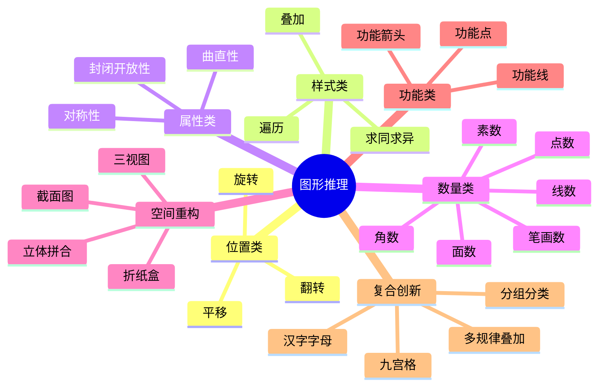

---

## 解题决策流程

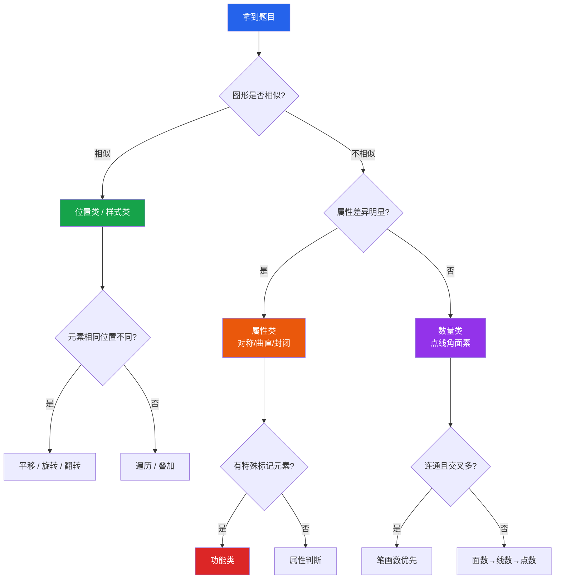

---

## 一、位置类规律

### 知识框架

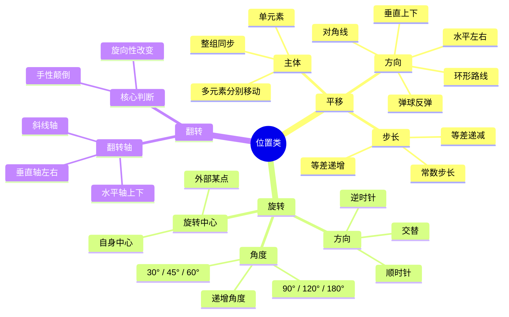

### 1.1 平移

**核心概念**：图形框架不变，某个（或某些）元素在固定方向上按固定步长移动。

**图示讲解**：

```
● 在 3×3 网格中的平移轨迹

图1        图2        图3        图4
┌─┬─┬─┐   ┌─┬─┬─┐   ┌─┬─┬─┐   ┌─┬─┬─┐
│●│ │ │   │ │●│ │   │ │ │●│   │ │ │ │
├─┼─┼─┤   ├─┼─┼─┤   ├─┼─┼─┤   ├─┼─┼─┤
│ │ │ │   │ │ │ │   │ │ │ │   │●│ │ │
├─┼─┼─┤   ├─┼─┼─┤   ├─┼─┼─┤   ├─┼─┼─┤
│ │★│ │   │ │★│ │   │ │★│ │   │ │★│ │
└─┴─┴─┘   └─┴─┴─┘   └─┴─┴─┘   └─┴─┴─┘

轨迹：● 每次右移1格 → 到最右列循环回最左列，跳到下一行
★ 固定不动（干扰元素）
```

**🔑 识别信号**：框架不变，只有个别元素位置在变。

**经典例题**

> 题干（3×3 网格，黑点 ● 沿外圈逆时针移动）：
>
> ```
> 图1        图2        图3        图4        图5
> ┌─┬─┬─┐   ┌─┬─┬─┐   ┌─┬─┬─┐   ┌─┬─┬─┐   ┌─┬─┬─┐
> │●│ │ │   │ │ │ │   │ │ │ │   │ │ │ │   │ │ │●│
> ├─┼─┼─┤   ├─┼─┼─┤   ├─┼─┼─┤   ├─┼─┼─┤   ├─┼─┼─┤
> │ │ │ │   │●│ │ │   │ │ │ │   │ │ │ │   │ │ │ │
> ├─┼─┼─┤   ├─┼─┼─┤   ├─┼─┼─┤   ├─┼─┼─┤   ├─┼─┼─┤
> │ │ │▲│   │ │ │▲│   │ │ │▲│   │ │ │▲│   │ │ │▲│
> └─┴─┴─┘   └─┴─┴─┘   └─┴─┴─┘   └─┴─┴─┘   └─┴─┴─┘
>
> ● 轨迹：位置1→4→7→8→9
> ```
>
> **问**：图6 中 ● 应在哪个位置？
>
> A. 位置3（第1行第3列）　　B. 位置6（第2行第3列）
>
> C. 位置2（第1行第2列）　　D. 位置5（第2行第2列）

**答案：B**

**解析**：

1. 标出 ● 的位置序列：1 → 4 → 7 → 8 → 9 → ？
2. 前 3 步（1→4→7）：沿**第1列向下**，每次1格
3. 第 4、5 步（7→8→9）：沿**第3行向右**，每次1格
4. 整体轨迹 = 沿网格**外圈逆时针**行走（下→右→上→左）
5. 下一步应**向上**：位置9 → 位置**6** ✅

**⚠ 易错辨析**：容易误认为只是简单的"向下移"，忽略方向变化。关键在于追踪完整轨迹发现"沿外圈走"的规律。

---

### 1.2 旋转

**核心概念**：同一个图形绕某点旋转固定角度，方向和角度是关键。

**图示讲解**：

```
L 形折线顺时针旋转 90°

图1      图2      图3      图4
 ┌─       │        ─┘       └
 │        │                 │

开口方向：右下 → 下 → 左上 → 右上
每次变化：顺时针旋转 90°
```

**🔑 识别信号**：图形形状完全相同，只有方向/朝向不同。

**经典例题**

> L 形折线每次顺时针旋转 90°，图4 为 └ 型，图5 应是什么形状？
>
> A. ┌ 型　　B. ─┐ 型　　C. └─ 型（竖在上）　　D. ┘ 型

**答案：C**

**解析**：开口方向序列 = 右下→下→左上→右上→**左下**，对应 └─ 型（选项C）。

**⚠ 易错辨析**：旋转 vs 翻转——旋转不改变"手性"（旋向性），翻转会改变。如果箭头方向从顺时针变成逆时针，那就是翻转而非旋转。

---

### 1.3 翻转

**核心概念**：图形沿某条轴做镜像翻转。翻转改变图形的"手性"。

**图示讲解**：

```
菱形内黑点的左右翻转

图1        图2        图3        图4
  /\         /\         /\         /\
 /  \       /  \       /  \       /  \
/ ●  \     /  ● \    / ●  \    /  ● \
\    /     \    /     \    /     \    /
 \  /       \  /       \  /       \  /
  \/         \/         \/         \/

规律：● 左→右→左→右 交替（每次沿垂直轴翻转）
```

**🔑 识别信号**：相邻图形呈镜像关系，左右或上下对称。

**经典例题**

> 菱形内黑点 ● 的位置规律如上图所示，图4 中 ● 应在？
>
> A. 左侧（与图1相同）　　B. 右侧（与图2相同）
>
> C. 上方　　D. 下方

**答案：B**

**解析**：每次沿垂直轴翻转（左右镜像），奇数图 ● 在左，偶数图 ● 在右。图4 是偶数 → 右侧。

**💡 技巧**：用 L 形或 S 形辅助判断——翻转后旋转方向必变（顺时针变逆时针）。

---

## 二、样式类规律

### 知识框架

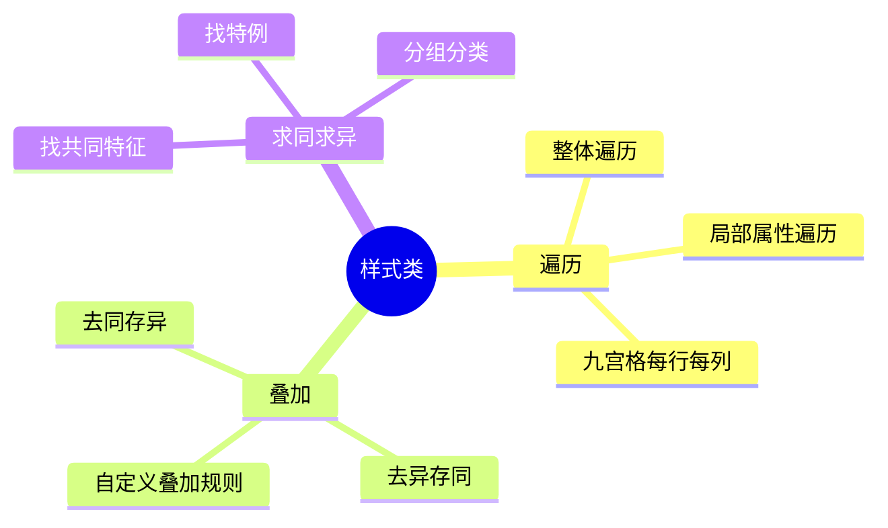

### 2.1 遍历

**核心概念**：所有元素在每行/列/组中各出现一次，"缺什么补什么"。

**图示讲解**：

```
九宫格遍历（形状×花纹 双重遍历）

形状：○  △  □    花纹：■实心  ▒斜线  □空心

      第1列      第2列      第3列
第1行   ○■         △▒         □□
第2行   △□         □■         ○▒
第3行   □▒         ○□         ？← △■

每行：○△□各一次 + ■▒□各一次 → 缺什么补什么
```

**经典例题**

> 上图九宫格中，问号处应填入：
>
> A. △■　　B. ○■　　C. △□　　D. □▒

**答案：A**

**解析**：

1. 第3行已有形状：□、○ → 缺 **△**
2. 第3行已有花纹：▒、□ → 缺 **■**
3. 组合 = **△■** ✅

**💡 技巧**：遍历题口诀 = **"缺啥补啥"**。分别检查每个属性维度的缺失项。

---

### 2.2 叠加（去同存异 / 去异存同）

**核心概念**：两图叠加时，按规则处理相同部分和不同部分。

**图示讲解**：

```
去同存异：两图叠加 → 去掉公共部分 → 保留独有部分

图1          图2          图3（结果）
 ┌─┐          ─┬─          │ │
 │ │           │           └─┘
（方框）      （T形）       （U形）

图1线条 = {上横, 左竖, 右竖}
图2线条 = {上横, 中竖}
共同 = {上横} → 去掉
独有 = {左竖, 右竖} → 保留 → U形 ✅
```

**经典例题**

> 规律：每行 图1 叠加 图2 = 图3（去同存异）
>
> ```
> 第1行：方框 + T形 = U形 ✅
> 第2行：十字 + 十字 = 空白 ✅（完全相同→全部去掉）
> 第3行：┌─┐ + ─┐ = ？
>         （缺右竖方框）（右上直角）
> ```
>
> A. └ 型（左竖+右竖）　　B. │（只有左竖）
>
> C. ┐ 型　　D. ╋（十字）

**答案：A**

**解析**：

1. 先用第1、2行**验证规则**为"去同存异"
2. 第3行：图1线条 = {上横, 左竖}，图2线条 = {上横, 右竖}
3. 共同 = {上横} → 去掉
4. 独有 = {左竖} + {右竖} → 合并 = 左右两条竖线 → 选项 A ✅

**⚠ 易错辨析**：必须先用已知行验证叠加规则（是去同存异还是去异存同），再套用到问号行。不要直接猜规则。

---

## 三、属性类规律

### 知识框架

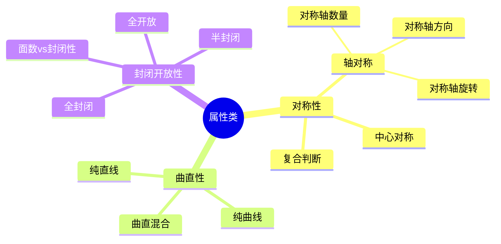

### 3.1 对称性

**核心概念**：判断图形是否为轴对称/中心对称，以及对称轴的数量和方向变化。

**图示讲解**：

```
对称轴数量递增规律

图1           图2           图3           图4           图5
  △             ◇             △             □             ☆
（等腰△）      （菱形）     （等边△）     （正方形）    （五角星）

对称轴：  1条    →     2条    →     3条    →     4条    →     5条

规律：对称轴数量等差递增（每次+1）
```

**经典例题**

> 按上图规律，图4（正方形，4条对称轴）之后，图5应选？
>
> A. ○（圆，∞条对称轴）　　B. ☆（五角星，5条对称轴）
>
> C. 平行四边形（0条对称轴）　　D. 直角三角形（0条）

**答案：B**

**解析**：对称轴数量序列 = 1→2→3→4→**5**，等差递增。五角星有5条对称轴 ✅

**💡 技巧**：对称性考法两步走——①定性（是否对称、轴对称还是中心对称）；②定量（数对称轴条数、看方向变化）。

**常见图形对称轴速查**：

| 图形 | 对称轴数 | 中心对称 |
|------|:--------:|:--------:|
| 等腰三角形 | 1 | ❌ |
| 等边三角形 | 3 | ❌ |
| 菱形 | 2 | ✅ |
| 正方形 | 4 | ✅ |
| 圆 | ∞ | ✅ |
| 正五角星 | 5 | ❌ |
| 正六边形 | 6 | ✅ |
| 平行四边形 | 0 | ✅ |

---

### 3.2 曲直性

**核心概念**：判断图形由纯直线、纯曲线还是曲直混合构成。

**图示讲解**：

```
曲直性三种状态遍历

图1          图2          图3
  ○            △            D形
（圆）       （三角形）    （半圆+直径）

纯曲线  →   纯直线   →   曲直混合
```

**经典例题**

> 上图规律中，图3（曲直混合）之后下一个图应为什么？
>
> A. □（正方形）　　B. D形（曲直混合）　　C. ⬡（六边形）　　D. 椭圆

**答案：A**

**解析**：序列为 纯曲线→纯直线→曲直混合→**纯曲线**（循环遍历）。□ 是纯直线，不符合。如果规律是"遍历后重复"，下一个应为纯曲线。此处选 A 的情况是重新开始新一轮。

**💡 技巧**：曲直性只有 3 种状态，优先检验。

---

### 3.3 封闭开放性

**核心概念**：判断图形是否封闭，以及封闭区域（面）的数量。

**经典例题**

> ```
> 图1      图2      图3      图4
>  Y        ○        ∞        ？
>
> 封闭区域：  0   →    1   →    2   →    ？
> ```
>
> 问号处应有多少个封闭区域？
>
> A. 2　　B. 3　　C. 4　　D. 5

**答案：B**

**解析**：封闭区域数 = 0→1→2→**3**，等差递增。选 B（3个封闭区域）。

**⚠ 易错辨析**：封闭性≠面数。封闭性看"是否封闭"（定性），面数看"有几个封闭区域"（定量）。U形有开口=0个面，不是封闭图形。

---

## 四、数量类规律

### 知识框架

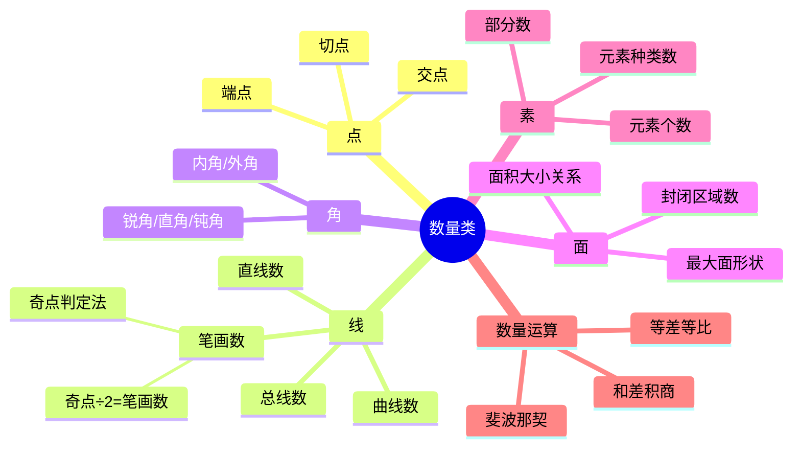

### 4.1 面数（最高频考点之一）

**图示讲解**：

```
封闭区域（面）计数示例

┌─┬─┬─┐      ┌─┬─┬─┬─┐     ┌─┬─┐
│ │ │ │      │ │ │ │ │     │ │
├─┼─┼─┤      ├─┼─┼─┼─┤     ├─┼─┤
│ │ │ │      │ │ │ │ │     └─┴─┘
└─┴─┴─┘      └─┴─┴─┴─┘
  4个面          8个面        2个面

口诀："数窟窿"——看图形中有几个完全封闭的"洞"
```

**经典例题**

> ```
> 图1      图2       图3       图4
>  ○        ∞        ⚬⚬⚬       ？
> 1个面    2个面     3个面
> ```
>
> A. 3个面　　B. 4个面　　C. 5个面　　D. 6个面

**答案：B**

**解析**：面数 = 1→2→3→**4**，等差递增。

---

### 4.2 线数

**经典例题**

> ```
> 图1      图2      图3      图4
>  ╱        ╳       米字      ？
> 1条线    2条线    3条线
> ```
>
> A. 2条线　　B. 4条线　　C. 5条线　　D. 6条线

**答案：B**

**解析**：直线数 = 1→2→3→**4**，等差递增。

**💡 技巧**：注意区分"直线数"和"线段数"。通常数的是完整的直线（可以穿过多个交点），不是两点间的线段。

---

### 4.3 笔画数（极高频考点）

**核心公式**：

$$\text{笔画数} = \frac{\text{奇点数}}{2}$$

> **奇点** = 引出**奇数**条线的点（1条、3条、5条…）
>
> - 奇点数 = 0 → **一笔画** ✅
> - 奇点数 = 2 → **一笔画** ✅
> - 奇点数 = 4 → **两笔画**
> - 奇点数 = 2n → **n 笔画**

**图示讲解**：

```
奇点判定示例

① 正方形 □               ② 田字形
   B────C                  B─────C
   │    │                  │  ╲╱  │
   │    │                  │  ╱╲  │
   A────D                  A─────D

A点：引出2条线(偶)→偶点    A点：引出2条(偶)→偶点
B点：引出2条线(偶)→偶点    B点：引出3条(奇)→奇点★
C点：引出2条线(偶)→偶点    C点：引出3条(奇)→奇点★
D点：引出2条线(偶)→偶点    D点：引出3条(奇)→奇点★
奇点=0 → 一笔画 ✅         中心：引出4条(偶)→偶点
                           奇点=4 → 两笔画 ❌

⚠ 注意：端点也是奇点！
```

**经典例题**

> 以下哪些是一笔画图形？
>
> ① 正方形 □　② 田字形　③ 圆 ○　④ 两个不相连的圆
>
> A. 只有①　　B. ①和③　　C. ①②③　　D. ①③④

**答案：B**

**解析**：

| 图形 | 奇点数 | 笔画数 | 一笔画？ |
|------|:------:|:------:|:--------:|
| ①正方形 | 0 | 0÷2=1 | ✅ |
| ②田字形 | 4 | 4÷2=2 | ❌ |
| ③圆 | 0 | 0÷2=1 | ✅ |
| ④两分离圆 | — | 不连通≥2 | ❌ |

一笔画 = ①③ → 选 B

**⚠ 易错辨析**：端点也是奇点！不要遗漏。两个不相连的图形一定不是一笔画（不连通至少需要和连通分支数相同的笔画数）。

---

### 4.4 点数

**经典例题**

> ```
> 图1       图2        图3        图4
>  │         ╲╱          ╲╱         ？
>  │          ·           ·╲╱
>  │         ╱╲           · ╱╲
>                        ╱  ╲
> 交点数：  0    →     1     →     3     →    ？
> ```
>
> A. 4个　　B. 5个　　C. 6个　　D. 7个

**答案：C**

**解析**：交点数 = 0→1→3→？，差值为 +1、+2，差值递增 → 下一个差值 +3 → 3+3=**6** ✅

---

### 4.5 数量类综合：点线角面素选择策略

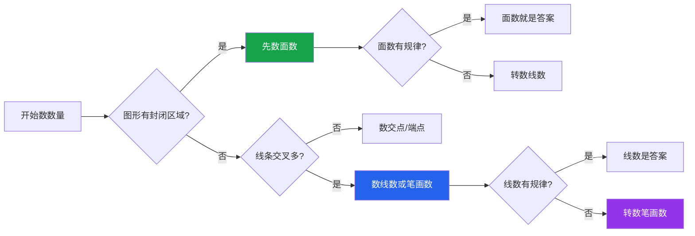

---

## 五、空间重构

### 知识框架

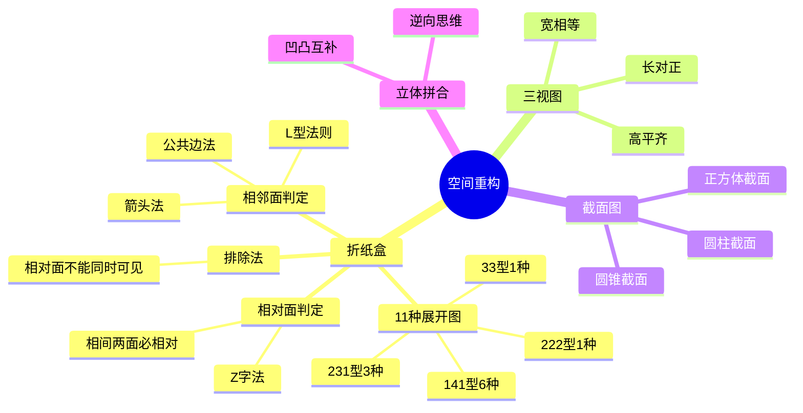

### 5.1 折纸盒

**核心方法**：

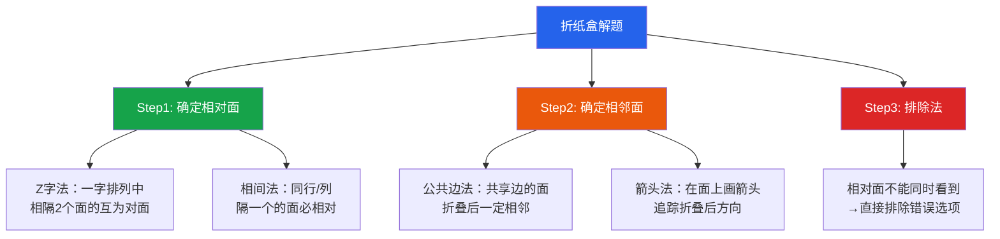

**图示讲解——相对面判定**：

```
一字形展开图（6面排成一行）

┌─────┬─────┬─────┬─────┬─────┬─────┐
│  ★  │  ●  │  ○  │  □  │  △  │  ◇  │
└─────┴─────┴─────┴─────┴─────┴─────┘
  ①     ②     ③     ④     ⑤     ⑥

相对面规则：间隔2个面 → 互为相对面
  ★(①) ←→ □(④)    相对面 ✅
  ●(②) ←→ △(⑤)    相对面 ✅
  ○(③) ←→ ◇(⑥)    相对面 ✅

相邻面规则：直接相邻 → 折叠后相邻
  ★(①) → ●(②)     相邻面
  ●(②) → ○(③)     相邻面
```

**经典例题**

> 上图一字形展开图折叠为正方体后，以下哪项正确？
>
> A. ★ 和 ● 是相对面　　B. ★ 和 ○ 是相对面
>
> C. ★ 和 □ 是相对面　　D. ○ 和 △ 是相对面

**答案：C**

**解析**：间隔2个面的判定法——★(①)与□(④)中间隔了②③，共2个面 → 相对面 ✅

**💡 技巧**：折纸盒首选**排除法**——看选项中是否有"两个相对面同时出现在同一个视图中"，有则直接排除。

---

### 5.2 三视图

**核心原则**：长对正、高平齐、宽相等

**图示讲解**：

```
由3个小正方体组成的L形立体

立体摆放（俯视图）：
   ┌───┬───┐
   │ 1 │ 2 │     编号1、2为底层
   ├───┼───┘     编号3叠在1上面
   │ 3 │
   └───┘

正视图（从正面看）：
   ■ ■        ← 上层能看到2个（3在1后面被遮挡... 重新分析）
   
   正确分析：
   正视图（从前方看）= 从前往后投影
   - 左列：底层1个 + 上层1个（3叠在1上）= 2层高
   - 右列：底层1个 = 1层高
   结果：
   ■
   ■ ■

侧视图（从右侧看）：
   - 前排：1层
   - 后排：2层（3叠在1上）
   结果：
   ■
   ■ ■

俯视图（从上往下看）：
   ■ ■
   ■
```

**经典例题**

> L 形立体（如上图），正视图是？
>
> A. ■ / ■■　　B. ■■ / ■　　C. ■■　　D. ■ / ■

**答案：A**（上面1个左对齐，下面2个并排）

---

### 5.3 截面图

**核心规则**：截面经过的棱数决定截面边数

| 几何体 | 可能的截面 | 不可能的截面 |
|--------|-----------|-------------|
| 正方体 | 三角形、四边形、五边形、六边形 | **七边形及以上** |
| 圆柱 | 圆、椭圆、矩形 | 梯形 |
| 圆锥 | 圆、椭圆、三角形、抛物线 | 矩形 |

**💡 技巧**：正方体最多截出**六边形**（经过6条棱）。

---

## 六、功能类规律

### 知识框架

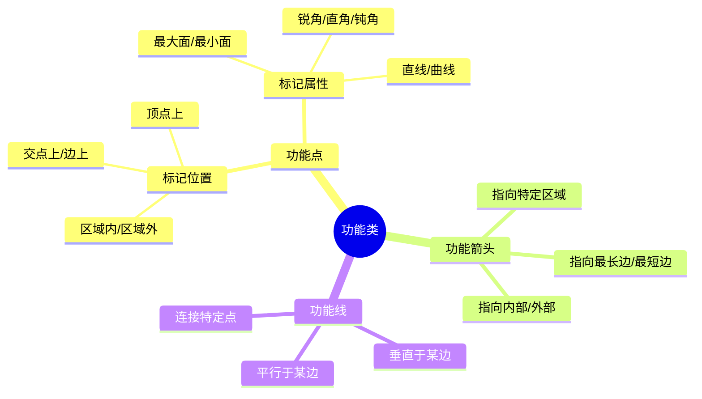

**🔑 识别信号**：图形中出现小黑点、小箭头、小圆圈等"小元素"，这些不是装饰，而是**标记某种关系**的功能元素。

**经典例题**

> 每个图形中都有一个小箭头 →：
>
> ```
> 图1: □ 中 → 指向右边（一条边）
> 图2: △ 中 ↗ 指向右上方的顶角
> 图3: ○ 中 → 指向右边的圆周
> ```
>
> 箭头的共同规律是？
>
> A. 指向图形内部　　B. 指向图形的边
>
> C. 从中心指向图形边缘　　D. 指向图形的角

**答案：C**

**解析**：三个图中，箭头都从图形内部（中心区域）出发，指向图形的边缘（边/角/圆周），方向不同但本质相同 = **从中心指向边缘** ✅

---

## 七、复合与创新题型

### 知识框架

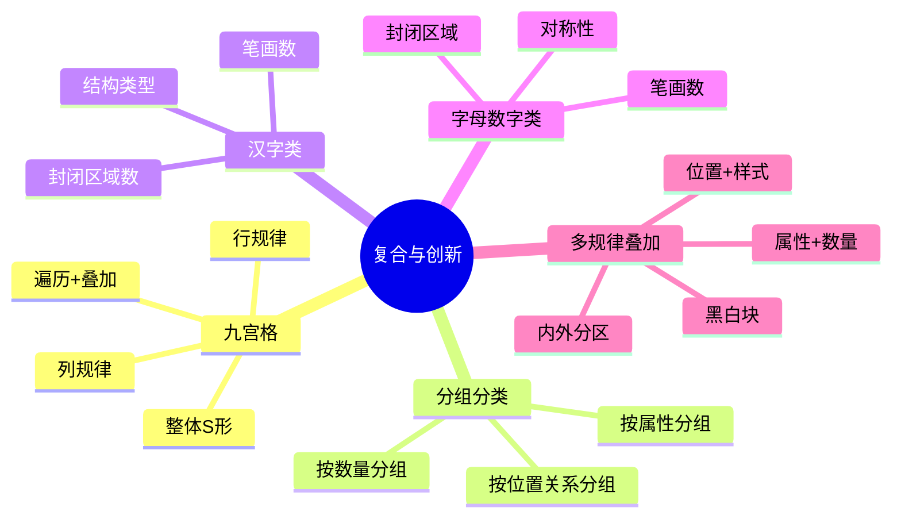

### 7.1 九宫格

**解题优先级**：先横看（行）→ 再竖看（列）→ 最后整体看（S 形/对角线）

**经典例题**

> ```
> 封闭区域数九宫格：
>
>        第1列  第2列  第3列
> 第1行    1      1      1      → 恒定
> 第2行    2      3      4      → 等差+1
> 第3行    1      2      ？     → 等差+1
> ```
>
> A. 2　　B. 3　　C. 4　　D. 5

**答案：B**

**解析**：第3行 = 等差递增（1→2→**3**），选 B。

---

### 7.2 分组分类

**万能三步法**：

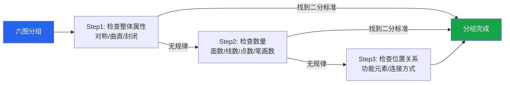

**经典例题**

> 六个图形分为两组：①正方形 ②字母H ③圆 ④字母A ⑤三角形 ⑥字母K
>
> A. ①③⑤ | ②④⑥　　B. ①②③ | ④⑤⑥
>
> C. ①④⑤ | ②③⑥　　D. ①③⑥ | ②④⑤

**答案：A**

**解析**：

| 图形 | 封闭性 |
|------|:------:|
| ①正方形 | 封闭 |
| ②H | 开放 |
| ③圆 | 封闭 |
| ④A | 开放 |
| ⑤三角形 | 封闭 |
| ⑥K | 开放 |

封闭组 = ①③⑤，开放组 = ②④⑥ → 选 A

---

### 7.3 汉字类

**三把刀**：① 笔画数（最常考）② 封闭区域数 ③ 结构特征

**经典例题**

> "一"(1画) → "十"(2画) → "工"(3画) → ？
>
> A. "王"(4画)　　B. "正"(5画)　　C. "出"(5画)　　D. "石"(5画)

**答案：A**

**解析**：笔画数 = 1→2→3→**4**，等差递增。只有"王"是4画 ✅

---

## 八、高频考点速查表

| 考点 | 识别信号 | 核心方法 | 高频指数 |
|------|---------|---------|:--------:|
| **平移** | 框架不变，元素位置变 | 标坐标，看方向+步长 | ★★★★ |
| **旋转** | 同一图形方向改变 | 标角度，辨顺逆 | ★★★★ |
| **翻转** | 相邻图呈镜像 | 看手性是否颠倒 | ★★★ |
| **遍历** | 九宫格+元素组合 | 缺啥补啥 | ★★★★ |
| **叠加** | 行内三图相关 | 先验证规则再套用 | ★★★★ |
| **对称性** | 常见对称图形 | 先定性再定量 | ★★★★★ |
| **曲直性** | 有曲线有直线 | 分类判断 | ★★★ |
| **封闭性** | 有封闭有开放 | 先判断再计数 | ★★★ |
| **面数** | 封闭区域明显 | "数窟窿" | ★★★★★ |
| **线数** | 线条清晰 | 直线/曲线分开数 | ★★★★ |
| **笔画数** | 线条多且交叉 | 奇点÷2 | ★★★★★ |
| **折纸盒** | 展开图→立体 | 相对面排除法 | ★★★★★ |
| **三视图** | 立体图→视图 | 长对正高平齐宽相等 | ★★★ |
| **功能元素** | 有小点/小箭头 | 看标记指向什么 | ★★★ |
| **分组分类** | 六图分两组 | 属性→数量→位置 | ★★★★ |

---

## 九、解题策略总览

### 做题时间分配

| 题型 | 建议用时 | 策略 |
|------|:--------:|------|
| 位置类 | ≤40秒 | 直接标坐标，快速判断 |
| 样式类 | ≤45秒 | 先验证规则 |
| 属性类 | ≤30秒 | 最快，先检验 |
| 数量类 | ≤60秒 | 从面数开始，逐项排查 |
| 空间重构 | ≤60秒 | 排除法优先 |
| 复合题 | ≤90秒 | 拆分为两步规律 |

### 常见陷阱清单

| 陷阱 | 说明 |
|------|------|
| 规律过于简单 | 恒定不变（所有图都是3个面）也是规律！ |
| 只找到一个规律 | 可能存在第二层规律叠加 |
| 看到对称只考虑对称性 | 对称轴数量变化也是考点 |
| 翻转误认为旋转 | 用旋向性区分 |
| 忽略端点 | 端点也是奇点 |
| 数面数漏数 | 被图形复杂度干扰 |

---

> **💡 备考建议**：图形推理的核心是 **"观察力 + 经验"**。每天练习 10-15 题，积累常见规律模式。先确保基础考点（位置、样式、属性、数量）烂熟于心，再攻克复合规律和创新题型。**超过 1 分钟没有思路就先跳过**，回头再做。
