# 图形推理完整知识图谱

> 公务员考试 · 判断推理 · 图形推理全景知识体系（含 SVG 图示 + Canvas 动图 + 经典例题）

---

## 全局知识架构

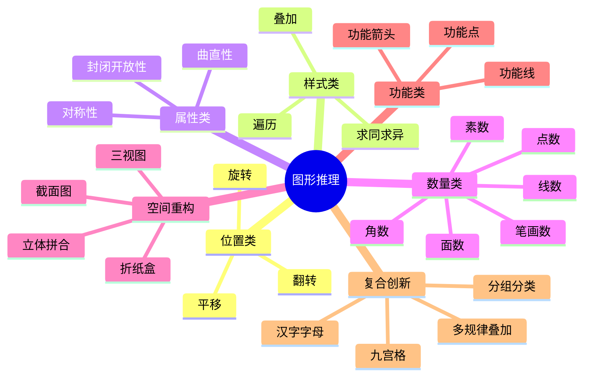

---

## 解题决策流程

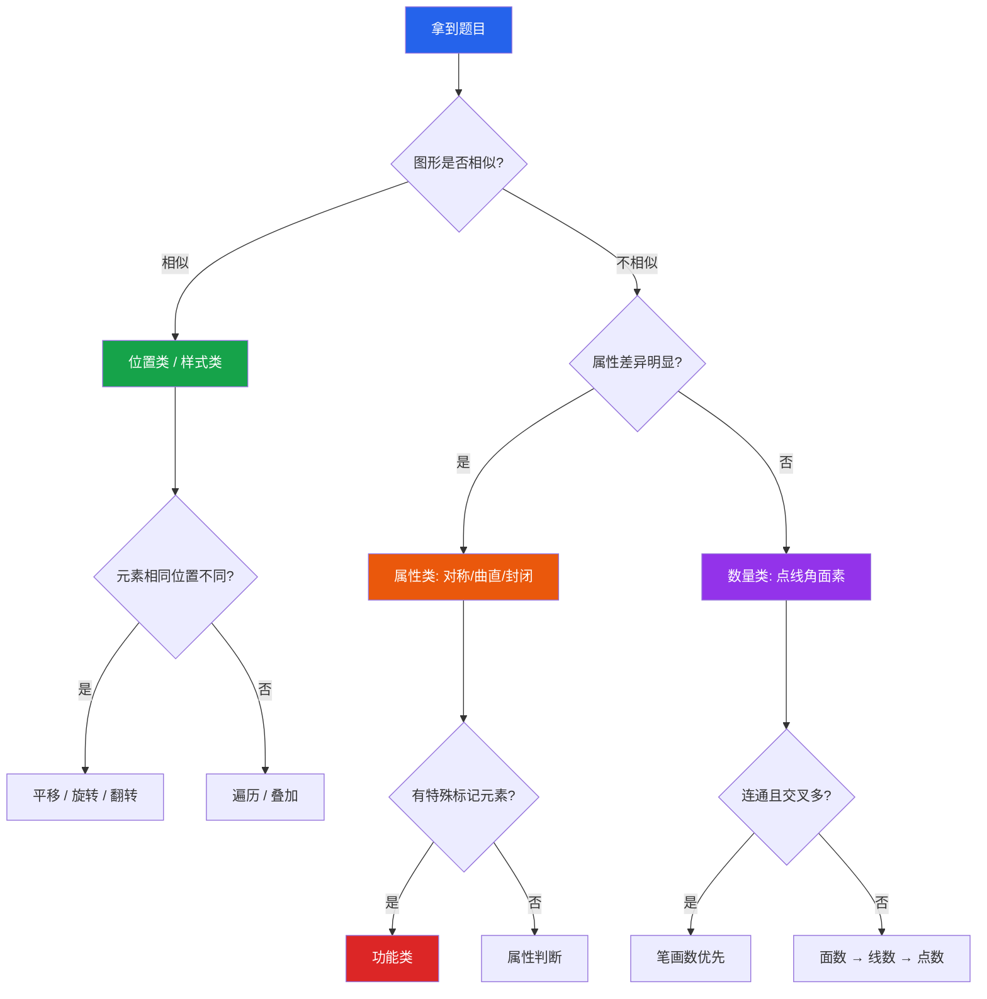

---

## 一、位置类规律

### 知识框架

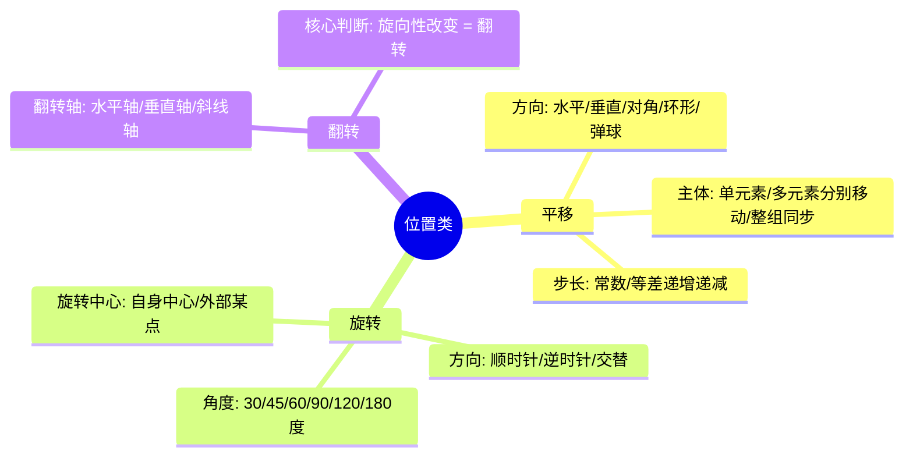

---

### 1.1 平移

**核心概念**：图形框架不变，某个（或某些）元素在固定方向上按固定步长移动。

**🔑 识别信号**：框架不变，只有个别元素位置在变。

#### 图示讲解：黑点沿外圈逆时针平移

```svg
<svg width="520" height="180" viewBox="0 0 520 180">
  <defs>
    <marker id="arrowG" markerWidth="8" markerHeight="6" refX="8" refY="3" orient="auto">
      <path d="M0,0 L8,3 L0,6 Z" fill="#16a34a"/>
    </marker>
  </defs>
  <style>
    .grid3 { fill: none; stroke: #94a3b8; stroke-width: 1.5; }
    .dot { fill: #2563eb; }
    .star { fill: #dc2626; }
    .label { font: bold 13px sans-serif; fill: #475569; text-anchor: middle; }
  </style>
  <!-- 图1 -->
  <g transform="translate(10,10)">
    <rect x="0" y="0" width="80" height="80" class="grid3"/>
    <line x1="0" y1="40" x2="80" y2="40" class="grid3"/>
    <line x1="40" y1="0" x2="40" y2="80" class="grid3"/>
    <circle cx="20" cy="20" r="8" class="dot"/>
    <text x="40" y="100" class="label">图1</text>
  </g>
  <!-- 图2 -->
  <g transform="translate(110,10)">
    <rect x="0" y="0" width="80" height="80" class="grid3"/>
    <line x1="0" y1="40" x2="80" y2="40" class="grid3"/>
    <line x1="40" y1="0" x2="40" y2="80" class="grid3"/>
    <circle cx="20" cy="60" r="8" class="dot"/>
    <text x="40" y="100" class="label">图2</text>
  </g>
  <!-- 图3 -->
  <g transform="translate(210,10)">
    <rect x="0" y="0" width="80" height="80" class="grid3"/>
    <line x1="0" y1="40" x2="80" y2="40" class="grid3"/>
    <line x1="40" y1="0" x2="40" y2="80" class="grid3"/>
    <circle cx="20" cy="100" r="8" class="dot"/>
    <text x="40" y="130" class="label">图3</text>
  </g>
  <!-- 图4 -->
  <g transform="translate(310,10)">
    <rect x="0" y="0" width="80" height="80" class="grid3"/>
    <line x1="0" y1="40" x2="80" y2="40" class="grid3"/>
    <line x1="40" y1="0" x2="40" y2="80" class="grid3"/>
    <circle cx="60" cy="100" r="8" class="dot"/>
    <text x="40" y="130" class="label">图4</text>
  </g>
  <!-- 图5 -->
  <g transform="translate(410,10)">
    <rect x="0" y="0" width="80" height="80" class="grid3"/>
    <line x1="0" y1="40" x2="80" y2="40" class="grid3"/>
    <line x1="40" y1="0" x2="40" y2="80" class="grid3"/>
    <circle cx="100" cy="100" r="8" class="dot"/>
    <text x="40" y="130" class="label">图5</text>
  </g>
</svg>
```

```svg
<svg width="520" height="120" viewBox="0 0 520 120">
  <style>
    .lbl { font: 12px sans-serif; fill: #64748b; text-anchor: middle; }
    .arr { fill: none; stroke: #16a34a; stroke-width: 2; marker-end: url(#arrowG2); }
  </style>
  <defs>
    <marker id="arrowG2" markerWidth="8" markerHeight="6" refX="8" refY="3" orient="auto">
      <path d="M0,0 L8,3 L0,6 Z" fill="#16a34a"/>
    </marker>
  </defs>
  <!-- 轨迹示意 -->
  <text x="260" y="20" style="font:bold 14px sans-serif;fill:#1e293b;text-anchor:middle;">● 沿外圈逆时针移动轨迹</text>
  <rect x="180" y="35" width="160" height="60" fill="none" stroke="#94a3b8" stroke-width="1.5"/>
  <line x1="180" y1="65" x2="340" y2="65" stroke="#94a3b8" stroke-width="1"/>
  <line x1="260" y1="35" x2="260" y2="95" stroke="#94a3b8" stroke-width="1"/>
  <!-- 轨迹箭头：沿外圈逆时针 -->
  <path d="M 185,42 Q 175,42 175,65 Q 175,92 195,92" class="arr"/>
  <path d="M 335,88 Q 345,88 345,65 Q 345,38 325,38" class="arr"/>
  <!-- 节点 -->
  <circle cx="200" cy="50" r="5" fill="#2563eb"/>
  <text x="200" y="43" class="lbl">1</text>
  <circle cx="200" cy="80" r="4" fill="#e2e8f0" stroke="#2563eb"/>
  <text x="189" y="84" class="lbl">4</text>
  <circle cx="200" cy="80" r="0"/>
  <circle cx="260" cy="80" r="4" fill="#e2e8f0" stroke="#2563eb"/>
  <circle cx="320" cy="80" r="4" fill="#e2e8f0" stroke="#2563eb"/>
  <circle cx="320" cy="50" r="5" fill="#dc2626"/>
  <text x="332" y="47" class="lbl">9</text>
  <text x="260" y="112" class="lbl">方向：下 → 右 → 上 → 左（逆时针外圈）</text>
</svg>
```

#### 经典例题

<section data-exam-question>

**【平移】** 在 3×3 网格中，黑点 ● 沿外圈逆时针移动，每次1格。轨迹为：位置1→4→7→8→9。问图6中 ● 应在哪个位置？

A. 位置3（第1行第3列）　　B. 位置6（第2行第3列）　　C. 位置2（第1行第2列）　　D. 位置5（第2行第2列）

</section>

**答案：B**

**解析**：

1. 位置序列：1→4→7→8→9→？
2. 前3步沿第1列**向下**，第4-5步沿第3行**向右**
3. 整体轨迹 = 沿网格**外圈逆时针**行走
4. 下一步方向 = **向上**：位置9→位置**6** ✅

**⚠ 易错辨析**：容易误判为简单的"向下移"。关键在于追踪完整轨迹发现"沿外圈走"的规律。

---

### 1.2 旋转

**核心概念**：同一个图形绕某点旋转固定角度，方向和角度是关键。

**🔑 识别信号**：图形形状完全相同，只有方向/朝向不同。

#### 图示讲解：L形折线顺时针旋转 90°

```svg
<svg width="480" height="200" viewBox="0 0 480 200">
  <style>
    .bg { fill: #f8fafc; stroke: #e2e8f0; stroke-width: 1; rx: 8; }
    .L { fill: none; stroke: #2563eb; stroke-width: 3.5; stroke-linecap: round; stroke-linejoin: round; }
    .ang { fill: none; stroke: #dc2626; stroke-width: 1.5; stroke-dasharray: 4 3; }
    .tag { font: bold 13px sans-serif; fill: #334155; text-anchor: middle; }
    .sub { font: 11px sans-serif; fill: #64748b; text-anchor: middle; }
  </style>
  <!-- 图1: L形朝右下 -->
  <g transform="translate(10,10)">
    <rect width="100" height="130" class="bg"/>
    <path d="M 30,30 L 30,80 L 70,80" class="L"/>
    <text x="50" y="105" class="tag">图1</text>
    <text x="50" y="122" class="sub">朝右下</text>
  </g>
  <!-- 图2: 顺时针90°= 朝左下 -->
  <g transform="translate(120,10)">
    <rect width="100" height="130" class="bg"/>
    <path d="M 70,30 L 70,80 L 30,80" class="L"/>
    <text x="50" y="105" class="tag">图2</text>
    <text x="50" y="122" class="sub">朝左下</text>
  </g>
  <!-- 图3: 再90°= 朝左上 -->
  <g transform="translate(230,10)">
    <rect width="100" height="130" class="bg"/>
    <path d="M 70,30 L 70,80" class="L" stroke="none"/>
    <path d="M 70,100 L 70,50 L 30,50" class="L"/>
    <text x="50" y="125" class="tag">图3</text>
    <text x="50" y="142" class="sub">朝左上</text>
  </g>
  <!-- 图4: 再90°= 朝右上 -->
  <g transform="translate(340,10)">
    <rect width="100" height="130" class="bg"/>
    <path d="M 30,100 L 30,50 L 70,50" class="L"/>
    <text x="50" y="125" class="tag">图4</text>
    <text x="50" y="142" class="sub">朝右上</text>
  </g>
  <!-- 旋转角度标注 -->
  <text x="115" y="25" style="font:11px sans-serif;fill:#dc2626;text-anchor:middle;">+90°</text>
  <text x="225" y="25" style="font:11px sans-serif;fill:#dc2626;text-anchor:middle;">+90°</text>
  <text x="335" y="25" style="font:11px sans-serif;fill:#dc2626;text-anchor:middle;">+90°</text>
</svg>
```

#### 经典例题

<section data-exam-question>

**【旋转】** L形折线每次顺时针旋转90°，图4为朝右上型，图5应是什么形状？

A. 朝右下（与图1相同）　　B. 朝左下（与图2相同）　　C. 朝左上（与图3相同）　　D. 朝右上（与图4相同）

</section>

**答案：A**

**解析**：每次+90°，4次旋转=360°回到初始。图5=图1的朝向，即朝右下 ✅

**⚠ 易错辨析**：旋转 vs 翻转——旋转不改变"手性"，翻转会改变。用 L 形辅助判断。

---

### 1.3 翻转

**核心概念**：图形沿某条轴做镜像翻转，翻转改变图形的"手性"（旋向性）。

**🔑 识别信号**：相邻图形呈镜像关系。

#### 图示讲解：菱形内黑点的左右翻转

```svg
<svg width="480" height="180" viewBox="0 0 480 180">
  <style>
    .bg { fill: #f8fafc; stroke: #e2e8f0; stroke-width: 1; rx: 8; }
    .diamond { fill: none; stroke: #2563eb; stroke-width: 2.5; }
    .dot-l { fill: #dc2626; }
    .dot-r { fill: #2563eb; }
    .ax { stroke: #94a3b8; stroke-width: 1; stroke-dasharray: 5 4; }
    .tag { font: bold 13px sans-serif; fill: #334155; text-anchor: middle; }
    .sub { font: 11px sans-serif; fill: #64748b; text-anchor: middle; }
  </style>
  <!-- 图1: 点在左 -->
  <g transform="translate(30,15)">
    <rect width="100" height="120" class="bg"/>
    <polygon points="50,10 85,55 50,100 15,55" class="diamond"/>
    <circle cx="35" cy="55" r="7" class="dot-l"/>
    <text x="50" y="115" class="tag">图1</text>
  </g>
  <!-- 翻转箭头 -->
  <g transform="translate(140,55)">
    <line x1="0" y1="0" x2="40" y2="0" stroke="#16a34a" stroke-width="2" marker-end="url(#farr)"/>
    <text x="20" y="-8" style="font:10px sans-serif;fill:#16a34a;text-anchor:middle;">左右翻转</text>
  </g>
  <defs>
    <marker id="farr" markerWidth="8" markerHeight="6" refX="8" refY="3" orient="auto">
      <path d="M0,0 L8,3 L0,6 Z" fill="#16a34a"/>
    </marker>
  </defs>
  <!-- 图2: 点在右 -->
  <g transform="translate(190,15)">
    <rect width="100" height="120" class="bg"/>
    <polygon points="50,10 85,55 50,100 15,55" class="diamond"/>
    <circle cx="65" cy="55" r="7" class="dot-r"/>
    <text x="50" y="115" class="tag">图2</text>
  </g>
  <!-- 图3: 点在左 -->
  <g transform="translate(310,15)">
    <rect width="100" height="120" class="bg"/>
    <polygon points="50,10 85,55 50,100 15,55" class="diamond"/>
    <circle cx="35" cy="55" r="7" class="dot-l"/>
    <text x="50" y="115" class="tag">图3</text>
  </g>
  <!-- 翻转轴示意 -->
  <line x1="240" y1="10" x2="240" y2="140" class="ax"/>
  <text x="240" y="155" style="font:10px sans-serif;fill:#94a3b8;text-anchor:middle;">翻转轴</text>
</svg>
```

#### 经典例题

<section data-exam-question>

**【翻转】** 如上图规律，每次沿垂直轴翻转（左右镜像），图3中点在左侧，图4中点应在？

A. 左侧（与图1相同）　　B. 右侧（与图2相同）　　C. 上方　　D. 下方

</section>

**答案：B**

**解析**：奇数图点在左，偶数图点在右（每次左右翻转）。图4是偶数→点在**右侧** ✅

**💡 技巧**：翻转改变"手性"——如果箭头/旋转方向从顺时针变逆时针，就是翻转而非旋转。

---

## 二、样式类规律

### 知识框架

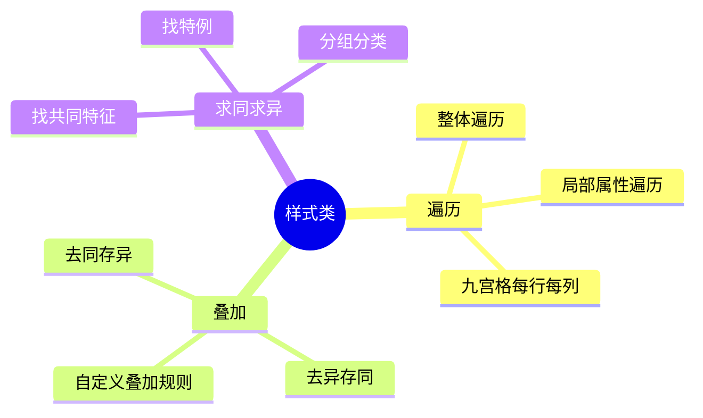

### 2.1 遍历

**核心概念**：所有元素在每行/列/组中各出现一次——**"缺什么补什么"**。

#### 图示讲解：九宫格双重遍历

```svg
<svg width="360" height="360" viewBox="0 0 360 360">
  <style>
    .grid { fill: #f8fafc; stroke: #334155; stroke-width: 2; }
    .qmark { font: bold 28px sans-serif; fill: #dc2626; text-anchor: middle; }
  </style>
  <!-- 网格线 -->
  <rect x="20" y="20" width="320" height="320" fill="none" stroke="#334155" stroke-width="2"/>
  <line x1="127" y1="20" x2="127" y2="340" stroke="#334155" stroke-width="2"/>
  <line x1="233" y1="20" x2="233" y2="340" stroke="#334155" stroke-width="2"/>
  <line x1="20" y1="127" x2="340" y2="127" stroke="#334155" stroke-width="2"/>
  <line x1="20" y1="233" x2="340" y2="233" stroke="#334155" stroke-width="2"/>
  <!-- Row 1: ○实心 △斜线 □空心 -->
  <!-- (1,1) ○实心 -->
  <circle cx="73" cy="73" r="25" fill="#2563eb" stroke="#1e40af" stroke-width="2"/>
  <!-- (1,2) △斜线 -->
  <polygon points="180,45 210,100 150,100" fill="url(#hatch1)" stroke="#334155" stroke-width="2"/>
  <defs>
    <pattern id="hatch1" patternUnits="userSpaceOnUse" width="6" height="6" patternTransform="rotate(45)">
      <line x1="0" y1="0" x2="0" y2="6" stroke="#334155" stroke-width="1.5"/>
    </pattern>
  </defs>
  <!-- (1,3) □空心 -->
  <rect x="248" y="48" width="45" height="45" fill="#fff" stroke="#334155" stroke-width="2"/>
  <!-- Row 2: △空心 □实心 ○斜线 -->
  <!-- (2,1) △空心 -->
  <polygon points="73,147 103,205 43,205" fill="#fff" stroke="#334155" stroke-width="2"/>
  <!-- (2,2) □实心 -->
  <rect x="155" y="155" width="45" height="45" fill="#2563eb" stroke="#1e40af" stroke-width="2"/>
  <!-- (2,3) ○斜线 -->
  <circle cx="287" cy="180" r="25" fill="url(#hatch1)" stroke="#334155" stroke-width="2"/>
  <!-- Row 3: □斜线 ○空心 ？ -->
  <!-- (3,1) □斜线 -->
  <rect x="40" y="248" width="45" height="45" fill="url(#hatch1)" stroke="#334155" stroke-width="2"/>
  <!-- (3,2) ○空心 -->
  <circle cx="180" cy="287" r="25" fill="#fff" stroke="#334155" stroke-width="2"/>
  <!-- (3,3) ？ -->
  <text x="287" y="295" class="qmark">?</text>
  <!-- 标注 -->
  <text x="73" y="345" style="font:10px sans-serif;fill:#64748b;text-anchor:middle;">形状:○△□ × 花纹:■▒□</text>
  <text x="233" y="345" style="font:10px sans-serif;fill:#64748b;text-anchor:middle;">每行遍历所有组合</text>
</svg>
```

#### 经典例题

<section data-exam-question>

**【遍历】** 上图九宫格中，每行包含○△□三种形状各一次，包含实心/斜线/空心三种花纹各一次。问号处应填入？

A. △实心　　B. ○实心　　C. △空心　　D. □斜线

</section>

**答案：A**

**解析**：第3行已有形状□、○→缺**△**；已有花纹斜线、空心→缺**实心**→答案 = **△实心** ✅

---

### 2.2 叠加（去同存异）

**核心概念**：两图叠加时去掉公共部分，保留独有部分。

#### 图示讲解：去同存异运算过程

```svg
<svg width="480" height="150" viewBox="0 0 480 150">
  <style>
    .bg { fill: #f8fafc; stroke: #e2e8f0; stroke-width: 1; rx: 8; }
    .ln { stroke: #2563eb; stroke-width: 3; stroke-linecap: round; }
    .rm { stroke: #dc2626; stroke-width: 3; stroke-linecap: round; stroke-dasharray: 6 4; }
    .keep { stroke: #16a34a; stroke-width: 3.5; stroke-linecap: round; }
    .tag { font: bold 13px sans-serif; fill: #334155; text-anchor: middle; }
    .note { font: 11px sans-serif; fill: #64748b; text-anchor: middle; }
  </style>
  <!-- 图1: 方框 (上横+左竖+右竖) -->
  <g transform="translate(20,15)">
    <rect width="100" height="100" class="bg"/>
    <line x1="20" y1="30" x2="80" y2="30" class="ln"/>
    <line x1="20" y1="30" x2="20" y2="80" class="ln"/>
    <line x1="80" y1="30" x2="80" y2="80" class="ln"/>
    <text x="50" y="95" class="tag">图1</text>
  </g>
  <!-- +号 -->
  <text x="140" y="65" style="font:bold 24px sans-serif;fill:#334155;text-anchor:middle;">+</text>
  <!-- 图2: T形 (上横+中竖) -->
  <g transform="translate(160,15)">
    <rect width="100" height="100" class="bg"/>
    <line x1="20" y1="30" x2="80" y2="30" class="ln"/>
    <line x1="50" y1="30" x2="50" y2="80" class="ln"/>
    <text x="50" y="95" class="tag">图2</text>
  </g>
  <!-- =号 -->
  <text x="280" y="65" style="font:bold 24px sans-serif;fill:#334155;text-anchor:middle;">=</text>
  <!-- 图3: U形 (左竖+右竖) = 去掉共同的上横线 -->
  <g transform="translate(300,15)">
    <rect width="100" height="100" class="bg"/>
    <line x1="20" y1="30" x2="20" y2="80" class="keep"/>
    <line x1="80" y1="30" x2="80" y2="80" class="keep"/>
    <text x="50" y="95" class="tag">图3</text>
  </g>
  <!-- 注释 -->
  <g transform="translate(415,15)">
    <rect width="55" height="90" class="bg" fill="#fef2f2"/>
    <text x="28" y="25" class="note" style="fill:#dc2626">去掉</text>
    <text x="28" y="42" class="note" style="fill:#dc2626">上横线</text>
    <text x="28" y="62" class="note" style="fill:#16a34a">保留</text>
    <text x="28" y="79" class="note" style="fill:#16a34a">两竖线</text>
  </g>
</svg>
```

#### 经典例题

<section data-exam-question>

**【叠加】** 规律为每行"图1 + 图2 = 图3"（去同存异）。已知第1行验证通过（方框+T形=U形），第2行验证通过（十字+十字=空白）。第3行图1={上横,左竖}，图2={上横,右竖}，图3=？

A. 左竖+右竖　　B. 只有左竖　　C. 只有上横　　D. 十字形

</section>

**答案：A**

**解析**：共同部分={上横}→去掉；独有部分={左竖}+{右竖}→保留→**左右两竖线** ✅

**⚠ 易错辨析**：必须先用已知行验证叠加规则是"去同存异"还是"去异存同"，再套用。

---

## 三、属性类规律

### 知识框架

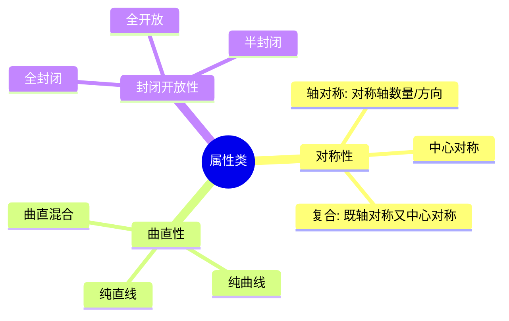

### 3.1 对称性

#### 图示讲解：对称轴数量递增规律

```svg
<svg width="520" height="200" viewBox="0 0 520 200">
  <style>
    .bg { fill: #f8fafc; stroke: #e2e8f0; stroke-width: 1; rx: 8; }
    .shape { fill: none; stroke: #2563eb; stroke-width: 2.5; }
    .ax { stroke: #dc2626; stroke-width: 1.5; stroke-dasharray: 5 3; }
    .num { font: bold 18px sans-serif; fill: #dc2626; text-anchor: middle; }
    .tag { font: 13px sans-serif; fill: #334155; text-anchor: middle; }
  </style>
  <!-- 图1: 等腰三角形 1条对称轴 -->
  <g transform="translate(15,15)">
    <rect width="90" height="130" class="bg"/>
    <polygon points="45,20 75,90 15,90" class="shape"/>
    <line x1="45" y1="15" x2="45" y2="95" class="ax"/>
    <text x="45" y="115" class="num">1条</text>
    <text x="45" y="130" class="tag">等腰△</text>
  </g>
  <!-- 图2: 菱形 2条对称轴 -->
  <g transform="translate(120,15)">
    <rect width="90" height="130" class="bg"/>
    <polygon points="45,15 80,65 45,115 10,65" class="shape"/>
    <line x1="45" y1="10" x2="45" y2="120" class="ax"/>
    <line x1="5" y1="65" x2="85" y2="65" class="ax"/>
    <text x="45" y="135" class="num">2条</text>
  </g>
  <!-- 图3: 等边三角形 3条对称轴 -->
  <g transform="translate(225,15)">
    <rect width="90" height="130" class="bg"/>
    <polygon points="45,15 80,78 10,78" class="shape"/>
    <line x1="45" y1="10" x2="45" y2="83" class="ax"/>
    <line x1="45" y1="10" x2="12" y2="78" class="ax" stroke="none"/>
    <line x1="14" y1="78" x2="62" y2="15" class="ax"/>
    <line x1="76" y1="78" x2="28" y2="15" class="ax"/>
    <text x="45" y="115" class="num">3条</text>
    <text x="45" y="130" class="tag">等边△</text>
  </g>
  <!-- 图4: 正方形 4条对称轴 -->
  <g transform="translate(330,15)">
    <rect width="90" height="130" class="bg"/>
    <rect x="15" y="20" width="60" height="60" class="shape"/>
    <line x1="45" y1="15" x2="45" y2="85" class="ax"/>
    <line x1="10" y1="50" x2="80" y2="50" class="ax"/>
    <line x1="15" y1="20" x2="75" y2="80" class="ax"/>
    <line x1="75" y1="20" x2="15" y2="80" class="ax"/>
    <text x="45" y="110" class="num">4条</text>
    <text x="45" y="126" class="tag">正方形</text>
  </g>
  <!-- 图5: 五角星 5条对称轴 -->
  <g transform="translate(435,15)">
    <rect width="80" height="130" class="bg"/>
    <polygon points="40,15 47,35 68,35 51,47 58,68 40,55 22,68 29,47 12,35 33,35" class="shape" fill="#eff6ff"/>
    <line x1="40" y1="10" x2="40" y2="73" class="ax"/>
    <text x="40" y="108" class="num">5条</text>
    <text x="40" y="124" class="tag">五角星</text>
  </g>
  <!-- 箭头 -->
  <text x="260" y="170" style="font:bold 13px sans-serif;fill:#16a34a;text-anchor:middle;">规律：对称轴数量 = 1 → 2 → 3 → 4 → 5（每次+1）</text>
  <text x="260" y="190" style="font:11px sans-serif;fill:#94a3b8;text-anchor:middle;">红色虚线 = 对称轴</text>
</svg>
```

#### 经典例题

<section data-exam-question>

**【对称性】** 对称轴数量按等差递增（1→2→3→4→？），图4为正方形（4条对称轴），图5应选？

A. 圆（∞条）　　B. 五角星（5条）　　C. 平行四边形（0条）　　D. 直角三角形（0条）

</section>

**答案：B**

**解析**：对称轴数 = 1→2→3→4→**5**，等差+1。五角星有5条对称轴 ✅

#### 常见图形对称性速查表

| 图形 | 对称轴数 | 中心对称 |
|------|:--------:|:--------:|
| 等腰三角形 | 1 | ❌ |
| 等边三角形 | 3 | ❌ |
| 菱形 | 2 | ✅ |
| 正方形 | 4 | ✅ |
| 圆 | ∞ | ✅ |
| 正五角星 | 5 | ❌ |
| 正六边形 | 6 | ✅ |
| 平行四边形 | 0 | ✅ |

---

### 3.2 曲直性

**核心概念**：判断图形由纯直线、纯曲线还是曲直混合构成。只有 **3 种状态**。

#### 图示讲解

```svg
<svg width="420" height="170" viewBox="0 0 420 170">
  <style>
    .bg { fill: #f8fafc; stroke: #e2e8f0; stroke-width: 1; rx: 8; }
    .shape { fill: none; stroke-width: 2.5; }
    .tag { font: bold 13px sans-serif; fill: #334155; text-anchor: middle; }
    .note { font: 12px sans-serif; fill: #dc2626; text-anchor: middle; }
  </style>
  <!-- 纯曲线 -->
  <g transform="translate(20,15)">
    <rect width="110" height="120" class="bg"/>
    <circle cx="55" cy="55" r="35" class="shape" stroke="#2563eb"/>
    <text x="55" y="110" class="tag">纯曲线</text>
    <text x="55" y="130" class="note">○ 圆</text>
  </g>
  <!-- 纯直线 -->
  <g transform="translate(155,15)">
    <rect width="110" height="120" class="bg"/>
    <polygon points="55,15 90,85 20,85" class="shape" stroke="#16a34a"/>
    <text x="55" y="110" class="tag">纯直线</text>
    <text x="55" y="130" class="note">△ 三角形</text>
  </g>
  <!-- 曲直混合 -->
  <g transform="translate(290,15)">
    <rect width="110" height="120" class="bg"/>
    <path d="M 25,80 A 30,30 0 0 1 85,80 L 85,80 L 55,25 Z" class="shape" stroke="#9333ea"/>
    <text x="55" y="110" class="tag">曲直混合</text>
    <text x="55" y="130" class="note">D形/半圆</text>
  </g>
  <text x="210" y="160" style="font:11px sans-serif;fill:#64748b;text-anchor:middle;">曲直性只有 3 种状态，优先检验</text>
</svg>
```

#### 经典例题

<section data-exam-question>

**【曲直性】** 图1为圆（纯曲线）→ 图2为三角形（纯直线）→ 图3为D形（曲直混合）→ 图4应为？

A. 正方形（纯直线）　　B. 椭圆（纯曲线）　　C. 六边形（纯直线）　　D. 半圆（曲直混合）

</section>

**答案：B**

**解析**：三种状态遍历后循环，下一轮从纯曲线开始→椭圆是纯曲线 ✅

---

### 3.3 封闭开放性

#### 图示讲解

```svg
<svg width="420" height="140" viewBox="0 0 420 140">
  <style>
    .shape { fill: none; stroke-width: 2.5; }
    .tag { font: bold 12px sans-serif; fill: #334155; text-anchor: middle; }
    .num { font: bold 14px sans-serif; fill: #dc2626; text-anchor: middle; }
  </style>
  <!-- Y 开放 0面 -->
  <g transform="translate(30,10)">
    <path d="M 30,10 L 30,50 M 30,30 L 10,10 M 30,30 L 50,10" class="shape" stroke="#2563eb"/>
    <text x="30" y="70" class="tag">Y形</text>
    <text x="30" y="88" class="num">0面</text>
  </g>
  <!-- 圆 封闭 1面 -->
  <g transform="translate(140,10)">
    <circle cx="30" cy="35" r="25" class="shape" stroke="#16a34a"/>
    <text x="30" y="75" class="tag">○</text>
    <text x="30" y="93" class="num">1面</text>
  </g>
  <!-- 8字 封闭 2面 -->
  <g transform="translate(250,10)">
    <path d="M 30,15 A 15,15 0 1 1 30,45 A 15,15 0 1 1 30,15 M 30,45 A 15,15 0 1 0 30,75 A 15,15 0 1 0 30,45" class="shape" stroke="#9333ea" fill="none"/>
    <text x="30" y="95" class="tag">∞形</text>
    <text x="30" y="113" class="num">2面</text>
  </g>
  <!-- 品字 封闭 3面 -->
  <g transform="translate(350,10)">
    <circle cx="20" cy="25" r="15" class="shape" stroke="#ea580c"/>
    <circle cx="45" cy="25" r="15" class="shape" stroke="#ea580c"/>
    <circle cx="32" cy="50" r="15" class="shape" stroke="#ea580c"/>
    <text x="32" y="80" class="tag">品形</text>
    <text x="32" y="98" class="num">3面</text>
  </g>
  <text x="210" y="130" style="font:11px sans-serif;fill:#64748b;text-anchor:middle;">封闭区域数 = 0 → 1 → 2 → 3（等差递增）</text>
</svg>
```

**⚠ 易错辨析**：封闭性≠面数。封闭性是定性（是否封闭），面数是定量（几个封闭区域）。

---

## 四、数量类规律

### 知识框架

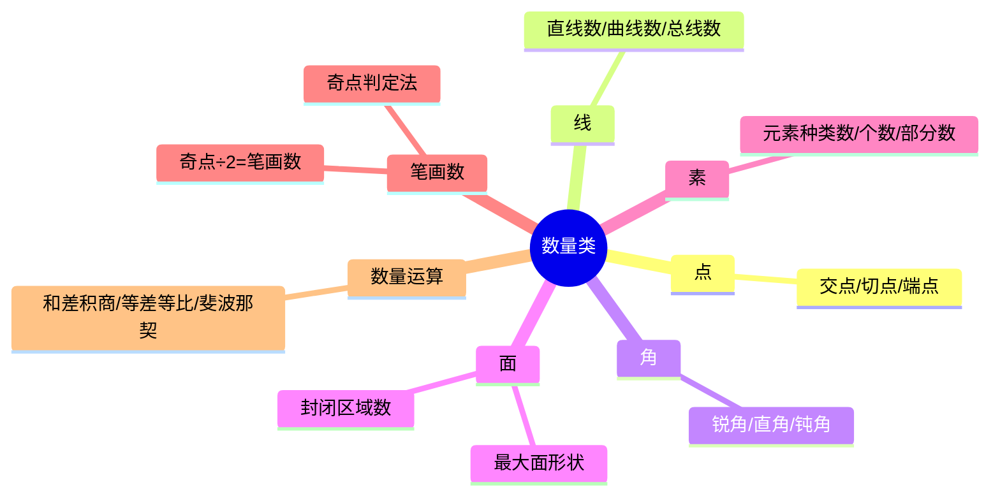

### 数量类选择策略

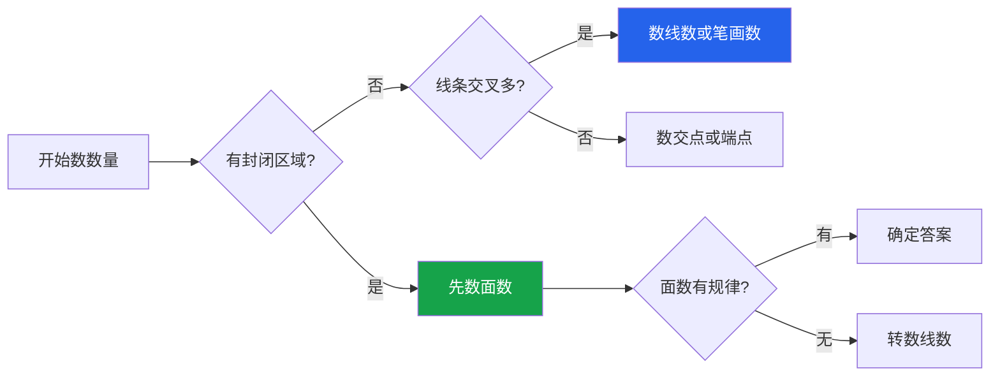

---

### 4.1 面数

**核心概念**：封闭区域（"窟窿"）的数量。**面数是最常见的数量类考点之一。**

#### 图示讲解

```svg
<svg width="440" height="150" viewBox="0 0 440 150">
  <style>
    .shape { fill: #eff6ff; stroke: #2563eb; stroke-width: 2; }
    .num { font: bold 20px sans-serif; fill: #dc2626; text-anchor: middle; }
    .tag { font: 12px sans-serif; fill: #334155; text-anchor: middle; }
  </style>
  <!-- 1面：圆 -->
  <g transform="translate(30,15)">
    <circle cx="40" cy="40" r="35" class="shape"/>
    <text x="40" y="47" class="num">1</text>
    <text x="40" y="100" class="tag">1个面</text>
  </g>
  <!-- 2面：8字 -->
  <g transform="translate(145,15)">
    <circle cx="40" cy="25" r="22" class="shape"/>
    <circle cx="40" cy="60" r="22" class="shape"/>
    <text x="40" y="30" style="font:14px sans-serif;fill:#dc2626;text-anchor:middle;">①</text>
    <text x="40" y="65" style="font:14px sans-serif;fill:#dc2626;text-anchor:middle;">②</text>
    <text x="40" y="100" class="tag">2个面</text>
  </g>
  <!-- 3面：品字 -->
  <g transform="translate(260,15)">
    <circle cx="25" cy="25" r="20" class="shape"/>
    <circle cx="55" cy="25" r="20" class="shape"/>
    <circle cx="40" cy="50" r="20" class="shape"/>
    <text x="40" y="100" class="tag">3个面</text>
  </g>
  <!-- 4面：田字 -->
  <g transform="translate(360,10)">
    <rect x="5" y="5" width="60" height="60" class="shape"/>
    <line x1="35" y1="5" x2="35" y2="65" stroke="#2563eb" stroke-width="2"/>
    <line x1="5" y1="35" x2="65" y2="35" stroke="#2563eb" stroke-width="2"/>
    <text x="35" y="100" class="tag">4个面</text>
  </g>
  <text x="220" y="130" style="font:11px sans-serif;fill:#64748b;text-anchor:middle;">口诀："数窟窿"——看图形中有几个完全封闭的洞</text>
</svg>
```

#### 经典例题

<section data-exam-question>

**【面数】** 面数序列为 1→2→3→？，问号处的图形应有几个封闭区域？

A. 3个　　B. 4个　　C. 5个　　D. 6个

</section>

**答案：B**

---

### 4.2 笔画数（极高频考点）

**核心公式**：

$$\text{笔画数} = \frac{\text{奇点数}}{2}$$

> **奇点** = 引出**奇数**条线（1、3、5…）的点
>
> - 奇点 = 0 → 一笔画 ✅
> - 奇点 = 2 → 一笔画 ✅
> - 奇点 = 4 → 两笔画
> - 奇点 = 2n → n 笔画

#### 图示讲解：奇点判定

```svg
<svg width="460" height="220" viewBox="0 0 460 220">
  <style>
    .ln { stroke: #2563eb; stroke-width: 2.5; stroke-linecap: round; }
    .odd { fill: #dc2626; } .even { fill: #94a3b8; }
    .tag { font: bold 13px sans-serif; fill: #334155; text-anchor: middle; }
    .res { font: bold 14px sans-serif; fill: #16a34a; text-anchor: middle; }
    .lbl { font: 10px sans-serif; text-anchor: middle; }
  </style>
  <!-- 正方形：0奇点 → 1笔画 -->
  <g transform="translate(20,15)">
    <rect x="10" y="10" width="80" height="80" fill="none" stroke="#2563eb" stroke-width="2.5"/>
    <circle cx="10" cy="10" r="5" class="even"/>
    <circle cx="90" cy="10" r="5" class="even"/>
    <circle cx="10" cy="90" r="5" class="even"/>
    <circle cx="90" cy="90" r="5" class="even"/>
    <text x="50" y="115" class="tag">正方形</text>
    <text x="50" y="133" style="font:11px sans-serif;fill:#64748b;text-anchor:middle;">每点引出2条线(偶)</text>
    <text x="50" y="150" class="res">奇点=0 → 1笔画 ✅</text>
  </g>
  <!-- 田字形：4奇点 → 2笔画 -->
  <g transform="translate(170,15)">
    <rect x="10" y="10" width="80" height="80" fill="none" stroke="#2563eb" stroke-width="2.5"/>
    <line x1="50" y1="10" x2="50" y2="90" stroke="#2563eb" stroke-width="2.5"/>
    <line x1="10" y1="50" x2="90" y2="50" stroke="#2563eb" stroke-width="2.5"/>
    <!-- 四角偶点 -->
    <circle cx="10" cy="10" r="4" class="even"/>
    <circle cx="90" cy="10" r="4" class="even"/>
    <circle cx="10" cy="90" r="4" class="even"/>
    <circle cx="90" cy="90" r="4" class="even"/>
    <!-- 中间T形交点=奇点 -->
    <circle cx="50" cy="10" r="5" class="odd"/>
    <circle cx="50" cy="90" r="5" class="odd"/>
    <circle cx="10" cy="50" r="5" class="odd"/>
    <circle cx="90" cy="50" r="5" class="odd"/>
    <!-- 中心=偶点 -->
    <circle cx="50" cy="50" r="4" class="even"/>
    <text x="50" y="115" class="tag">田字形</text>
    <text x="50" y="133" style="font:11px sans-serif;fill:#dc2626;text-anchor:middle;">红点=奇点(引出3条线)</text>
    <text x="50" y="150" class="res" style="fill:#dc2626">奇点=4 → 2笔画 ❌</text>
  </g>
  <!-- 圆：0奇点 → 1笔画 -->
  <g transform="translate(330,15)">
    <circle cx="50" cy="50" r="40" fill="none" stroke="#2563eb" stroke-width="2.5"/>
    <text x="50" y="115" class="tag">圆</text>
    <text x="50" y="133" style="font:11px sans-serif;fill:#64748b;text-anchor:middle;">无奇点(连续曲线)</text>
    <text x="50" y="150" class="res">奇点=0 → 1笔画 ✅</text>
  </g>
  <!-- 图例 -->
  <circle cx="150" cy="195" r="5" class="odd"/>
  <text x="170" y="199" style="font:11px sans-serif;fill:#334155;">= 奇点（引出奇数条线）</text>
  <circle cx="310" cy="195" r="5" class="even"/>
  <text x="330" y="199" style="font:11px sans-serif;fill:#334155;">= 偶点（引出偶数条线）</text>
</svg>
```

#### 经典例题

<section data-exam-question>

**【笔画数】** 以下哪些是一笔画图形？①正方形 ②田字形 ③圆 ④两个不相连的圆

A. 只有①　　B. ①和③　　C. ①②③　　D. ①③④

</section>

**答案：B**

**解析**：

| 图形 | 奇点数 | 笔画数 | 一笔画？ |
|------|:------:|:------:|:--------:|
| ①正方形 | 0 | 0÷2=1 | ✅ |
| ②田字形 | 4 | 4÷2=2 | ❌ |
| ③圆 | 0 | 0÷2=1 | ✅ |
| ④两分离圆 | — | 不连通≥2 | ❌ |

**⚠ 易错辨析**：端点也是奇点！两个不相连的图形一定不是一笔画。

---

### 4.3 线数

<section data-exam-question>

**【线数】** 直线数序列为 1→2→3→？，图4应有几条直线？

A. 2条　　B. 4条　　C. 5条　　D. 6条

</section>

**答案：B**（等差+1）

---

### 4.4 点数

<section data-exam-question>

**【点数】** 交点数序列为 0→1→3→？，差值为+1、+2、？，图4应有几个交点？

A. 4个　　B. 5个　　C. 6个　　D. 7个

</section>

**答案：C**

**解析**：差值递增（+1, +2, +3）→ 3+3=**6** ✅

---

## 五、空间重构

### 知识框架

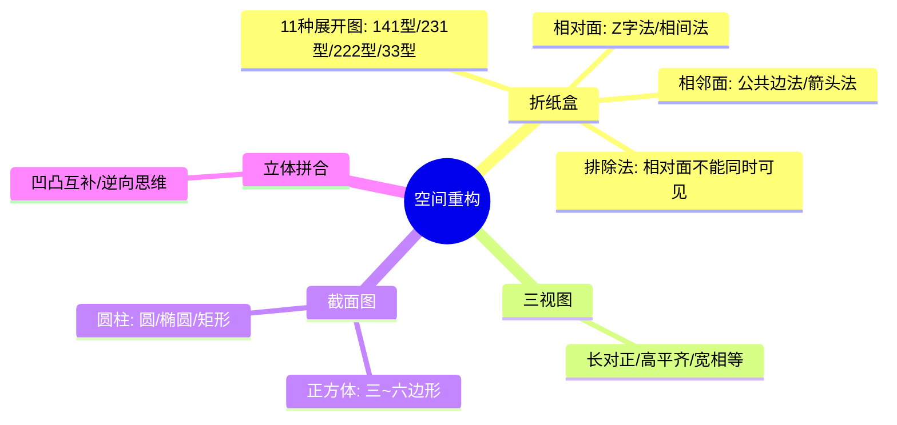

### 5.1 折纸盒

**解题三步法**：

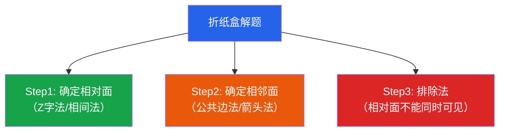

#### 图示讲解：一字形展开图的相对面判定

```svg
<svg width="500" height="140" viewBox="0 0 500 140">
  <style>
    .face { fill: #eff6ff; stroke: #334155; stroke-width: 2; }
    .pair { fill: #fef2f2; stroke: #dc2626; stroke-width: 2; }
    .ftxt { font: bold 22px sans-serif; text-anchor: middle; }
    .tag { font: 12px sans-serif; fill: #334155; text-anchor: middle; }
    .note { font: 11px sans-serif; fill: #dc2626; text-anchor: middle; }
  </style>
  <!-- 6个面一字排列 -->
  <rect x="10" y="20" width="70" height="70" class="pair"/>
  <text x="45" y="62" class="ftxt" fill="#dc2626">★</text>
  <text x="45" y="105" class="tag">①</text>

  <rect x="80" y="20" width="70" height="70" class="face"/>
  <text x="115" y="62" class="ftxt" fill="#334155">●</text>
  <text x="115" y="105" class="tag">②</text>

  <rect x="150" y="20" width="70" height="70" class="face"/>
  <text x="185" y="62" class="ftxt" fill="#334155">○</text>
  <text x="185" y="105" class="tag">③</text>

  <rect x="220" y="20" width="70" height="70" class="pair"/>
  <text x="255" y="62" class="ftxt" fill="#dc2626">□</text>
  <text x="255" y="105" class="tag">④</text>

  <rect x="290" y="20" width="70" height="70" class="face"/>
  <text x="325" y="62" class="ftxt" fill="#334155">△</text>
  <text x="325" y="105" class="tag">⑤</text>

  <rect x="360" y="20" width="70" height="70" class="face"/>
  <text x="395" y="62" class="ftxt" fill="#334155">◇</text>
  <text x="395" y="105" class="tag">⑥</text>

  <!-- 相对面连线 -->
  <path d="M 45,95 C 45,135 255,135 255,95" fill="none" stroke="#dc2626" stroke-width="2" stroke-dasharray="6 3"/>
  <text x="150" y="135" class="note">★① ←间隔2个→ □④ = 相对面</text>
  <text x="250" y="5" style="font:bold 12px sans-serif;fill:#16a34a;text-anchor:middle;">规则：间隔2个面 = 相对面（Z字法）</text>
</svg>
```

#### 经典例题

<section data-exam-question>

**【折纸盒】** 一字形展开图 6个面依次为 ★●○□△◇，折叠后哪组是相对面？

A. ★和●　　B. ★和○　　C. ★和□　　D. ○和△

</section>

**答案：C**

**解析**：间隔2个→①④(★□)、②⑤(●△)、③⑥(○◇)互为相对面。★和□间隔2个→**相对面** ✅

**💡 技巧**：排除法最快——如果选项中两个相对面同时出现在一个视图中，直接排除。

---

### 5.2 三视图

**核心原则**：长对正、高平齐、宽相等

#### 图示讲解：L形立体的三视图

```svg
<svg width="420" height="200" viewBox="0 0 420 200">
  <style>
    .blk { fill: #2563eb; stroke: #1e40af; stroke-width: 1; }
    .lbl { font: bold 12px sans-serif; fill: #334155; text-anchor: middle; }
    .dir { font: 11px sans-serif; fill: #64748b; text-anchor: middle; }
  </style>
  <!-- 立体示意（斜二测画法） -->
  <g transform="translate(10,10)">
    <text x="60" y="15" class="lbl">立体图</text>
    <!-- 底层2个 -->
    <rect x="20" y="50" width="30" height="30" class="blk"/>
    <rect x="50" y="50" width="30" height="30" class="blk"/>
    <!-- 上层1个叠在左侧 -->
    <rect x="20" y="20" width="30" height="30" class="blk" fill="#3b82f6"/>
  </g>
  <!-- 正视图 -->
  <g transform="translate(150,10)">
    <text x="40" y="15" class="lbl">正视图</text>
    <rect x="10" y="50" width="60" height="30" class="blk"/>
    <rect x="10" y="20" width="30" height="30" class="blk" fill="#3b82f6"/>
    <text x="40" y="100" class="dir">（从前往后看）</text>
  </g>
  <!-- 侧视图 -->
  <g transform="translate(290,10)">
    <text x="30" y="15" class="lbl">侧视图</text>
    <rect x="10" y="50" width="30" height="30" class="blk"/>
    <rect x="10" y="20" width="30" height="30" class="blk" fill="#3b82f6"/>
    <text x="25" y="100" class="dir">（从左往右看）</text>
  </g>
</svg>
```

#### 经典例题

<section data-exam-question>

**【三视图】** L形立体（底层2个方块并排，上层1个叠在左侧），正视图是？

A. 上1左对齐+下2并排　　B. 上2+下1　　C. 只有1列2层　　D. 只有1列1层

</section>

**答案：A**

---

### 5.3 截面图速查

| 几何体 | 可能截面 | 不可能截面 |
|--------|---------|-----------|
| 正方体 | 三角形、四边形、五边形、**六边形** | **七边形及以上** |
| 圆柱 | 圆、椭圆、矩形 | 梯形 |
| 圆锥 | 圆、椭圆、三角形、抛物线 | 矩形 |

> 💡 正方体最多截出**六边形**（截面最多经过6条棱）

---

## 六、功能类规律

### 知识框架

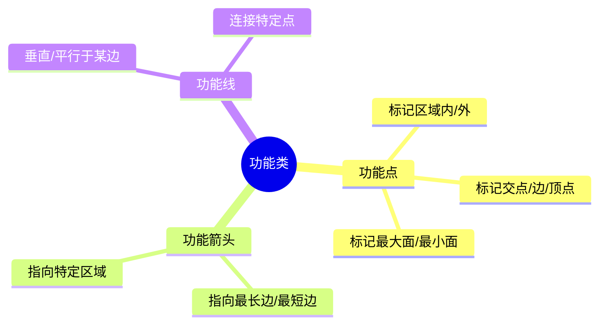

**🔑 识别信号**：图形中出现小黑点、小箭头、小圆圈等"小元素"——它们不是装饰，而是**标记某种关系**。

#### 图示讲解：功能箭头指向边缘

```svg
<svg width="420" height="150" viewBox="0 0 420 150">
  <style>
    .shape { fill: none; stroke: #2563eb; stroke-width: 2.5; }
    .arrow { fill: #dc2626; stroke: none; }
    .tag { font: 12px sans-serif; fill: #334155; text-anchor: middle; }
  </style>
  <!-- 正方形+箭头指向右边 -->
  <g transform="translate(20,15)">
    <rect x="10" y="10" width="70" height="70" class="shape"/>
    <polygon points="60,45 48,38 48,52" class="arrow"/>
    <line x1="35" y1="45" x2="48" y2="45" stroke="#dc2626" stroke-width="2"/>
    <text x="45" y="100" class="tag">指向边</text>
  </g>
  <!-- 三角形+箭头指向顶角 -->
  <g transform="translate(145,15)">
    <polygon points="45,10 80,80 10,80" class="shape"/>
    <polygon points="45,25 38,18 52,18" class="arrow"/>
    <line x1="45" y1="45" x2="45" y2="22" stroke="#dc2626" stroke-width="2"/>
    <text x="45" y="100" class="tag">指向角</text>
  </g>
  <!-- 圆+箭头指向圆周 -->
  <g transform="translate(270,15)">
    <circle cx="45" cy="45" r="35" class="shape"/>
    <polygon points="75,45 65,38 65,52" class="arrow"/>
    <line x1="45" y1="45" x2="65" y2="45" stroke="#dc2626" stroke-width="2"/>
    <text x="45" y="100" class="tag">指向圆周</text>
  </g>
  <text x="210" y="135" style="font:bold 12px sans-serif;fill:#16a34a;text-anchor:middle;">共同规律：箭头从中心指向图形边缘</text>
</svg>
```

<section data-exam-question>

**【功能箭头】** 上图中箭头的共同规律是？

A. 指向图形内部　　B. 指向图形的边　　C. 从中心指向边缘　　D. 指向图形的角

</section>

**答案：C**

---

## 七、复合与创新题型

### 知识框架

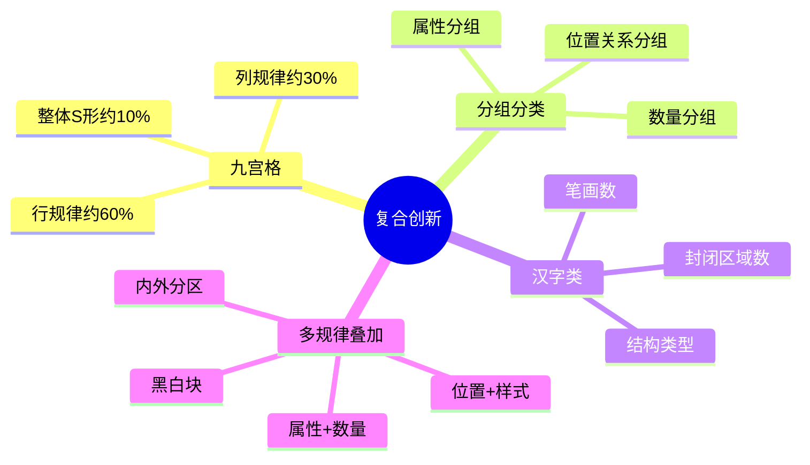

### 7.1 九宫格解题优先级

**先横看（行）→ 再竖看（列）→ 最后整体看（S形/对角线）**

<section data-exam-question>

**【九宫格】** 面数九宫格：第1行(1,1,1)恒定；第2行(2,3,4)等差+1；第3行(1,2,?)。问号=？

A. 2　　B. 3　　C. 4　　D. 5

</section>

**答案：B**（第3行等差+1：1→2→**3**）

---

### 7.2 分组分类万能三步法

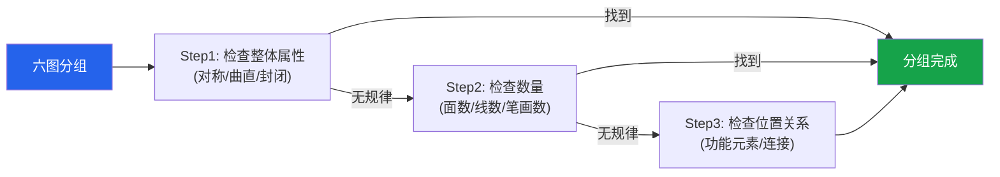

<section data-exam-question>

**【分组分类】** ①正方形 ②字母H ③圆 ④字母A ⑤三角形 ⑥字母K。分为两组：

A. ①③⑤ | ②④⑥　　B. ①②③ | ④⑤⑥　　C. ①④⑤ | ②③⑥　　D. ①③⑥ | ②④⑤

</section>

**答案：A**

**解析**：①③⑤=封闭图形，②④⑥=开放图形。按封闭性分组 ✅

---

### 7.3 汉字类三把刀

① **笔画数**（最常考）② **封闭区域数** ③ **结构特征**

<section data-exam-question>

**【汉字】** "一"(1画) → "十"(2画) → "工"(3画) → ？

A. 王(4画)　　B. 正(5画)　　C. 出(5画)　　D. 石(5画)

</section>

**答案：A**（笔画数等差+1）

---

## 八、高频考点速查表

```chart
{
  "type": "bar",
  "data": {
    "labels": ["笔画数", "面数", "折纸盒", "对称性", "平移", "线数", "遍历", "叠加", "分组分类", "旋转", "曲直性", "封闭性", "翻转", "三视图", "功能元素"],
    "datasets": [{
      "label": "考试高频指数",
      "data": [95, 90, 88, 85, 80, 78, 75, 73, 72, 70, 60, 58, 55, 50, 48],
      "backgroundColor": ["#dc2626","#dc2626","#dc2626","#ea580c","#ea580c","#ea580c","#2563eb","#2563eb","#2563eb","#2563eb","#16a34a","#16a34a","#16a34a","#64748b","#64748b"]
    }]
  },
  "options": {
    "indexAxis": "y",
    "plugins": {
      "legend": { "display": false },
      "title": { "display": true, "text": "图形推理各考点考试频率" }
    }
  }
}
```

| 考点 | 识别信号 | 核心方法 |
|------|---------|---------|
| **笔画数** | 线条多且交叉 | 奇点÷2 |
| **面数** | 封闭区域明显 | "数窟窿" |
| **折纸盒** | 展开图→立体 | 相对面排除法 |
| **对称性** | 常见对称图形 | 先定性再定量 |
| **平移** | 框架不变，元素位置变 | 标坐标看方向步长 |
| **遍历** | 九宫格+元素组合 | 缺啥补啥 |
| **叠加** | 行内三图相关 | 先验证规则再套用 |

---

## 九、解题策略总览

### 时间分配

| 题型 | 建议用时 | 策略 |
|------|:--------:|------|
| 位置类 | ≤40秒 | 标坐标快速判断 |
| 样式类 | ≤45秒 | 先验证规则 |
| 属性类 | ≤30秒 | 最快，优先检验 |
| 数量类 | ≤60秒 | 面数→线数→笔画数 |
| 空间重构 | ≤60秒 | 排除法优先 |
| 复合题 | ≤90秒 | 拆分为两步规律 |

### 常见陷阱

| 陷阱 | 说明 |
|------|------|
| 规律过于简单 | 恒定不变（所有图都是3个面）**也是规律** |
| 只找到一个规律 | 可能存在第二层规律叠加 |
| 对称=只考虑对称性 | 对称轴**数量**变化也是考点 |
| 翻转误认为旋转 | 用旋向性区分 |
| 忽略端点 | **端点也是奇点** |
| 漏数面 | 被图形复杂度干扰 |

---

> **💡 备考建议**：图形推理的核心是"**观察力 + 经验**"。每天练习 10-15 题，积累常见规律模式。先确保基础考点烂熟于心，再攻克复合规律。**超过1分钟没思路就先跳过**，回头再做。
