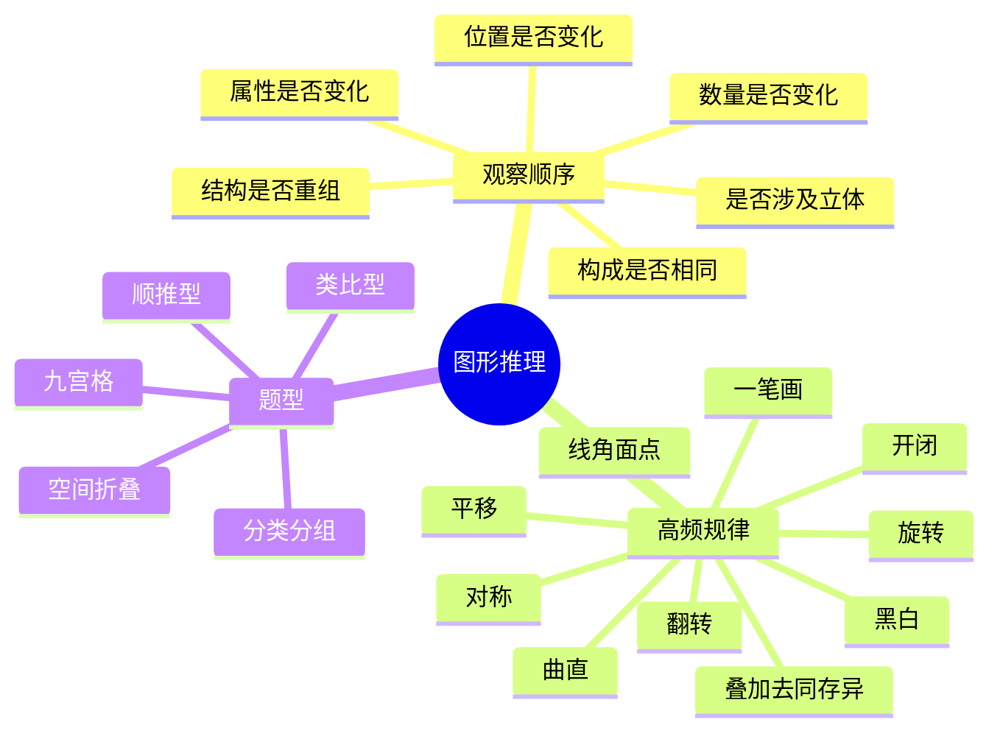

# 图形推理系统总结：规律、方法、例题

图形推理本质上是在有限图形信息中找“稳定变化关系”。真正高频的规律并不多，难点在于题目会把位置、属性、数量、结构混在一起考，因此做题顺序比单个技巧更重要。

## 一、图推的总做题顺序

1. 先看“元素构成”  
如果每幅图的基本元素都差不多，只是摆放方式不同，优先考虑位置规律和遍历规律；如果元素数量明显在变，优先考虑数量规律；如果图形外形整体在变但数量不敏感，优先考虑属性和结构。

2. 再看“整体是否在动”  
最先排查平移、旋转、翻转、顺逆时针遍历、里外交换、上下左右交换。这一步能解决大量序列题和类比题。

3. 再看“图形性质有没有变化”  
对称性、开闭性、曲直性、凹凸性、黑白填充、线条粗细、连通性，都是常见稳定考点。

4. 最后再做“数量统计”  
数量规律最容易漏，也最费时间。通常按“面数 -> 线数 -> 角数 -> 交点数 -> 部件数 -> 笔画数”的顺序排查。

5. 涉及立体时，立刻切换到空间题思维  
折纸盒、截面图、三视图、相对面、相邻面、阴影朝向，和普通平面规律不是一套逻辑，不要混着想。

## 二、高频规律体系

### 1. 位置规律

位置规律的核心是“图形本身没怎么变，变的是放置方式”。

1. 平移  
元素沿固定方向移动，常见于小黑点、小箭头、小三角、小圆点在格子或边界上移动。注意等步长移动、跳格移动、循环移动。

2. 旋转  
图形按固定角度旋转，最常见是 90 度、180 度、45 度。题目常故意把图形做成近似对称，让你误判成翻转。

3. 翻转  
包括左右翻转、上下翻转、对角翻转。判断翻转时，重点看有方向性的细节，如缺口、箭头、阴影、黑点位置。

4. 遍历  
元素按顺时针、逆时针、Z 字形、对角线、行列轮换等路径移动。九宫格里尤其常见。

5. 里外交换  
内外层图形互换、中心与外圈互换、角上元素与边上元素互换，是矩阵题高频考法。

### 2. 样式规律

样式规律强调“同一个元素，外观状态在变”。

1. 黑白变化  
空心变实心、黑白交替、黑块数量变化、局部填黑后再移动，是最常见样式规律之一。

2. 线面变化  
线条图变封闭面图，或由轮廓线变填充块。要注意“线的数量不变，但封闭区域变了”。

3. 大小变化  
元素大小规律可能呈递增、递减、交替变化，也可能和位置变化叠加考查。

4. 粗细与虚实  
线条粗细、实线虚线、阴影方向、纹理方向，有时本身就是规律。

### 3. 属性规律

属性规律常在图形“不太会动，也不太会数”时出现。

1. 对称性  
看轴对称和中心对称。常见陷阱是把“旋转后重合”误当成轴对称，或者只看整体不看局部。

2. 曲直性  
图形由曲线构成还是直线构成，或者曲直混合比例是否变化。

3. 开闭性  
图形是封闭的还是开口的，开口朝向是否变化，封闭区域是否增加。

4. 凹凸性  
外轮廓是否有内凹或外凸，凹凸角数量有时直接构成数量规律。

5. 连通性  
是一整块连通，还是分成若干独立部分；是相交还是相离；是否由断开变连接。

### 4. 数量规律

数量规律是图推里最稳定、也最容易出细节题的一类。

1. 面数量  
数封闭区域，常用于多边形叠加、线条分割图、网格图。

2. 线数量  
数线段条数、边数、平行线组数、射线数。遇到复杂图先拆局部再统计。

3. 角数量  
数尖角、直角、钝角、内角、外角，有时题目只考某一种特殊角。

4. 点数量  
数交点、端点、切点、顶点、黑点、白点。交点题经常和相交线条结合出现。

5. 部件数量  
相同小元素的个数、种类数、每层元素数、内外元素数之和或差。

6. 笔画数  
一笔画问题本质上是奇点数判断：奇点为 0 个或 2 个时可一笔画；奇点大于 2 个时不可一笔画。

### 5. 结构规律

结构规律关注“图形由哪些部分组成、怎么组合”。

1. 同构与异构  
图形由相同部件组成，只是拼接方式不同；或者由不同部件按固定方式组合。

2. 叠加  
常见有直接叠加、去同存异、去异存同、黑白叠加、相交部分保留等。

3. 拆分与重组  
整体图形切成几个小块，再重新拼合。题目常在类比题里考“拆法是否一致”。

4. 内外层分开看  
双层图、三层图常常“外层走位置、内层走样式”，不要把所有信息混成一锅。

5. 局部替换  
每次只替换一个角、一个边、一个小元素，属于结构微调型规律。

### 6. 空间类规律

1. 折纸盒  
重点记相对面、相邻面、公共边方向。判断时先排除“本不相邻却被放成相邻”的选项。

2. 折叠与打孔  
先看折叠轴，再看打孔点相对折线的位置，最后做镜像还原。

3. 截面图  
关注切面是否连续、是否经过顶点、是否可能形成曲线或闭合形。

4. 三视图  
主视、俯视、左视要和实体的长宽高一一对应，容易错在遮挡关系和凸起位置。

## 三、不同题型怎么切

### 1. 顺推型

前几幅图到后一幅图，最先找连续变化。  
优先级通常是：位置 -> 样式 -> 属性 -> 数量 -> 结构。

### 2. 类比型

A:B :: C:? 的关键不是“像不像”，而是“A 到 B 发生了什么变化”。  
变化如果有两步，C 也通常要完整复现两步。

### 3. 九宫格

九宫格一定要同时看行规律和列规律。  
高频关系包括：第三格由前两格叠加得到、每行元素数递增、行列分别控制不同属性、元素按固定路径遍历。

### 4. 分类分组

这类题的关键是找到“同组之间唯一稳定共同点”。  
通常从对称、曲直、封闭、笔画、元素种类、局部特征六个角度切。

### 5. 空间题

不要在脑中硬转太久，先抓最稳定信息：相对面、公共边、特殊符号面、阴影面。

## 四、看到什么先想什么

| 题面特征 | 优先考虑 |
|---|---|
| 元素一样，只是位置不同 | 平移、旋转、翻转、遍历 |
| 黑白/空实变化明显 | 黑白规律、填充规律 |
| 图形不太动，但性质变了 | 对称、开闭、曲直、凹凸 |
| 元素个数明显变多变少 | 点线角面、部件数、笔画数 |
| 图里有明显内外两层 | 分层看规律 |
| 前两图能“合成”第三图 | 叠加、去同存异、去异存同 |
| 题目是立方体/折纸 | 相对面、相邻面、折叠镜像 |

## 五、最常见易错点

1. 把翻转看成旋转  
解决方法是盯住缺口、阴影、箭头、小黑点等方向性细节。

2. 只看整体，不看局部  
很多题整体类似，但真正规律藏在某一个角、某一条边、某一个小元素上。

3. 一上来就数数量  
数量规律应该在位置和属性排查后再上，避免把简单题做复杂。

4. 混淆轴对称和中心对称  
轴对称看“沿一条线折叠能否重合”，中心对称看“旋转 180 度能否重合”。

5. 一笔画只靠感觉  
必须落到奇点数：奇点 0 或 2 可一笔画，奇点超过 2 不可一笔画。

## 六、实战速记口诀

位置先行，属性补充，数量压轴，结构收尾，立体单算。

更具体一点可以记成：

先看像不像，再看动没动；  
动就查位置，不动查属性；  
属性不明显，再数点线角面；  
图层很多分开看，立体题换脑子做。

## 七、代表性例题

<section data-exam-question>
<h3>例题 1：顺推型中的旋转规律</h3>

<strong>题干：</strong>观察下列图形序列，选择最合适的下一项。

  

    
1

    <svg width='90' height='90' viewBox='0 0 80 80'>
      <rect x='5' y='5' width='70' height='70' rx='8' fill='none' stroke='#2563eb' stroke-width='2'/>
      <polygon points='40,14 58,32 48,32 48,60 32,60 32,32 22,32' fill='#2563eb'/>
    </svg>
  

  

    
2

    <svg width='90' height='90' viewBox='0 0 80 80'>
      <rect x='5' y='5' width='70' height='70' rx='8' fill='none' stroke='#2563eb' stroke-width='2'/>
      <polygon points='66,40 48,58 48,48 20,48 20,32 48,32 48,22' fill='#2563eb'/>
    </svg>
  

  

    
3

    <svg width='90' height='90' viewBox='0 0 80 80'>
      <rect x='5' y='5' width='70' height='70' rx='8' fill='none' stroke='#2563eb' stroke-width='2'/>
      <polygon points='40,66 58,48 48,48 48,20 32,20 32,48 22,48' fill='#2563eb'/>
    </svg>
  

<strong>选项：</strong>

  

    
A

    <svg width='90' height='90' viewBox='0 0 80 80'>
      <rect x='5' y='5' width='70' height='70' rx='8' fill='none' stroke='#111827' stroke-width='2'/>
      <polygon points='14,40 32,58 32,48 60,48 60,32 32,32 32,22' fill='#111827'/>
    </svg>
  

  

    
B

    <svg width='90' height='90' viewBox='0 0 80 80'>
      <rect x='5' y='5' width='70' height='70' rx='8' fill='none' stroke='#111827' stroke-width='2'/>
      <polygon points='40,14 58,32 48,32 48,60 32,60 32,32 22,32' fill='#111827'/>
    </svg>
  

  

    
C

    <svg width='90' height='90' viewBox='0 0 80 80'>
      <rect x='5' y='5' width='70' height='70' rx='8' fill='none' stroke='#111827' stroke-width='2'/>
      <polygon points='40,66 58,48 48,48 48,20 32,20 32,48 22,48' fill='#111827'/>
    </svg>
  

  

    
D

    <svg width='90' height='90' viewBox='0 0 80 80'>
      <rect x='5' y='5' width='70' height='70' rx='8' fill='none' stroke='#111827' stroke-width='2'/>
      <polygon points='66,40 48,58 48,48 20,48 20,32 48,32 48,22' fill='#111827'/>
    </svg>
  

点击查看答案与解析

<strong>正确答案：A</strong>

<strong>解析：</strong>箭头方向依次为上、右、下，说明每一步顺时针旋转 90 度，下一幅应为向左。此题是最标准的位置规律中的旋转题。做这类题时，优先盯住有方向性的元素，避免把旋转和翻转混淆。

</section>

<section data-exam-question>
<h3>例题 2：数量和样式的组合规律</h3>

<strong>题干：</strong>观察下列图形序列，选择最合适的下一项。

  

    
1

    <svg width='100' height='90' viewBox='0 0 100 80'>
      <rect x='20' y='25' width='20' height='20' fill='none' stroke='#2563eb' stroke-width='3'/>
    </svg>
  

  

    
2

    <svg width='100' height='90' viewBox='0 0 100 80'>
      <rect x='20' y='25' width='20' height='20' fill='#2563eb'/>
      <rect x='50' y='25' width='20' height='20' fill='#2563eb'/>
    </svg>
  

  

    
3

    <svg width='120' height='90' viewBox='0 0 120 80'>
      <rect x='15' y='25' width='18' height='18' fill='none' stroke='#2563eb' stroke-width='3'/>
      <rect x='45' y='25' width='18' height='18' fill='none' stroke='#2563eb' stroke-width='3'/>
      <rect x='75' y='25' width='18' height='18' fill='none' stroke='#2563eb' stroke-width='3'/>
    </svg>
  

<strong>选项：</strong>

  

    
A

    <svg width='120' height='90' viewBox='0 0 120 80'>
      <rect x='5' y='25' width='18' height='18' fill='none' stroke='#111827' stroke-width='3'/>
      <rect x='33' y='25' width='18' height='18' fill='none' stroke='#111827' stroke-width='3'/>
      <rect x='61' y='25' width='18' height='18' fill='none' stroke='#111827' stroke-width='3'/>
      <rect x='89' y='25' width='18' height='18' fill='none' stroke='#111827' stroke-width='3'/>
    </svg>
  

  

    
B

    <svg width='120' height='90' viewBox='0 0 120 80'>
      <rect x='5' y='25' width='18' height='18' fill='#111827'/>
      <rect x='33' y='25' width='18' height='18' fill='#111827'/>
      <rect x='61' y='25' width='18' height='18' fill='#111827'/>
      <rect x='89' y='25' width='18' height='18' fill='#111827'/>
    </svg>
  

  

    
C

    <svg width='140' height='90' viewBox='0 0 140 80'>
      <rect x='5' y='25' width='18' height='18' fill='none' stroke='#111827' stroke-width='3'/>
      <rect x='31' y='25' width='18' height='18' fill='none' stroke='#111827' stroke-width='3'/>
      <rect x='57' y='25' width='18' height='18' fill='none' stroke='#111827' stroke-width='3'/>
      <rect x='83' y='25' width='18' height='18' fill='none' stroke='#111827' stroke-width='3'/>
      <rect x='109' y='25' width='18' height='18' fill='none' stroke='#111827' stroke-width='3'/>
    </svg>
  

  

    
D

    <svg width='140' height='90' viewBox='0 0 140 80'>
      <rect x='5' y='25' width='18' height='18' fill='#111827'/>
      <rect x='31' y='25' width='18' height='18' fill='#111827'/>
      <rect x='57' y='25' width='18' height='18' fill='#111827'/>
      <rect x='83' y='25' width='18' height='18' fill='#111827'/>
      <rect x='109' y='25' width='18' height='18' fill='#111827'/>
    </svg>
  

点击查看答案与解析

<strong>正确答案：B</strong>

<strong>解析：</strong>个数依次为 1、2、3，因此下一幅应为 4 个；同时样式在“空心、实心、空心”之间交替，所以第四幅应为“4 个实心方块”。这类题说明数量规律经常和样式规律叠加，不能只盯一个维度。

</section>

<section data-exam-question>
<h3>例题 3：分类题中的对称性判断</h3>

<strong>题干：</strong>下列四个图形中，哪一项与其他三项不属于同一类？

  

    
A

    <svg width='100' height='100' viewBox='0 0 80 80'>
      <polygon points='40,10 62,40 40,70 18,40' fill='none' stroke='#111827' stroke-width='3'/>
    </svg>
  

  

    
B

    <svg width='100' height='100' viewBox='0 0 80 80'>
      <polygon points='40,14 62,60 18,60' fill='none' stroke='#111827' stroke-width='3'/>
    </svg>
  

  

    
C

    <svg width='100' height='100' viewBox='0 0 80 80'>
      <polygon points='20,18 62,18 20,60' fill='none' stroke='#111827' stroke-width='3'/>
    </svg>
  

  

    
D

    <svg width='100' height='100' viewBox='0 0 80 80'>
      <rect x='18' y='18' width='44' height='44' fill='none' stroke='#111827' stroke-width='3'/>
    </svg>
  

点击查看答案与解析

<strong>正确答案：C</strong>

<strong>解析：</strong>A 菱形、B 等腰三角形、D 正方形都至少具有一条对称轴；C 为直角三角形，不具备轴对称性，因此不属于同类。分类题的关键是找“唯一稳定共同点”，本题的共同点就是轴对称。

</section>

<section data-exam-question>
<h3>例题 4：一笔画判断</h3>

<strong>题干：</strong>下列图形中，哪一项可以一笔画成？

  

    
A

    <svg width='100' height='100' viewBox='0 0 80 80'>
      <line x1='40' y1='10' x2='40' y2='55' stroke='#111827' stroke-width='4'/>
      <line x1='18' y1='25' x2='62' y2='25' stroke='#111827' stroke-width='4'/>
    </svg>
  

  

    
B

    <svg width='100' height='100' viewBox='0 0 80 80'>
      <rect x='18' y='18' width='44' height='44' fill='none' stroke='#111827' stroke-width='4'/>
      <line x1='18' y1='18' x2='62' y2='62' stroke='#111827' stroke-width='4'/>
    </svg>
  

  

    
C

    <svg width='100' height='100' viewBox='0 0 80 80'>
      <line x1='40' y1='14' x2='40' y2='66' stroke='#111827' stroke-width='4'/>
      <line x1='14' y1='40' x2='66' y2='40' stroke='#111827' stroke-width='4'/>
    </svg>
  

  

    
D

    <svg width='100' height='100' viewBox='0 0 80 80'>
      <line x1='40' y1='40' x2='18' y2='18' stroke='#111827' stroke-width='4'/>
      <line x1='40' y1='40' x2='62' y2='18' stroke='#111827' stroke-width='4'/>
      <line x1='40' y1='40' x2='40' y2='66' stroke='#111827' stroke-width='4'/>
    </svg>
  

点击查看答案与解析

<strong>正确答案：B</strong>

<strong>解析：</strong>

A 是 T 形图，顶部两个端点、底部一个端点、交汇点共形成 4 个奇点，不能一笔画。

B 为正方形加一条对角线，左上角和右下角为奇点，其余为偶点，共 2 个奇点，可以一笔画。

C 为十字图，有 4 个奇点，不能一笔画。

D 为三叉图，有 3 个奇点，也不能一笔画。

一笔画题必须落回“奇点数”判断，不能靠目测。

</section>

## 八、怎么把这套知识真正用熟

1. 训练顺序  
先单练位置规律，再练属性和数量，最后做综合题和空间题。不要一开始就刷混合套题。

2. 建立自己的排查模板  
每做一道题，都强迫自己按“位置 -> 属性 -> 数量 -> 结构 -> 空间”走一遍，速度会越来越快。

3. 错题按规律归类  
不要只记题号，要记“这题错在把翻转看成旋转”“这题漏数封闭区域”“这题没有分内外层”。

4. 碰到难题先保底  
如果一分钟内没有头绪，先排明显错误选项，再用最稳定的特征做比较，不要死耗。

## 九、最后总结

图推并不是靠“感觉像不像”，而是靠稳定的观察顺序。  
真正高频的核心只有五类：位置、属性、数量、结构、空间。  
把这五类按优先级练熟，再配合题型化拆解，你的图推速度和正确率都会明显提升。
